<p align="center">
  
</p>

<p align="center" style="font-size: 16pt; line-height: 1.5;">
  Universidad Peruana de Ciencias Aplicadas<br>
  Carrera de Ingeniería de Software
</p>

<br><br>

<p align="center" style="font-size: 14pt; margin-bottom: 5px;">
  <strong>1ASI0732</strong>
</p>

<p align="center" style="font-size: 14pt; margin-bottom: 5px;">
  <strong>Diseño de Experimentos de Ingeniería de Software</strong>
</p>

<p align="center" style="font-size: 12pt; margin-bottom: 5px;">
  NRC
</p>

<p align="center" style="font-size: 14pt;">
  <strong>9095</strong>
</p>

<p align="center" style="font-size: 16pt;">
  <strong>Informe del Trabajo Final</strong>
</p>

<p align="center" style="font-size: 12pt; margin-bottom: 5px;">
  Docente
</p>

<p align="center" style="font-size: 14pt;">
  <strong>Noriega Melendez, Julio Manuel</strong>
</p>

<br>

<p align="center" style="font-size: 12pt; margin-bottom: 5px;">
  Equipo
</p>

<p align="center" style="font-size: 14pt;">
  <strong>Ccarita Tech</strong>
</p>

<br>

<p align="center" style="font-size: 12pt; margin-bottom: 5px;">
  Proyecto
</p>

<p align="center" style="font-size: 14pt;">
  <strong>IoBuild</strong>
</p>

<br><br>

<p align="center" style="font-size: 12pt;">
  <strong>Integrantes</strong>
</p>

<div style="text-align: center;">
  <div style="
    display: inline-block;
    text-align: left;
    white-space: pre;
    font-size: 11pt;
    font-family: inherit;
    line-height: 2;
  ">
<span style="font-size:12pt;"><strong>Código</strong>  <strong>Apellidos y Nombres</strong></span>
u20231d978      Argomedo Camacho, Jhosep Jamil
U20221C218      Ccarita Cruz, Brayan Roberto
U202215004      Loechle Arias, Mateo Italo
U202216827      Ordóñez Ricaldi, Axel Randall
U20231A810      Panta Castro, Fabrizio Martín
  </div>
</div>

<br>

<p align="center" style="font-size: 12pt;">
  <strong>Período 202620</strong>
</p>

<br>

<p align="center" style="font-size: 12pt;">
  Septiembre del 2026
</p>

<div style="page-break-after: always;"></div>

# Registro de Versiones del Informe

| Version | Fecha      | Autor  | Descripcion de Modificacion |
|---------|------------|--------|-----------------------------|
| 0.1     | 10/04/2026 | Axel Ordoñez Ricaldi| Se agregó la información base del informe, incluyendo la portada institucional, datos del curso, nombre de la startup, producto IoBuild e integrantes del equipo. También se incorporaron las primeras imágenes de presentación y la descripción general del perfil de la startup, dejando preparada la estructura inicial del documento para el desarrollo de los capítulos posteriores. |
| 0.2     | 12/04/2026 | Axel Ordoñez Ricaldi| Se realizó el primer avance del Capítulo I, desarrollando los antecedentes, la problemática y el contexto del proyecto. Además, se avanzó con el enfoque Lean UX mediante la elaboración del Problem Statement, el registro de supuestos principales, la formulación de Hypothesis Statements y la construcción inicial del Lean UX Canvas para orientar la propuesta de solución. |
| 0.3     | 14/04/2026 | Brayan Ccarita Cruz| Se revisó y editó el Capítulo I para mejorar la coherencia de la redacción, la conexión entre la problemática y la solución propuesta, y la presentación del Lean UX Process. Asimismo, se integraron los aportes realizados por los integrantes en esta primera etapa y se organizó el contenido para mantener una estructura clara dentro del informe. |
| 0.4     | 16/04/2026 | Brayan Ccarita Cruz| Se avanzó en el Capítulo II con el análisis competitivo, identificando soluciones similares, sus características, fortalezas y debilidades. También se incorporó el diseño de entrevistas, el registro de entrevistas realizadas y el análisis inicial de los hallazgos obtenidos. Finalmente, se documentó el progreso del needfinding como base para comprender mejor a los usuarios objetivo. |
| 0.5     | 18/04/2026 | Iker Barturen Panez| Se continuó el desarrollo del Capítulo II mediante la finalización del needfinding, incluyendo User Personas, User Task Matrix, User Journey Mapping y Empathy Mapping. Además, se trabajó el Big Picture EventStorming para identificar eventos relevantes del dominio y se inició la definición del Ubiquitous Language, permitiendo alinear la terminología del equipo con el contexto del producto. |
| 0.6     | 20/04/2026 | Iker Barturen Panez| Se complementó el Capítulo II con la identificación de épicas, user stories y technical stories. También se registraron criterios de aceptación, prioridades y dependencias entre historias, además de incorporar el Impact Mapping para relacionar objetivos del negocio, actores principales, impactos esperados y funcionalidades necesarias para IoBuild. |
| 0.7     | 22/04/2026 | Mateo Loechle Arias| Se integró el avance del Product Backlog en el Capítulo II, organizando las historias de usuario según su prioridad, estimación y relación con los objetivos del producto. Asimismo, se documentó el trabajo realizado en Trello junto con el equipo, dejando evidencia de la planificación colaborativa y de la gestión inicial de tareas para los siguientes sprints. |
| 0.8     | 24/04/2026 | Fabrizio Panta Castro| Se avanzó en el diseño del producto dentro del Capítulo II, incorporando lineamientos visuales iniciales, arquitectura de información y propuestas UI/UX preliminares. Se documentaron guías de estilo, organización de contenido, primeras ideas de wireframes, mock-ups y flujos de interacción, buscando asegurar consistencia, usabilidad y coherencia con la propuesta de valor de IoBuild. |
| 0.9     | 26/04/2026 | Fabrizio Panta Castro| Se consolidó el Capítulo II con artefactos de diseño y arquitectura, incluyendo prototipos, diagramas orientados a objetos, diseño de base de datos y elementos de arquitectura de software. Esta actualización permitió conectar los requisitos levantados con una propuesta técnica más estructurada, preparando la base para la implementación y documentación posterior del producto. |
| 1.0     | 28/04/2026 | Mateo Loechle Arias| Se culminó el Capítulo II mediante la revisión final de requisitos, diseño y arquitectura. También se añadió información sobre la configuración del entorno de desarrollo, la gestión del código fuente y la preparación del despliegue de la solución tecnológica. Finalmente, se integraron las evidencias de avance y se ordenó el contenido para mantener continuidad con los capítulos III y IV. |
| 1.1     | 30/04/2026 | Axel Ordoñez Ricaldi| Se desarrolló la primera parte del Capítulo III, correspondiente al diseño UX/UI del producto. Se documentaron los Style Guidelines, incluyendo lineamientos generales de diseño, criterios visuales, paleta de colores, tipografías, componentes de interfaz y reglas de consistencia. También se trabajó la Information Architecture, detallando sistemas de organización, etiquetado, búsqueda y navegación para la landing page y la aplicación móvil. |
| 1.2     | 02/05/2026 | Fabrizio Panta Castro| Se complementó el Capítulo III con los apartados de Landing Page UI Design y Mobile Applications UX/UI Design. Se documentaron los wireframes y mock-ups de la landing page, así como los wireframes, wireflow diagrams, mock-ups, user flow diagrams y prototipos de la aplicación móvil. Además, se revisó la coherencia entre los flujos, pantallas y objetivos funcionales definidos en los capítulos anteriores. |
| 1.3     | 04/05/2026 | Axel Ordoñez Ricaldi y Fabrizio Panta Castro | Se realizó la integración completa del Capítulo III, unificando los entregables de diseño trabajados por ambos integrantes. Se verificó que los lineamientos visuales, la arquitectura de información, los wireframes, los mock-ups, los flujos de usuario y el prototipado mantuvieran una misma identidad visual y respondieran adecuadamente a las necesidades de los segmentos objetivo de IoBuild. |
| 1.4     | 06/05/2026 | Mateo Loechle Arias| Se desarrolló la primera parte del Capítulo IV, enfocada en Software Configuration Management. Se documentó la configuración del entorno de desarrollo, las herramientas utilizadas, los repositorios del proyecto, la estrategia de ramas, el uso de GitHub, las convenciones de código y los criterios de organización para la landing page, el backend y la aplicación móvil. |
| 1.5     | 08/05/2026 | Iker Barturen Panez| Se complementó el Capítulo IV con la documentación de Product Implementation & Validation. Se incorporó el Sprint Planning 1, el Sprint Backlog 1, las tareas realizadas, las user stories completadas, las evidencias de desarrollo y la descripción de las funcionalidades implementadas en la landing page y en el backend. También se ordenaron las capturas, repositorios y resultados del sprint. |
| 1.6     | 10/05/2026 | Mateo Loechle Arias e Iker Barturen Panez | Se integraron las secciones de testing, ejecución y servicios del Capítulo IV. Se documentaron las pruebas unitarias, pruebas BDD, criterios Given-When-Then, evidencias de ejecución, endpoints REST, bounded contexts, recursos DTO, operaciones HTTP y documentación Swagger/OpenAPI. Además, se revisó la redacción técnica para que las evidencias de implementación y validación quedaran alineadas con el Sprint 1. |
| 1.7     | 12/05/2026 | Brayan Ccarita Cruz| Se desarrolló la aplicación móvil en Kotlin, incorporando la estructura inicial del proyecto móvil, pantallas base, navegación y conexión con las funcionalidades principales planificadas para IoBuild. También se realizaron aportes al backend, apoyando la implementación de servicios, controladores y lógica necesaria para conectar la aplicación con los recursos de la plataforma. |
| 1.8     | 12/05/2026 | Brayan Ccarita Cruz| Se realizaron los despliegues de la landing page y del backend. La landing page fue publicada en un entorno accesible públicamente y el backend fue desplegado junto con su documentación Swagger/OpenAPI. Además, se configuraron las variables necesarias para el funcionamiento de los servicios, se validaron las URLs públicas y se incorporaron las evidencias de despliegue dentro del Capítulo IV. |
| 1.9     | 13/05/2026 | Equipo CcaritaTech | Se integraron los avances colaborativos de la landing page y del backend desarrollados por todos los integrantes. El equipo participó en la implementación de secciones visuales, estilos, assets, interactividad, bounded contexts, endpoints, documentación técnica y evidencias de desarrollo. Finalmente, se revisó el informe completo para asegurar coherencia entre capítulos, entregables, capturas, repositorios y despliegues de la solución IoBuild. |
| 2.0 | 16/06/2026 | Axel Ordoñez Ricaldi | Se inició el desarrollo de la segunda iteración de la aplicación móvil correspondiente al Sprint 2. Se diseñaron las primeras pantallas en Flutter, definiendo la estructura visual y la navegación inicial de la aplicación. |
| 2.1 | 17/06/2026 | Axel Ordoñez Ricaldi | Se continuó con el diseño de la aplicación móvil, refinando la interfaz de usuario y organizando las pantallas necesarias para cubrir las funcionalidades planificadas durante el Sprint 2. |
| 2.2 | 18/06/2026 | Brayan Ccarita Cruz | Se inició la implementación de las funcionalidades de la aplicación móvil en Flutter, desarrollando la navegación entre pantallas y la lógica necesaria para la interacción del usuario. |
| 2.3 | 19/06/2026 | Brayan Ccarita Cruz | Se completó la programación de las funcionalidades planificadas para el Sprint 2, integrando las pantallas desarrolladas y realizando pruebas de funcionamiento de la aplicación móvil. |
| 2.4 | 20/06/2026 | Mateo Loechle Arias | Se inició la documentación del Sprint 2 en el Capítulo IV del informe, incorporando el Sprint Planning 2, Sprint Backlog 2 y la descripción de las actividades desarrolladas durante la iteración. |
| 2.5 | 21/06/2026 | Iker Barturen Panez | Se complementó la documentación del Sprint 2 con las evidencias de desarrollo, pruebas, ejecución, documentación de servicios, despliegue y colaboración del equipo, manteniendo la estructura del informe. |
| 2.6 | 22/06/2026 | Mateo Loechle Arias e Iker Barturen Panez | Se revisó y organizó la documentación del Sprint 2, verificando la coherencia entre las evidencias, capturas, tablas y descripción de los entregables implementados durante esta iteración. |
| 2.7 | 23/06/2026 | Fabrizio Panta Castro | Se inició la revisión del informe con base en la retroalimentación brindada por el docente durante la entrega anterior, identificando los apartados que requerían correcciones y mejoras. |
| 2.8 | 24/06/2026 | Fabrizio Panta Castro | Se aplicaron las correcciones al informe, mejorando la redacción, la organización del contenido y la consistencia entre capítulos, de acuerdo con las observaciones realizadas por el docente. |
| 2.9 | 25/06/2026 | Todos | Se realizaron los últimos ajustes al diseño y programación de la aplicación móvil en Flutter, verificando el correcto funcionamiento de las pantallas implementadas y la integración de las funcionalidades desarrolladas durante el Sprint 2. |
| 3.0 | 26/06/2026 | Equipo CcaritaTech | Se integraron todos los avances correspondientes al Sprint 2. El equipo consolidó la aplicación móvil desarrollada en Flutter, la documentación de la iteración y las correcciones realizadas al informe, verificando la coherencia entre los entregables funcionales, las evidencias técnicas y la documentación final antes de la entrega. |
| 3.1 | 01/07/2026 | Axel Ordoñez Ricaldi | Se iniciaron los ajustes finales de la aplicación móvil en Flutter, refinando la interfaz de usuario y optimizando la navegación entre pantallas para mejorar la experiencia del usuario antes de la entrega final. |
| 3.2 | 01/07/2026 | Axel Ordoñez Ricaldi | Se realizaron las correcciones finales del diseño de la aplicación móvil, verificando la consistencia visual, la organización de las pantallas y el correcto funcionamiento de los flujos implementados durante el Sprint 3. |
| 3.3 | 04/07/2026 | Brayan Ccarita Cruz | Se completaron los ajustes finales de la programación de la aplicación móvil en Flutter, corrigiendo incidencias detectadas durante las pruebas e integrando las mejoras necesarias para garantizar la estabilidad de las funcionalidades implementadas. |
| 3.4 | 04/07/2026 | Brayan Ccarita Cruz | Se realizaron las validaciones finales de la aplicación móvil, verificando el correcto funcionamiento de las funcionalidades desarrolladas y preparando la versión definitiva para la entrega del proyecto. |
| 3.5 | 04/07/2026 | Mateo Loechle Arias | Se inició la actualización de la documentación correspondiente al Sprint 3, incorporando las evidencias finales de implementación, validación y ejecución de las funcionalidades desarrolladas durante esta iteración. |
| 3.6 | 05/07/2026 | Iker Barturen Panez | Se complementó la documentación del Sprint 3 con las evidencias de pruebas, documentación de servicios, despliegue y colaboración del equipo, manteniendo la coherencia con la estructura general del informe. |
| 3.7 | 05/07/2026 | Iker Barturen Panez | Se revisó y consolidó toda la documentación del Sprint 3, verificando la coherencia entre capturas, tablas, evidencias, repositorios y entregables implementados para la versión final del proyecto. |
| 3.8 | 05/07/2026 | Fabrizio Panta Castro | Se inició la revisión final del informe, aplicando las observaciones realizadas por el docente y corrigiendo aspectos de redacción, formato y organización del contenido para la entrega definitiva. |
| 3.9 | 06/07/2026 | Fabrizio Panta Castro | Se completaron las correcciones finales del informe, verificando la consistencia entre capítulos, referencias, figuras, tablas y anexos, asegurando la calidad del documento antes de su presentación. |
| 4.0 | 06/07/2026 | Equipo CcaritaTech | Se integraron todos los avances correspondientes al Sprint 3. El equipo consolidó la versión final de la aplicación móvil en Flutter, las correcciones del informe y la documentación del proyecto, verificando la coherencia entre los entregables funcionales, las evidencias técnicas y la documentación académica para la entrega final del Trabajo Final. |

<div style="page-break-before: always;"></div>

# Project Report Collaboration Insights

Enlace del repositorio: https://github.com/CcaritaTech/Report


<div style="page-break-before: always;"></div>

# Project Landing Page Collaboration Insights

Enlace del repositorio: https://github.com/CcaritaTech/IoBuild-LandingPage


<div style="page-break-before: always;"></div>

# Project Backend Collaboration Insights

Enlace del repositorio: https://github.com/CcaritaTech/IoBuild-Backend


<div style="page-break-before: always;"></div>

El desarrollo del informe fue producto de un trabajo colaborativo planificado y dividido en etapas progresivas. Para esta entrega, el equipo organizó las responsabilidades por capítulos y componentes técnicos, manteniendo una participación equilibrada en la documentación, la landing page y el backend de la plataforma IoBuild.

Barturen Panez, Iker Gabriel trabajó junto con Mateo Loechle en el desarrollo del Capítulo IV, enfocado en la implementación y validación del producto. Su participación se centró en documentar la configuración del entorno de desarrollo, la gestión del código fuente, las convenciones de estilo, las evidencias del Sprint 1, la documentación de servicios y la colaboración técnica del equipo. Además, colaboró en la implementación de la landing page y del backend, aportando a la consolidación de las evidencias técnicas del proyecto.

Ccarita Cruz, Brayan Roberto se encargó principalmente del desarrollo de la aplicación móvil en Kotlin, incorporando las funcionalidades iniciales necesarias para la experiencia móvil de IoBuild. También participó en el desarrollo del backend junto con el equipo, aportando a la construcción de servicios y funcionalidades de soporte. Asimismo, fue responsable de realizar los despliegues de la landing page y del backend, dejando disponibles las URLs públicas, la documentación Swagger y las evidencias de despliegue requeridas para la validación del producto.

Loechle Arias, Mateo Italo trabajó junto con Iker Barturen en el Capítulo IV, organizando la documentación de implementación, validación y evidencias del sprint. Su aporte incluyó la estructuración de la información relacionada con la configuración del software, repositorios, ramas, criterios de desarrollo, pruebas, ejecución de funcionalidades y documentación de servicios. También participó en el desarrollo colaborativo del backend y la landing page, asegurando que los avances técnicos quedaran correctamente reflejados en el informe.

Ordoñez Ricaldi, Axel Randall desarrolló junto con Fabrizio Panta los puntos del Capítulo III, correspondientes al diseño UX/UI de la solución. Su trabajo incluyó la elaboración y documentación de lineamientos visuales, arquitectura de información, wireframes, wireflows, mock-ups, user flows y prototipos de la aplicación móvil. Además, colaboró en la landing page y en el backend, contribuyendo a que la propuesta visual y funcional mantuviera coherencia con los objetivos de IoBuild.

Panta Castro, Fabrizio Martin trabajó junto con Axel Ordoñez en el desarrollo completo del Capítulo III, enfocándose en la organización de los entregables de diseño del producto. Participó en la definición de la experiencia de usuario, la documentación de la landing page, la consistencia visual de los mock-ups y la presentación de los flujos de interacción de la aplicación móvil. De igual manera, colaboró con el equipo en el desarrollo de la landing page y del backend, apoyando la integración final de los entregables.

<div style="page-break-before: always;"></div>

# Contenido
[Registro de Versiones del Informe](#registro-de-versiones-del-informe)

[Project Report Collaboration Insights](#project-report-collaboration-insights)

[Student Outcome](#student-outcome)

[Objetivos SMART](#objetivos-smart)

[Capítulo I: Presentación](#capítulo-i-presentación)

[1.1 Startup Profile](#11-startup-profile)  
[1.1.1. Descripción de la Startup](#111-descripción-de-la-startup)  
[1.1.2. Perfiles de integrantes del equipo](#112-perfiles-de-integrantes-del-equipo)  

[1.2. Solution Profile](#12-solution-profile)
[1.2.1 Antecedentes y problemática](#121-antecedentes-y-problemática)  
[1.2.2 Lean UX Process.](#122-lean-ux-process)  
[1.2.2.1. Lean UX Problem Statements.](#1221-lean-ux-problem-statements)  
[1.2.2.2. Lean UX Assumptions.](#1222-lean-ux-assumptions)
[1.2.2.3. Lean UX Hypothesis Statements.](#1223-lean-ux-hypothesis-statements)  
[1.2.2.4. Lean UX Canvas.](#1224-lean-ux-canvas)  

[1.3. Segmentos objetivo.](#13-segmentos-objetivo)  

[Capítulo II: Requirements Development and Software Solution Design](#capítulo-ii-requirements-development-and-software-solution-design)  

[2.1. Competidores](#21-competidores)  
[2.1.1. Análisis competitivo](#211-análisis-competitivo)  
[2.1.2. Estrategias y tácticas frente a competidores](#211-análisis-competitivo)  

[2.2. Entrevistas](#22-entrevistas)  
[2.2.1. Diseño de entrevistas](#221-diseño-de-entrevistas)  
[2.2.2. Registro de entrevistas](#222-registro-de-entrevistas)  
[2.2.3. Análisis de entrevistas](#223-análisis-de-entrevistas)  

[2.3. Needfinding](#23-needfinding)  
[2.3.1. User Personas](#231-user-personas)  
[2.3.2. User Task Matrix](#232-user-task-matrix)  
[2.3.3. User Journey Mapping](#233-user-journey-mapping)  
[2.3.4. Empathy Mapping](#234-empathy-mapping)  
[2.3.5. Big Picture Event Storming](#235-big-picture-event-storming)  
[2.3.6. Ubiquitous Language](#236-ubiquitous-language)

[2.4. Requirements Specification](#24-requirements-specification)  
[2.4.1. User Stories](#241-user-stories)  
[2.4.1.1. Epics](#2411-epics)  
[2.4.1.2. User Stories](#2412-user-stories)  
[2.4.1.3. Technical Stories](#2413-technical-stories)  
[2.4.1.4. Spike Stories](#2414-spike-stories)  
[2.4.2. Impact Mapping](#242-impact-mapping)  
[2.4.3. Product Backlog](#243-product-backlog)  

[2.5. Strategic-Level Domain-Driven Design](#25-strategic-level-domain-driven-design)  
[2.5.1. EventStorming](#251-eventstorming)  
[2.5.1.1. Candidate Context Discovery](#2511-candidate-context-discovery)  
[2.5.1.2. Domain Message Flows Modeling](#2512-domain-message-flows-modeling)  
[2.5.1.3. Bounded Context Canvases](#2513-bounded-context-canvases)  
[2.5.2. Context Mapping](#252-context-mapping)  
[2.5.3. Software Architecture](#253-software-architecture)  
[2.5.3.1. Software Architecture Context Level Diagrams](#2531-software-architecture-context-level-diagrams)  
[2.5.3.2. Software Architecture Container Level Diagrams](#2532-software-architecture-container-level-diagrams)  
[2.5.3.3. Software Architecture Deployment Diagrams](#2533-software-architecture-deployment-diagrams)  

[2.6. Tactical-Level Domain-Driven Design](#26-tactical-level-domain-driven-design)  
[2.6.1. Bounded Context: <Bounded Context Name>](#261-bounded-context-smart-project-setup)  
[2.6.1.1. Domain Layer](#2611-domain-layer)  
[2.6.1.2. Interface Layer](#2612-interface-layer)  
[2.6.1.3. Application Layer](#2613-application-layer)  
[2.6.1.4 Infrastructure Layer](#2614-infrastructure-layer)  
[2.6.1.5. Bounded Context Software Architecture Component Level Diagrams](#2615-bounded-context-software-architecture-component-level-diagrams)  
[2.6.1.6. Bounded Context Software Architecture Code Level Diagrams](#2616-bounded-context-software-architecture-code-level-diagrams)  
[2.6.1.6.1. Bounded Context Domain Layer Class Diagrams](#26161-bounded-context-domain-layer-class-diagrams)  
[2.6.1.6.2. Bounded Context Database Design Diagram](#26162-bounded-context-database-design-diagram)  

[2.6.2. Bounded Context: <Bounded Context Name>](#262-bounded-context-service-execution-and-monitoring)  
[2.6.2.1. Domain Layer](#2621-domain-layer)  
[2.6.2.2. Interface Layer](#2622-interface-layer)  
[2.6.2.3. Application Layer](#2623-application-layer)  
[2.6.2.4 Infrastructure Layer](#2624-infrastructure-layer)  
[2.6.2.5. Bounded Context Software Architecture Component Level Diagrams](#2625-bounded-context-software-architecture-component-level-diagrams)  
[2.6.2.6. Bounded Context Software Architecture Code Level Diagrams](#2626-bounded-context-software-architecture-code-level-diagrams)  
[2.6.2.6.1. Bounded Context Domain Layer Class Diagrams](#26261-bounded-context-domain-layer-class-diagrams)  
[2.6.2.6.2. Bounded Context Database Design Diagram](#26262-bounded-context-database-design-diagram)  

[2.6.3. Bounded Context: <Bounded Context Name>](#263-bounded-context-smart-assistant)  
[2.6.3.1. Domain Layer](#2631-domain-layer)  
[2.6.3.2. Interface Layer](#2632-interface-layer)  
[2.6.3.3. Application Layer](#2633-application-layer)  
[2.6.3.4 Infrastructure Layer](#2634-infrastructure-layer)  
[2.6.3.5. Bounded Context Software Architecture Component Level Diagrams](#2635-bounded-context-software-architecture-component-level-diagrams)  
[2.6.3.6. Bounded Context Software Architecture Code Level Diagrams](#2636-bounded-context-software-architecture-code-level-diagrams)  
[2.6.3.6.1. Bounded Context Domain Layer Class Diagrams](#26361-bounded-context-domain-layer-class-diagrams)  
[2.6.3.6.2. Bounded Context Database Design Diagram](#26362-bounded-context-database-design-diagram)  

[2.6.4. Bounded Context: <Bounded Context Name>](#264-bounded-context-energy-management)  
[2.6.4.1. Domain Layer](#2641-domain-layer)  
[2.6.4.2. Interface Layer](#2642-interface-layer)  
[2.6.4.3. Application Layer](#2643-application-layer)  
[2.6.4.4 Infrastructure Layer](#2644-infrastructure-layer)  
[2.6.4.5. Bounded Context Software Architecture Component Level Diagrams](#2645-bounded-context-software-architecture-component-level-diagrams)  
[2.6.4.6. Bounded Context Software Architecture Code Level Diagrams](#2646-bounded-context-software-architecture-code-level-diagrams)  
[2.6.4.6.1. Bounded Context Domain Layer Class Diagrams](#26461-bounded-context-domain-layer-class-diagrams)  
[2.6.4.6.2. Bounded Context Database Design Diagram](#26462-bounded-context-database-design-diagram)  

[Capítulo III: Solution UI/UX Design](#capítulo-iii-solution-uiux-design)  

[3.1. Product design](#31-product-design)  
[3.1.1. Style Guidelines](#311-style-guidelines)  
[3.1.1.1. General Style Guidelines](#3111-general-style-guidelines)  
[3.1.2. Information Architecture](#312-information-architecture)  
[3.1.2.1. Organization Systems](#3121-organization-systems)  
[3.1.2.2. Labelling Systems](#3122-labelling-systems)  
[3.1.2.3. SEO Tags and Meta Tags](#3123-seo-tags-and-meta-tags)  
[3.1.2.4. Searching Systems](#3124-searching-systems)  
[3.1.2.5. Navigation Systems](#3125-navigation-systems)  
[3.1.3. Landing Page UI Design](#313-landing-page-ui-design)  
[3.1.3.1. Landing Page Wireframe](#3131-landing-page-wireframe)  
[3.1.3.2. Landing Page Mock-up](#3132-landing-page-mock-up)  
[3.1.4. Mobile Applications UX/UI Design](#314-mobile-applications-uxui-design)  
[3.1.4.1. Mobile Applications Wireframes](#3141-mobile-applications-wireframes)  
[3.1.4.2. Mobile Applications Wireflow Diagrams](#3142-mobile-applications-wireflow-diagrams)  
[3.1.4.3. Mobile Applications Mock-ups](#3143-mobile-applications-mock-ups)  
[3.1.4.4. Mobile Applications User Flow Diagrams](#3144-mobile-applications-user-flow-diagrams)  
[3.1.4.5. Mobile Applications Prototyping](#3145-mobile-applications-prototyping)  

[Capítulo IV: Product Implementation & Validation](#capítulo-iv-product-implementation--validation)  

[4.1. Software Configuration Management](#41-software-configuration-management)  
[4.1.1. Software Development Environment Configuration](#411-software-development-environment-configuration)  
[4.1.2. Source Code Management](#412-source-code-management)  
[4.1.3. Source Code Style Guide & Conventions](#413-source-code-style-guide--conventions)  
[4.1.4. Software Deployment Configuration](#414-software-deployment-configuration)  

[4.2. Landing Page & Mobile Application Implementation](#42-landing-page--mobile-application-implementation)  
[4.2.1. Sprint 1](#421-sprint-1)  
[4.2.1.1. Sprint Planning 1](#4211-Sprint-planning-1)  
[4.2.1.2. Sprint Backlog 1](#4212-sprint-backlog-1)  
[4.2.1.3. Development Evidence for Sprint Review](#4213-development-evidence-for-sprint-review)  
[4.2.1.4. Testing Suite Evidence for Sprint Review](#4214-testing-suite-evidence-for-sprint-review)  
[4.2.1.5. Execution Evidence for Sprint Review](#4215-execution-evidence-for-sprint-review)  
[4.2.1.6. Services Documentation Evidence for Sprint Review](#4216-services-documentation-evidence-for-sprint-review)  
[4.2.1.7. Software Deployment Evidence for Sprint Review](#4217-software-deployment-evidence-for-sprint-review)  
[4.2.1.8. Team Collaboration Insights during Sprint](#4218-team-collaboration-insights-during-sprint)  

[4.2.2. Sprint 2](#422-sprint-2)  
[4.2.2.1. Sprint Planning 2](#4221-Sprint-planning-2)  
[4.2.2.2. Sprint Backlog 2](#4222-sprint-backlog-2)  
[4.2.2.3. Development Evidence for Sprint Review](#4223-development-evidence-for-sprint-review)  
[4.2.2.4. Testing Suite Evidence for Sprint Review](#4224-testing-suite-evidence-for-sprint-review)  
[4.2.2.5. Execution Evidence for Sprint Review](#4225-execution-evidence-for-sprint-review)  
[4.2.2.6. Services Documentation Evidence for Sprint Review](#4226-services-documentation-evidence-for-sprint-review)  
[4.2.2.7. Software Deployment Evidence for Sprint Review](#4227-software-deployment-evidence-for-sprint-review)  
[4.2.2.8. Team Collaboration Insights during Sprint](#4228-team-collaboration-insights-during-sprint)  

[4.2.3. Sprint 3](#423-sprint-3)  
[4.2.3.1. Sprint Planning 3](#4231-Sprint-planning-3)  
[4.2.3.2. Sprint Backlog 3](#4232-sprint-backlog-3)  
[4.2.3.3. Development Evidence for Sprint Review](#4233-development-evidence-for-sprint-review)  
[4.2.3.4. Testing Suite Evidence for Sprint Review](#4234-testing-suite-evidence-for-sprint-review)  
[4.2.3.5. Execution Evidence for Sprint Review](#4235-execution-evidence-for-sprint-review)  
[4.2.3.6. Services Documentation Evidence for Sprint Review](#4236-services-documentation-evidence-for-sprint-review)  
[4.2.3.7. Software Deployment Evidence for Sprint Review](#4237-software-deployment-evidence-for-sprint-review)  
[4.2.3.8. Team Collaboration Insights during Sprint](#4238-team-collaboration-insights-during-sprint)  

[4.3. Validation Interviews](#43-validation-interviews)  
[4.3.1. Diseño de Entrevistas](#431-diseño-de-entrevistas)  
[4.3.2. Registro de Entrevistas](#432-registro-de-entrevistas)  
[4.3.3. Evaluaciones según heurísticas](#433-evaluaciones-según-heurísticas)  

[Conclusiones](#conclusiones)  
[Video App Validation](#video-app-validation)  
[Video About the product](#video-about-the-product)  
[Video About the team](#video-about-the-team)  

[Bibliografía](#bibliografía)  
[Anexos](#anexos)  

<div style="page-break-before: always;"></div>

# Student Outcome
|Criterio Especifico|Acciones Realizadas|Conclusiones|
|-|-|-|
|Actualiza conceptos y conocimientos necesarios para su desarrollo profesional y, en especial, para su proyecto en soluciones de software.| Jhosep Argomedo <br> **AV1** <br> Investigación y actualización de métricas de calidad web para la optimización de la landing page corporativa. <br><br> Roberto Ccarita <br> **AV1** <br> Actualización de conceptos de desarrollo mobile nativo/híbrido para la resolución de errores en la aplicación móvil. <br><br> Mateo Loechle <br> **AV1** <br> Revisión teórica de los estándares del proyecto para la validación y corrección de la consistencia técnica del informe. <br><br> Axel Ordoñez <br> **AV1** <br> Estudio de patrones arquitectónicos modernos para la reestructuración de la app móvil y actualización de diagramas. <br><br> Fabrizio Panta <br> **AV1** <br> Actualización en metodologías ágiles y criterios de aceptación INVEST para la redefinición de historias de usuario. <br> | En base a las actividades desarrolladas en la **AV1**, el equipo logró asimilar conceptos clave de arquitectura, metodologías ágiles, estándares de documentación y optimización tanto web como móvil. Esta actualización técnica fue indispensable para corregir las deficiencias del proyecto y alinear la solución con los requerimientos profesionales del mercado actual. |
|Reconoce la necesidad del aprendizaje permanente para el desempeño profesional y el desarrollo de proyectos en soluciones de software.| Jhosep Argomedo <br> **AV1** <br> Corrección transversal del informe final, identificando vacíos de información y auto-educándose en la redacción técnica de ingeniería. <br><br> Roberto Ccarita <br> **AV1** <br> Redacción de la sección de auditoría, requiriendo el autoaprendizaje de normativas de seguridad y cumplimiento de software. <br><br> Mateo Loechle <br> **AV1** <br> Corrección de secciones críticas del informe, detectando de forma autónoma oportunidades de mejora en la documentación del proyecto. <br><br> Axel Ordoñez <br> **AV1** <br> Modelado autónomo de diagramas de arquitectura de software para plasmar de forma precisa la nueva estructura de la app móvil. <br><br> Fabrizio Panta <br> **AV1** <br> Refactorización integral del Product Backlog, reconociendo de manera autodidacta la importancia de mantener requerimientos dinámicos y adaptables. <br>  | El desarrollo de la **AV1** demostró que la ingeniería de software exige un aprendizaje autónomo y constante. Cada integrante identificó limitaciones en el estado inicial del proyecto y recurrió a la investigación independiente (en auditoría, arquitectura, documentación y metodologías) para levantar las observaciones, asumiendo que el aprendizaje permanente es la única vía para garantizar el éxito del proyecto. |

<div style="page-break-before: always;"></div>

# Capítulo I: Presentación
## 1.1. Startup Profile
### 1.1.1. Descripción de la Startup

IoBuild nace con un propósito claro: transformar los edificios y espacios inmobiliarios en entornos inteligentes, accesibles y altamente personalizables. Creemos que los espacios donde vivimos y trabajamos no deben ser estáticos, sino dinámicos, adaptándose a las necesidades de quienes los habitan y a la visión de quienes los construyen.

Nuestra plataforma digital ofrece herramientas intuitivas que permiten a empresas constructoras, ingenieros y arquitectos integrar fácilmente funcionalidades inteligentes en sus proyectos, como el control de iluminación, la automatización de ventanas, la programación de riego en áreas verdes o la gestión de energía en tiempo real. Al mismo tiempo, los propietarios pueden personalizar la experiencia de su hogar o edificio con ajustes simples y sin necesidad de conocimientos técnicos avanzados.

IoBuild se dirige a dos segmentos clave:

Empresas constructoras, arquitectos e ingenieros, que buscan diferenciar sus proyectos con propuestas de valor innovadoras y adaptadas a las nuevas tendencias de espacios inteligentes.

Propietarios e inquilinos, que desean disfrutar de mayor confort, eficiencia y personalización en sus viviendas o espacios de trabajo.

Nuestra propuesta de valor combina simplicidad, innovación y personalización. Queremos que la gestión de un espacio inteligente sea tan fácil como usar una aplicación móvil, eliminando barreras técnicas y potenciando tanto la habitabilidad como la eficiencia.

**Misión:** Democratizar el acceso a la tecnología para edificios inteligentes, brindando a constructoras y propietarios herramientas accesibles y prácticas que mejoren la experiencia de los espacios y optimicen su funcionamiento.

**Visión:** Construir una comunidad en la que cada espacio cuente con identidad propia, promoviendo ciudades más inteligentes, sostenibles y centradas en las personas.

Más que facilitar la automatización, en IoBuild buscamos que cada espacio cobre vida y refleje el estilo de quienes lo habitan. Queremos ser el puente entre la innovación tecnológica y el confort humano, impulsando una nueva era en el sector inmobiliario.


#### 1.1.2. Perfiles de integrantes del equipo

| Miembros del equipo    | Codigo Estudiante | Carrera       | Descripción |
|------------------------|-------------------|---------------|-------------|
|Jhosep Jamil Argomedo Camacho <br>  |U20231D978|Ingeniería de Software| Mi nombre es Jhosep Argomedo, actualmente curso el 8vo ciclo de Ingeniería de Software en la UPC. Me considero una persona con habilidades de liderazgo, buena comunicación y capacidad para trabajar en equipo. Mis principales conocimientos se centran en React, Vue, Python, C# y C++, además del uso de Git y GitHub, herramientas de testing, DevOps, bases de datos relacionales y no relacionales y contenedores. Asimismo, cuento con conocimientos en análisis de datos, métricas de software y evaluación de resultados, habilidades que considero útiles para el desarrollo de experimentos y proyectos de Ingeniería de Software. |
| Axel Randall Ordoñez Ricaldi <br>        | U202216827| Ingenieria de software  | Mi nombre es Axel, tengo 21 años, estoy cursando el 7mo ciclo de la carrera de Ingeniería de Software en la UPC. Me considero una persona con paciencia y buen trabajo en equipo, lo cual ayuda mucho cuando las tareas se acumulan. Tengo conocimientos bastante útiles para el desarrollo de este proyecto como tal, y espero llevarme bien con mi equipo y hacer un buen trabajo. Mis conocimientos y habilidades se centran en C# y Python principalmente, acompañado de diversos frameworks como React, Vue y Angular, de la misma forma me llevo de mejor forma con lo que son dbs, SQL y MongoDB, entre otros más. |
| Ccarita Cruz, Brayan Roberto  <br>       | U20221C218| Ingeniería de Software  | Mi nombre es Brayan, estoy cursando el 7mo ciclo de la carrera de Ingeniería de Software en la UPC. Me considero una persona perseverante y puntual, siempre tratando de cumplir con lo que me corresponde a tiempo. Tengo conocimientos bastante útiles para el desarrollo de este proyecto como tal, y espero llevarme bien con mi equipo y hacer un buen trabajo. Mis conocimientos y habilidades se centran en lenguajes como Golang y herramientas como Astro.js y Svelte, de la misma forma me llevo de mejor forma con metodologías de diseño como Design Sprint, entre otros más.   |
| Panta Castro, Fabrizio Martin  <br>  | U20231A810| Ingeniería de Software  | Mi nombre es Fabrizio, tengo 23 años, estoy cursando el 7mo ciclo de la carrera de Ingeniería de Software en la UPC. Me considero una persona con compañerismo y responsable con las entregas, enfocándome en que el equipo avance unido. Tengo conocimientos bastante útiles para el desarrollo de este proyecto como tal, y espero llevarme bien con mi equipo y hacer un buen trabajo. Mis conocimientos y habilidades se centran en C++ y Python principalmente, acompañado de frameworks para móviles como Flutter y Vue, de la misma forma me llevo de mejor forma con lo que son dbs como SQL, entre otros más.    |
| Loechle Arias, Mateo Italo <br>       | U202215004| Ingenieria de software  | Mi nombre es Mateo , tengo 21 años , estoy cursando el 7to ciclo de la carrera de Ingenieria de Software en la UPC. Me considero una persona responsable ocasionalmente , dependiendo de cuantas cosas tenga por hacer . Tengo conocimientos bastante utiles para el desarrollo de este proyecto como tal , y espero llevarme bien con mi equipo y hacer un buen trabajo. Mis conocimientos y habilidades se centran en Java principalmente acompañado de diversos frameworks como angular y react , de la misma forma me llevo de mejor forma con lo que son dbs , mongodb, sql , sqlite, entre otros mas.     |

## 1.2. Solution Profile
### 1.2.1 Antecedentes y problemática

En los últimos años, el sector inmobiliario y de la construcción ha experimentado una transformación impulsada por la creciente demanda de espacios inteligentes, sostenibles y personalizables. Las tendencias globales en domótica, IoT (Internet of Things) y eficiencia energética han comenzado a redefinir la forma en que las personas interactúan con sus viviendas y lugares de trabajo. Sin embargo, en gran parte de Latinoamérica y específicamente en el Perú, la adopción de estas tecnologías sigue siendo limitada debido a altos costos de implementación, falta de estandarización y ausencia de soluciones accesibles para el usuario final.

Actualmente, la mayoría de proyectos inmobiliarios no incorpora de manera nativa funcionalidades inteligentes como control automatizado de iluminación, climatización, seguridad o gestión energética en tiempo real. Cuando estas soluciones se incluyen, suelen estar restringidas a segmentos de alto poder adquisitivo, generando una brecha de accesibilidad entre quienes pueden disfrutar de la tecnología y quienes no.

Por otro lado, los propietarios e inquilinos enfrentan problemas al intentar personalizar sus espacios: las opciones suelen ser costosas, requieren conocimientos técnicos avanzados o dependen de la contratación de múltiples proveedores sin integración entre sistemas. Esto genera experiencias fragmentadas y reduce el valor percibido de la inversión.

En el caso de las constructoras, arquitectos e ingenieros, la problemática se centra en la necesidad de diferenciar sus proyectos en un mercado altamente competitivo. Si bien existe interés en ofrecer soluciones innovadoras, los equipos de construcción se enfrentan a falta de plataformas unificadas que simplifiquen la integración de tecnología inteligente en sus edificaciones, lo que dificulta la planificación y eleva los costos de implementación.

La problemática puede resumirse en los siguientes puntos:
- **Accesibilidad limitada:** la mayoría de soluciones de automatización están dirigidas a mercados premium, dejando de lado a gran parte de la población.

- **Falta de estandarización:** los sistemas actuales suelen ser propietarios y poco compatibles, lo que genera barreras técnicas.

- **Costos elevados:** implementar tecnologías inteligentes requiere inversiones iniciales altas, lo que desalienta a constructoras y propietarios.

- **Complejidad técnica:** los usuarios finales carecen de herramientas intuitivas para personalizar y gestionar sus espacios de manera autónoma.

- **Baja diferenciación en proyectos inmobiliarios:** las constructoras tienen dificultades para ofrecer un valor agregado innovador frente a la competencia.

En este contexto, IoBuild surge como respuesta a la necesidad de democratizar el acceso a los espacios inteligentes, ofreciendo una plataforma que facilita la integración tecnológica desde la etapa de construcción hasta la personalización por parte del usuario final.<br><br>

<div style="page-break-before: always;"></div>

**1. What (¿Qué?)**

La mayoría de proyectos inmobiliarios no incorporan de manera integral soluciones inteligentes desde su diseño, lo que provoca que los espacios continúen siendo rígidos y poco adaptables a las necesidades de los usuarios. Las opciones que existen en el mercado suelen estar enfocadas en segmentos de alto costo, como consecuencia, los usuarios finales terminan recurriendo a dispositivos aislados, como focos inteligentes o asistentes de voz, que no siempre son compatibles entre sí.

**2. Why (¿Por qué?)**

Porque las tecnologías de domótica e IoT han sido diseñadas de forma fragmentada, con estándares poco unificados que dificultan la integración entre sistemas. Además, el costo de implementación es elevado, ya que no solo implica la adquisición de hardware, sino también licencias y soporte especializado. A ello se suma la complejidad tecnológica, pues la configuración y mantenimiento de estos sistemas requieren conocimientos avanzados que no todos los usuarios poseen.

**3. Who (¿Quién?)**

Impacta principalmente en empresas constructoras, arquitectos e ingenieros que buscan diferenciar sus proyectos, pero no encuentran soluciones accesibles que les permitan añadir valor con espacios inteligentes. También, afecta a los propietarios e inquilinos, quienes experimentan frustración al no poder personalizar fácilmente sus viviendas u oficinas y ven reducido su nivel de confort.

**4. Where (¿Dónde?)**

Se manifiesta tanto en proyectos de construcción urbana como en remodelaciones de viviendas y oficinas. En el primer caso, los edificios se levantan bajo modelos tradicionales, con muy poca o nula integración de sistemas inteligentes, lo que limita el atractivo de las propuestas inmobiliarias. En el segundo, los propietarios interesados en modernizar sus espacios encuentran barreras técnicas y económicas que dificultan la incorporación de funcionalidades de automatización.

**5. When (¿Cuándo?)**

Se presenta en la actualidad, en un momento en que la digitalización y la sostenibilidad se han convertido en factores clave de competitividad. La demanda de espacios inteligentes es cada vez más alta, especialmente entre nuevas generaciones que valoran la tecnología como parte de su estilo de vida.

**6. How (¿Cómo?)**

Se refleja en la dificultad de las constructoras y arquitectos para ofrecer proyectos innovadores sin depender de sistemas costosos y difíciles de implementar. Para los propietarios e inquilinos, se traduce en experiencias limitadas, ya que deben conformarse con dispositivos sueltos que no logran integrarse en un ecosistema coherente.

**7. How much (¿Cuánto?)**

El costo de implementar tecnologías inteligentes en espacios inmobiliarios tradicionales suele ser elevado, no solo por el precio de los dispositivos, sino también por la necesidad de contratar integradores especializados y adquirir licencias propietarias. Para una empresa constructora, la integración de soluciones de automatización puede representar entre un 10 % y un 20 % adicional sobre el presupuesto inicial de un proyecto, lo que limita su adopción en desarrollos de bajo o mediano costo. Para un propietario, la inversión inicial en sistemas fragmentados puede superar varios miles de dólares, sin garantizar una experiencia unificada ni la posibilidad de escalar a nuevas funcionalidades.

### 1.2.2 Lean UX Process.
#### 1.2.2.1. Lean UX Problem Statements.

Actualmente, el uso de tecnologías inteligentes en viviendas y edificios residenciales ha ido aumentando debido al interés de las personas por mejorar la comodidad, la seguridad y la eficiencia energética de los espacios que habitan. Cada vez es más común encontrar dispositivos como cámaras inteligentes, sistemas de iluminación automatizada, sensores de acceso y asistentes de voz. Sin embargo, la implementación de estas tecnologías aún presenta desafíos relacionados con la compatibilidad entre dispositivos, la facilidad de uso y la gestión centralizada de los distintos servicios disponibles.

El punto crítico identificado es la falta de integración entre las distintas tecnologías utilizadas en los edificios inteligentes. Las constructoras suelen enfrentar dificultades al implementar soluciones de diferentes proveedores, mientras que los propietarios deben adaptarse al uso de múltiples aplicaciones para gestionar funciones como iluminación, seguridad o climatización. Esta fragmentación genera una experiencia poco práctica para los usuarios, dificulta la adopción de la tecnología y reduce los beneficios que podrían obtenerse mediante una gestión centralizada y eficiente de los dispositivos inteligentes.

¿Cómo podríamos simplificar el despliegue y la operación diaria de dispositivos IoT en proyectos residenciales, logrando que tanto constructoras como residentes adopten una única solución que incremente el control, la eficiencia y la satisfacción en todos los espacios habitados?

#### 1.2.2.2. Lean UX Assumptions.

En la fase inicial de desarrollo de la plataforma IoBuild, hemos identificado y articulado una serie de supuestos fundamentales siguiendo los principios de la metodología Lean UX. Estos supuestos son nuestras hipótesis iniciales sobre quiénes son nuestros usuarios, qué beneficios esperan, cómo operará el negocio, el impacto que anticipamos generar y las características clave que necesitamos para lograrlo. Formalizar estas creencias nos permite enfocar el desarrollo del producto en la validación temprana, la minimización de riesgos y la toma de decisiones estratégicas basada en datos.

Los supuestos se han clasificado en cinco categorías principales para una estructuración clara:

- **User Assumptions**: Nuestras creencias sobre las necesidades, comportamientos y motivaciones de las empresas constructoras, arquitectos y propietarios.
- **User Outcome Assumptions**: Los resultados positivos y las ganancias de eficiencia que esperamos que nuestros usuarios experimenten al interactuar con IoBuild.
- **Business Assumptions**: Hipótesis sobre la viabilidad de nuestro modelo de negocio y el contexto del mercado inmobiliario.
- **Business Outcome Assumptions**: Los impactos mensurables que esperamos que la plataforma genere en la empresa, como crecimiento de ingresos y reducción de costos.
- **Feature Assumptions**: Nuestras creencias sobre cómo funcionalidades específicas resolverán los problemas de los usuarios y validarán los supuestos de negocio.

Estos supuestos formarán la estructura de nuestra estrategia de diseño y proporcionarán un marco para la validación continua.

- **User Assumptions** 
   - **Creemos que el 65 % de las empresas constructoras y arquitectos buscan soluciones de automatización de edificios que no requieran una integración compleja y costosa**, ya que las barreras tecnológicas y económicas actuales limitan la adopción de la domótica en sus proyectos.

   - **Creemos que el 90 % de los propietarios y arrendatarios valoran una interfaz de control unificada para sus hogares inteligentes**, porque la fragmentación de aplicaciones y dispositivos genera una experiencia frustrante e ineficiente.

   - **Creemos que el 80 % de los propietarios desea personalizar su entorno doméstico (iluminación, temperatura, seguridad) sin necesidad de conocimientos técnicos**, debido a que la personalización es un factor clave en la satisfacción residencial moderna.

   - **Creemos que el 75 % de los ingenieros y técnicos de la construcción desean herramientas que les permitan configurar y desplegar sistemas inteligentes de forma remota y sin interrupciones**, porque la gestión de proyectos a gran escala demanda flexibilidad y control en tiempo real.

   - **Creemos que el 55 % de los promotores inmobiliarios priorizarán la integración de tecnologías inteligentes si estas les permiten ofrecer un valor distintivo en el mercado**, ya que la innovación tecnológica se está convirtiendo en un factor decisivo de compra y arrendamiento.
<br>

- **User Outcome Assumptions**
   - **Creemos que si las constructoras pueden integrar nuestra solución con un proceso simplificado y modular, entonces reducirán el tiempo de implementación de tecnologías inteligentes en al menos un 40 %**, lo que les permitirá finalizar proyectos más rápido y de manera más competitiva.

    - **Creemos que si los propietarios tienen una herramienta accesible para controlar sus espacios, entonces su calificación de satisfacción con la experiencia de habitar será un 25 % superior** en encuestas de salida o de satisfacción anual.

    - **Creemos que si nuestra plataforma permite la gestión centralizada de múltiples funciones (seguridad, energía, confort), entonces el 60 % de los usuarios reportará una reducción significativa de la frustración** asociada al uso de múltiples aplicaciones dispares.

    - **Creemos que si los arquitectos y diseñadores pueden visualizar y simular la integración de nuestros sistemas en sus modelos BIM, entonces acelerarán su fase de diseño conceptual en un 30 %,** mejorando la eficiencia de sus flujos de trabajo.
<br>

- **Business Assumptions**
   - **Creemos que el 70 % de nuestros ingresos provendrá de la venta de licencias de proyecto (B2B)** a constructoras y arquitectos, y el 30 % restante de suscripciones y servicios de gestión para propietarios finales (B2C), ya que el sector de la construcción se digitaliza a un ritmo acelerado.

    - **Creemos que el 15 % de los proyectos registrados en la plataforma en el primer año superará los 100 usuarios activos**, lo que nos permitirá generar ingresos adicionales por el escalado de licencias.

    - **Creemos que mantendremos un margen bruto del 60 %**, ya que nuestro modelo de negocio de software y la producción bajo demanda evitan los costos de inventario.

    - **Creemos que cerraremos al menos 10 alianzas estratégicas con fabricantes de hardware y domótica**, lo que solidificará nuestra propuesta de valor y atraerá a un 20 % de clientes que prefieren ecosistemas de productos definidos.

    - **Creemos que al ofrecer una prueba de concepto gratuita para proyectos pequeños, lograremos convertir al 25 % de esos usuarios en clientes de pago en los primeros seis meses**, validando así la efectividad de nuestro embudo de ventas.

    - **Creemos que el 50 % de nuestras nuevas adquisiciones de clientes provendrá de marketing de contenido y alianzas con influenciadores de la industria inmobiliaria**, porque la confianza y las referencias son cruciales en este sector.
<br>

- **Business Outcome Assumptions**
    - **Creemos que si los propietarios adoptan y utilizan la plataforma con regularidad, entonces lograremos una tasa de retención de licencias B2C del 75 % en el primer año**, lo que generará un flujo de ingresos recurrente.
    - **Creemos que si la plataforma ofrece una experiencia de usuario fluida y sin complicaciones, entonces reduciremos los costos de soporte y atención al cliente en un 30 %** durante los primeros seis meses, mejorando la rentabilidad operativa.
    - **Creemos que si los ingenieros pueden configurar los sistemas de forma remota, entonces se reducirá en un 40 %** el tiempo y los costos de implementación en sitio, permitiéndonos escalar nuestra operación a más proyectos simultáneamente.
    - **Creemos que si fortalecemos las alianzas estratégicas, entonces conseguiremos una reducción del 15 % en los costos de adquisición de clientes (CAC)**, ya que las recomendaciones de nuestros socios nos proporcionarán nuevos clientes de forma más eficiente.
    - **Creemos que si las empresas constructoras pueden integrar nuestra plataforma fácilmente, entonces incrementaremos la tasa de conversión de proyectos de prueba a clientes de pago en un 25 %** durante el primer semestre, aumentando los ingresos directos.
<br>

- **Feature Assumptions**
    - **Creemos que la funcionalidad de un constructor de espacios inteligentes permitirá a los arquitectos e ingenieros diseñar layouts arrastrando y soltando dispositivos IoT**, de modo que el 60 % de ellos lo utilice para planificar sus proyectos en la plataforma.
    - **Creemos que el simulador en tiempo real de flujos de automatización permitirá a las constructoras validar la lógica de sus sistemas antes de la instalación**, de forma que el 90 % lo utilice para testear sus configuraciones.
    - **Creemos que el panel de control unificado permitirá a los propietarios gestionar su espacio desde una sola interfaz**, consiguiendo que el 80 % lo use como su herramienta principal de control diario.
    - **Creemos que la integración con marcas de hardware permitirá a los usuarios conectar sus dispositivos existentes a la plataforma**, logrando que el 70 % de los clientes B2C lo use en su primera semana de activación.
    - **Creemos que las notificaciones y alertas personalizables permitirán a los usuarios estar al tanto de la seguridad y el consumo de energía en sus propiedades**, de forma que el 50 % de ellos configure al menos 3 alertas en los primeros 30 días.
    - **Creemos que la funcionalidad de acceso remoto permitirá a los ingenieros y propietarios gestionar sus espacios desde cualquier lugar**, alcanzando que el 75 % de las gestiones fuera de la oficina se realicen en dispositivos móviles.
    - **Creemos que el sistema de reportes de consumo de energía permitirá a los usuarios tomar decisiones para optimizar sus gastos**, logrando una disminución del 20 % en el consumo energético reportado en el primer año.
    - **Creemos que la funcionalidad de creación de "escenas" o ambientes (ej. "Modo cine") simplificará la vida de los propietarios**, con el 60 % de ellos creando al menos una escena en el primer mes de uso.
    - **Creemos que la integración con asistentes de voz (ej. Alexa, Google Home) mejorará la experiencia del usuario**, consiguiendo que el 40 % de los usuarios de hogares inteligentes conecte su cuenta en los primeros tres meses.
    - **Creemos que un sistema de permisos y roles permitirá a los administradores de proyectos controlar quién puede acceder a qué funciones**, logrando una reducción del 95 % en los problemas de seguridad o acceso no autorizado reportados.
<br>

#### 1.2.2.3. Lean UX Hypothesis Statements.

- Creemos que centralizaremos el control en una única plataforma accesible
para propietarios que sufren por el uso de múltiples aplicaciones de domótica,
lograremos eliminar la fragmentación tecnológica y simplificar la gestión del hogar.
Sabremos que tuvimos éxito cuando veamos una tasa de retención de licencias B2C del 75% en el primer año.

- Creemos que implementaremos una interfaz de autogestión intuitiva y un centro de ayuda integrado
para residentes que dependen constantemente del soporte técnico,
lograremos reducir el volumen de consultas operativas y aumentar la autonomía del usuario.
Sabremos que tuvimos éxito cuando veamos que las solicitudes de soporte técnico disminuyen en un 30%.

- Creemos que permitiremos la creación de "escenas" y rutinas personalizadas sin código
para usuarios finales que desean un hogar inteligente adaptado a su estilo de vida,
lograremos mejorar la percepción de valor y confort del sistema loBuild.
Sabremos que tuvimos éxito cuando veamos que la satisfacción del usuario aumenta un 25% en las encuestas de NPS.

- Creemos que entregaremos reportes analíticos de consumo en tiempo real
para usuarios preocupados por el gasto excesivo de recursos,
lograremos una reducción tangible en el desperdicio de energía y agua en los hogares.
Sabremos que tuvimos éxito cuando veamos una disminución promedio del 20% en el consumo energético reportado por los usuarios.

- Creemos que ofreceremos configuraciones modulares y escalables de bajo costo
para personas que consideran que la domótica es un lujo inalcanzable,
lograremos democratizar el acceso a la tecnología Smart Home en sectores de ingresos medios.
Sabremos que tuvimos éxito cuando veamos un incremento del 40% en nuevas suscripciones del segmento residencial.

**Segmento: Ingenieros y Técnicos (Operaciones)<br>**
- Creemos que habilitaremos herramientas de configuración y despliegue remoto
para los ingenieros de preventa y técnicos de instalación,
lograremos reducir drásticamente los tiempos de configuración y los traslados innecesarios a la obra.
Sabremos que tuvimos éxito cuando veamos una reducción del 40% en los costos operativos de instalación.

- Creemos que optimizaremos el sistema de monitoreo masivo de dispositivos
para ingenieros responsables de la infraestructura de grandes edificios,
lograremos una gestión eficiente de miles de nodos IoT desde una sola estación de trabajo.
Sabremos que tuvimos éxito cuando veamos que un solo técnico puede gestionar un 50% más de proyectos simultáneamente.

- Creemos que integraremos un simulador de flujos compatible con modelos BIM (Building Information Modeling)
para diseñadores y arquitectos técnicos,
lograremos eliminar errores de compatibilidad de hardware antes de la construcción física.
Sabremos que tuvimos éxito cuando veamos una reducción del 30% en los cambios de diseño durante la fase de ejecución.

**Segmento: Constructoras e Inmobiliarias (B2B)**<br>
- Creemos que estableceremos alianzas de compatibilidad con los principales fabricantes de hardware IoT
para constructoras que buscan evitar el "vendor lock-in",
lograremos reducir el costo de adquisición de clientes mediante un ecosistema abierto.
Sabremos que tuvimos éxito cuando veamos una disminución del 15% en el CAC (Costo de Adquisición de Clientes).

- Creemos que ofreceremos una "Prueba de Concepto" (PoC) digital y simulada
para tomadores de decisiones en empresas inmobiliarias,
lograremos reducir el riesgo percibido y acelerar la aprobación de presupuestos.
Sabremos que tuvimos éxito cuando veamos que el 25% de los proyectos piloto se convierten en contratos anuales.

- Creemos que integraremos nuestra plataforma modular como un valor agregado desde los planos
para constructoras que necesitan diferenciar su oferta inmobiliaria,
lograremos aumentar el valor comercial de las propiedades vendidas.
Sabremos que tuvimos éxito cuando veamos un incremento del 25% en los ingresos por licencias B2B semestrales.

- Creemos que implementaremos un constructor visual de espacios inteligentes
para inmobiliarias en fase de preventa,
lograremos que los compradores finales visualicen y personalicen la tecnología de su futuro hogar.
Sabremos que tuvimos éxito cuando veamos que el ciclo de venta de los departamentos se reduce en un 15%.

- Creemos que simplificaremos el proceso de instalación modular de kits IoT
para empresas constructoras con cronogramas ajustados,
lograremos que la entrega de proyectos tecnológicos sea hasta un 40% más rápida.
Sabremos que tuvimos éxito cuando veamos el cumplimiento del 100% de los hitos técnicos en los cronogramas de obra.

- Creemos que proporcionaremos un sistema de post-venta digital y predictivo
para constructoras que desean reducir sus costos de garantía,
lograremos identificar fallos en dispositivos antes de que el residente reporte una queja.
Sabremos que tuvimos éxito cuando veamos una reducción del 60% en los reclamos por garantías técnicas.

#### 1.2.2.4. Lean UX Canvas.


## 1.3. Segmentos objetivo.

| | Segmento 1 | Segmento 2 |
| - | - | - |
| **Variables** | **Arquitectos e Ingenieros Civiles** | **Dueños de apartamentos (usuarios finales)** |
| **Geográfica** | Principalmente en áreas urbanas de **alto crecimiento inmobiliario** en Latinoamérica, como ciudades capitales (Bogotá, Lima, Ciudad de México), donde la demanda de proyectos de construcción, como torres de apartamentos, es intensiva. | Residentes en zonas urbanas densamente pobladas, como **distritos centrales o suburbanos** de grandes ciudades. Priorizan la accesibilidad a servicios y transporte en regiones con un mercado inmobiliario activo. |
| **Demográfica** | **Edad:** 30-55 años; **Género:** Predominantemente masculino, pero con creciente participación femenina; **Educación:** Título universitario en arquitectura, ingeniería civil o afines; **Ingresos:** Medio-alto (profesionales independientes o empleados en firmas); **Estado civil:** Mayoría casados o en unión libre, con o sin hijos. | **Edad:** 25-45 años; **Género:** Mixto; **Educación:** Nivel universitario o técnico; **Ingresos:** Medio a medio-alto; **Estado civil:** Solteros, parejas jóvenes o familias pequeñas; **Ocupación:** Profesionales urbanos, empleados o emprendedores. |
| **Psicológica** | Orientados a la **innovación y sostenibilidad**, valoran la eficiencia, la **funcionalidad estructural** y la diferenciación competitiva. Personalidad meticulosa y colaborativa, motivados por el impacto en el mercado y la adopción de tendencias tecnológicas para mejorar diseños y la viabilidad del proyecto. | Buscadores de **comodidad y seguridad**. Tienen una actitud práctica hacia la tecnología (desde entusiastas a cautelosos). Valoran la conveniencia diaria y la privacidad. Su estilo de vida es urbano y dinámico, con énfasis en el equilibrio entre trabajo y vida personal, así como el ahorro de tiempo. |
| **Función de comportamiento** | Alta frecuencia en la integración de tendencias tecnológicas en diseños y estructuras. Lealtad a herramientas y marcas que faciliten la **colaboración entre diseño y cálculo estructural** (software BIM, CAD, etc.). Buscan soluciones que optimicen costos, mantenimiento y la **seguridad de la construcción**. Se frustran por barreras regulatorias o la falta de compatibilidad tecnológica. Su objetivo es diferenciar proyectos y asegurar la **viabilidad técnica y estructural**. | Uso ocasional a diario de apps para el hogar. La adopción se basa en la **facilidad de uso y la seguridad**. Son leales a marcas intuitivas. Se frustran por la complejidad técnica o problemas de privacidad. Sus objetivos son automatizar rutinas, mejorar la seguridad y la eficiencia energética en su apartamento. |

---
<div style="page-break-before: always;"></div>

# Capítulo II: Requirements Elicitation & Analysis
## 2.1. Competidores.
### 2.1.1. Análisis competitivo.
| Competitive Analysis Landscape      |   |
| ------------------------------------------------------- | - |
| ¿Por qué llevar a cabo este análisis?| El objetivo es identificar oportunidades de mejora y diferenciación frente a los principales competidores en el ecosistema de soluciones orientadas al monitoreo y optimización del consumo energético en el hogar, considerando tecnologías de hardware inteligente, plataformas digitales y servicios de automatización. |

|  |  | IoBuild (Nosotros)   | MWF Solutions  | Orvibo Perú  | Domotec Perú  |
| - | - | - | - | - | - |
| PERFIL | Overview | Startup que transforma edificios y espacios en entornos inteligentes, accesibles y personalizables. Ofrece una plataforma digital sencilla para constructoras, arquitectos y propietarios, facilitando la integración de soluciones smart. | Empresa líder en soluciones multitécnicas. Especialistas en diseño, ejecución y mantenimiento de proyectos de ingeniería. | Empresa dedicada a soluciones de domótica y automatización de hogares. | Especialistas en convertir hogares y edificios en Smart Home, ofreciendo control desde dispositivos móviles y asistentes de voz. |
|  | Ventaja competitiva ¿Qué valor ofrece a los clientes? | Enfoque low-barrier: integración simplificada, costos accesibles y experiencia de usuario unificada. Prioriza la personalización, escalabilidad y eficiencia energética. | Equipo de ingenieros altamente capacitados. Experiencia comprobada en proyectos exitosos. Alta calidad, eficiencia energética y estándares internacionales. Partner estratégico en todas las fases del proyecto (diseño, ejecución, mantenimiento). | Ofrecen soluciones completas de domótica personalizadas para hogares y empresas. Control y monitoreo fácil desde app, voz y diversos equipos smart. | Soluciones profesionales, completas y fáciles de usar. Integración con asistentes de voz (Apple, Alexa, Google). Garantizan la ciberseguridad y control centralizado de todos los dispositivos. |
| Perfil de marketing | Mercado Objetivo | Constructoras que buscan diferenciarse con proyectos inteligentes sin complejidad tecnológica. Propietarios que desean personalizar y gestionar sus hogares de manera práctica y accesible. | Empresas constructoras de oficinas, edificaciones industriales, comerciales y residenciales que necesiten ingeniería multitécnica. | Oficinas y hogares interesados en automatización y domótica. | Hogares, edificios, hoteles y oficinas interesados en automatización y modernización smart. |
|  | Estrategia de Marketing | Redes sociales (Facebook, Instagram, Youtube, Linkedin). Marketing de contenidos (demos). | Activos en Facebook, Linkedin, Instagram y Youtube. Promoción de servicios, casos de éxito, y artículos de ingeniería. | Redes sociales (Facebook, Instagram, Youtube). Promocionan productos y nuevas tecnologías en publicaciones. | Redes sociales (Facebook, Instagram, Linkedin). Enfocados en la experiencia de usuario y difusión de soluciones smart. |
| Perfil del producto | Productos y servicios | Control unificado de iluminación, clima, seguridad, riego y energía. Funcionalidades avanzadas: escenas personalizadas, reportes de consumo, permisos multiusuario, integración con Alexa/Google Home. | Aire acondicionado, ventilación, clima, seguridad electrónica, domótica, automatización, energía, instalación eléctrica, sistemas contra incendio, refrigeración, mantenimiento. | Smart film, cortinas inteligentes, gestión y ahorro de energía, seguridad smart, equipos Sonoff, luces smart, audio y jardín smart. | Cerraduras inteligentes, cortinas inteligentes, iluminación inteligente, seguridad, redes unificadas, interfaces y soluciones de automatización personalizadas. |
|  | Precios y costos | B2B: licencias por proyecto + servicios de integración. Instalación inicial con costo fijo ajustado al proyecto. B2C: suscripción mensual/anual según tamaño del espacio. | Cotización personalizada, generalmente modelo de proyecto a medida (no disponible en línea). | Servicios personalizados. Contacto para cotización (no disponible en línea), según la selección del cliente. | Servicios personalizados. Contacto para cotización. Ventas por proyecto, cada solución es a medida. |
|  | Canales de distribución (Web y/o Móvil) | Plataforma web y aplicación móvil. Contacto directo vía sitio web, WhatsApp, correo y redes sociales. | Web, contacto vía sitio, redes sociales, WhatsApp, correo y móvil para atención y soporte. | Web, contacto por teléfono, correo, WhatsApp y redes sociales. | Web, WhatsApp, contacto por teléfono y atención presencial. |

### 2.1.2. Estrategias y tácticas frente a competidores.
| Competidores |  | Nosotros | MWF Solutions | Orvibo Perú | Domotec Perú |
| - | - | - | - | - | - |
| Análisis SWOT | Fortalezas | Modelo de negocio por suscripción (ingresos recurrentes). Alianza directa con constructoras. Servicio integral que incluye instalación, soporte de cableado y plataforma centralizada. Doble interfaz para administradores y residentes. | Experiencia multisectorial y enfoque integral en proyectos. Alta capacidad técnica y cumplimiento de estándares. Amplio portafolio de ingeniería multitécnica. | Propuesta innovadora con soluciones llave en mano para hogares inteligentes. Fácil integración y foco en simplificar la tecnología para el usuario doméstico. | Especialistas en experiencia de cliente smart y conectividad centralizada. Trabajan múltiples verticales (hogares, hoteles, edificios). Alto nivel de integración. |
|  | Debilidades | Alta dependencia del sector construcción e inmobiliario. Ciclo de ventas potencialmente largo con constructoras. Requiere inversión inicial fuerte en tecnología y personal técnico especializado. | Dependencia de proyectos grandes y relaciones comerciales de largo plazo. Escalabilidad condicionada por la naturaleza personalizada de los servicios. | Menor penetración en segmento corporativo. Posible dependencia de marcas externas/globales para domótica. Segmentación principalmente residencial. | Foco avanzado puede limitar llegada a usuarios menos familiarizados. Requiere asesoría y soporte muy personalizado para escalar. |
|  | Oportunidades | Auge de edificios inteligentes como estándar en nuevos proyectos inmobiliarios. Potencial para servicios de valor añadido (mantenimiento predictivo, analítica de datos). Expansión a otros mercados verticales. | Crecimiento de la demanda en modernización de infraestructura y eficiencia energética. Oportunidad de fortalecer soluciones propias de gestión y control. | Tendencia de adopción masiva de IoT y hogares inteligentes en Latinoamérica. Posibilidad de alianzas con desarrolladoras inmobiliarias. Ampliación de servicios postventa y soporte. | Hoteles y edificios buscan modernización. Auge de viviendas premium smart. Potencial de expansión internacional y alianzas con marcas globales. |
|  | Amenazas | Resistencia de constructoras a adoptar modelo por suscripción. Ciberseguridad como riesgo crítico al centralizar el control del edificio. Evolución rápida de estándares/protocolos IoT que exige actualización constante. | Competencia de multinacionales e integradores globales. Cambios regulatorios del sector técnico. Riesgo de obsolescencia rápida de equipos o sistemas. | Entrada de nuevas startups globales con soluciones más económicas o DIY. Cambio rápido de estándares (protocolos, compatibilidad). Piratería tecnológica. | Vulnerabilidad a cambios en protocolos de asistentes de voz o plataformas smart. Volatilidad del mercado inmobiliario. Ciberseguridad como preocupación creciente. |

## 2.2. Entrevistas.

Para comprender a fondo las necesidades, expectativas y frustraciones de nuestros segmentos clave ingenieros y arquitectos de constructoras y propietarios de viviendas o espacios inmobiliarios realizamos entrevistas estructuradas con formularios diseñados específicamente para cada grupo. Las preguntas abiertas permitieron explorar su experiencia en el uso de tecnologías inteligentes, sus prioridades al diseñar o habitar un espacio, y sus percepciones sobre personalización, accesibilidad y eficiencia.

Las entrevistas fueron registradas, resumidas y posteriormente analizadas para identificar patrones de comportamiento y criterios de decisión. Los resultados sirvieron de base para elaborar User Personas, Empathy Maps y User Task Matrices, herramientas que nos permitieron captar con mayor claridad los puntos clave de cada segmento.

Las entrevistas realizadas aportaron información clave para definir los requisitos y guiar el diseño de IoBuild, asegurando que la plataforma responda a las expectativas de constructores y propietarios en la gestión de espacios inteligentes.

### 2.2.1. Diseño de entrevistas.

En esta sección se define la información a recolectar de los segmentos objetivos.

   **Entrevistas Arquitectos/Ingenieros segmento 1**
1. ¿Puede contarme un poco sobre su background profesional, como cuántos años lleva en la arquitectura/ingeniería y qué tipos de proyectos ha liderado?
2. ¿Cuál es su ocupación principal actual y qué habilidades clave utiliza en su rol (por ejemplo, software de diseño como AutoCAD o Revit)?
3. ¿Cuáles son sus objetivos profesionales a corto y largo plazo en el campo de la arquitectura residencial?
4. ¿Cuáles son las mayores frustraciones que enfrenta en su rol actual, y cómo las maneja?
5. ¿Con qué frecuencia incorpora nuevas tendencias tecnológicas en sus diseños arquitectónicos para proyectos residenciales?
6. ¿Cuáles son los factores principales que considera al diseñar torres de apartamentos para satisfacer las demandas actuales del mercado inmobiliario?
7. ¿Cómo equilibra las expectativas de los clientes con los desafíos técnicos y presupuestarios en la planificación de un proyecto residencial?
8. ¿Ha trabajado en proyectos donde los compradores finales hayan solicitado características específicas relacionadas con la automatización del hogar?
9. ¿Qué papel juega la sostenibilidad o la eficiencia energética en sus decisiones de diseño para torres de apartamentos, y cómo priorizar estas características frente a otros elementos?
10. ¿Ha incorporado dispositivos inteligentes en el diseño de torres de apartamentos en los últimos 5 años?
11. ¿Cuáles son los principales desafíos que enfrenta al integrar tecnologías inteligentes en la fase de planificación y diseño de construcciones residenciales?
12. En una escala del 1 al 10, ¿cuánto valor cree que agregaría una integración de tecnologías inteligentes al atractivo general de un proyecto de torre de apartamentos?
13. ¿Cómo imagina que una app web para el control de dispositivos inteligentes podría influir en el proceso de diseño inicial y en la colaboración con otros equipos de la constructora?
14. ¿Consideraría esencial incluir compatibilidad con tecnologías inteligentes en los planos arquitectónicos futuros para diferenciarse de la competencia?
15. ¿Qué consideraciones regulatorias o normativas le preocupan más al planear la incorporación de tecnologías inteligentes en torres de apartamentos?
16. ¿Ha enfrentado problemas de compatibilidad entre sistemas inteligentes y la infraestructura existente en proyectos anteriores?
17. ¿De qué manera cree que una suscripción a una app web para tecnologías inteligentes podría optimizar el mantenimiento post-construcción y la entrega de proyectos a los clientes?
18. En una escala del 1 al 10, ¿cuán factible ve la integración de tecnologías inteligentes en el diseño sin aumentar significativamente los costos de construcción?
19. ¿Qué características específicas de diseño recomendaría para facilitar la adopción de tecnologías inteligentes en torres de apartamentos modernas?

**Entrevistas Propietarios segmento 2**
1. ¿Puede compartir un poco sobre su background, como cuánto tiempo lleva viviendo en apartamentos y qué le motivó a elegir su hogar actual?
2. ¿Cuáles son sus objetivos principales al vivir en un apartamento?
3. ¿Cuáles son las mayores frustraciones con su hogar actual, y cómo las resuelve?
4. ¿Cómo describiría su rutina diaria en su apartamento y qué aspectos de su vida en el hogar le gustaría hacer más fáciles o cómodos?
5. ¿Utiliza actualmente algún dispositivo en su apartamento que se controle desde su teléfono, como luces inteligentes, termostatos o cámaras de seguridad?
6. ¿Ha tenido problemas en el pasado con dispositivos o aplicaciones tecnológicas en su hogar, como dificultades para configurarlos o usarlos?
7. Si pudiera controlar cosas en su apartamento desde una app en su teléfono, ¿qué le gustaría poder hacer y por qué cree que eso mejoraría su día a día?
8. Si su apartamento incluyera una app para controlar dispositivos como luces o seguridad sin costo adicional, ¿la usaría?
9. En una escala del 1 al 10, ¿cuánto influiría la posibilidad de controlar cosas como luces, temperatura o seguridad desde su teléfono en su decisión de comprar un apartamento nuevo?
10. ¿En qué momentos de su día a día le sería más útil controlar cosas de su apartamento desde su teléfono, y por qué?
11. ¿Qué características o funciones le gustaría que tuviera una app para controlar cosas en su apartamento, como alertas, facilidad de uso o conexión con otros servicios?
12. ¿Qué preocupaciones tendría al usar una app para controlar dispositivos en su apartamento, como la privacidad de sus datos, la seguridad o la facilidad para usarla?
13. Si los dispositivos inteligentes ya están instalados en su apartamento, ¿estaría dispuesto a pagar una suscripción mensual por funciones avanzadas en la app, como alertas personalizadas o reportes de energía?

### 2.2.2. Registro de entrevistas.

En este apartado se debe documentar detalladamente cada entrevista realizada a los distintos segmentos
objetivo. Se debe incluir información relevante como el perfil del entrevistado, sus respuestas y los principales
hallazgos obtenidos.

URL de las entrevistas:

**Segmento 1: Arquitectos e Ingenieros Civiles**

| Segmento objetivo #1: Arquitectos/Ingenieros||
|----|---------------------------------------|
| **Entrevista 1:** Javier Maximo Ordoñez Cordova       ||
| **Enlace de la entrevista:**       https://youtu.be/l9eikn4YOmw ||
| **Sexo:** Masculino     | **Edad**: 59      |
| **Instante en el que inicia:**    0 minutos y 0 segundos| **Duración:** 5 minutos y 7 segundos  |
| **Imagen del entrevistado:**<br>   ||
| **Resumen de la entrevista:**<br>Javier Ordóñez Córdoba es arquitecto con 30 años de experiencia en el sector. A lo largo de su trayectoria ha ejercido como docente en construcción civil, perito judicial en obras públicas, funcionario en municipalidades en áreas de desarrollo urbano y obras, además de supervisor y residente de proyectos arquitectónicos. Su trabajo está centrado en el diseño de viviendas, departamentos y otras edificaciones, siempre buscando garantizar buenas condiciones de ventilación, iluminación natural y distribución de espacios que favorezcan el bienestar de los usuarios.<br>Considera esencial mantenerse actualizado en el uso de software y herramientas tecnológicas como Revit, que simplifican procesos constructivos y permiten una mejor colaboración. Está abierto a la integración de tecnologías inteligentes en viviendas, como sistemas de iluminación automatizada, accesos inteligentes y control inalámbrico de dispositivos, aunque reconoce que esto incrementa ligeramente los costos de construcción. En cuanto a sostenibilidad, enfatiza la necesidad de priorizar energías renovables, como la solar y la eólica, para reducir la dependencia de fuentes contaminantes y costosas.<br>Entre sus frustraciones destaca la falta de apoyo gubernamental al desarrollo de la arquitectura y los bajos sueldos en comparación con el aporte profesional que se brinda. Pese a ello, se mantiene enfocado en incorporar innovaciones que satisfagan a los usuarios y en fomentar edificaciones modernas, sostenibles y adaptadas a las tendencias actuales del mercado inmobiliario.<br><br>**Datos adicionales del entrevistado:**<br>**Navegador preferido:** Google Chrome<br>**Sistema operativo de preferencia:** Windows <br>**Dispositivo usado con mas frecuencia:** Computadora estacionaria, Laptop, Smartphone<br>**Dispositivo movil prefereido:** Android<br>**Principal medio de contacto:** Apps de colaboración<br>**Herramientas utilizadas:** Revit y software de diseño arquitectónico.<br>**Enfoque de diseño:** Distribución eficiente de espacios, ventilación e iluminación natural.<br>**Tecnologías inteligentes incorporadas:** Iluminación automatizada, accesos inteligentes, control inalámbrico de agua, desagüe y comunicación.<br>**Factores clave en diseño residencial:** Necesidades del usuario, satisfacción del cliente final y adaptación a tendencias tecnológicas.<br>**Motivaciones:** Crear edificaciones sostenibles y modernas, incorporar tecnologías inteligentes, mejorar procesos constructivos con software especializado.<br>**Frustraciones:** Falta de apoyo gubernamental, bajos sueldos en el sector, limitaciones presupuestarias de los clientes.||
|     ||
| **Entrevista 2:** Arturo Velazco  ||
| **Enlace de la entrevista:** https://youtu.be/zBm7PVg4cjI       ||
| **Sexo:** Masculino     | **Edad:** 57      |
| **Instante en el que inicia:** 11 minutos y 6 segundos| **Duración:** 4 minutos y 59 segundos |
| **Imagen del entrevistado:**<br>   ||
| **Resumen de la entrevista:**<br>Arturo Velasco es ingeniero civil colegiado desde 1994, con más de 30 años de experiencia en el sector construcción, especialmente en proyectos inmobiliarios y multifamiliares. Ha participado en obras de gran envergadura, como la ciudad de Nueva Cuerabamba, una central termoeléctrica y diversos edificios residenciales. Actualmente se desempeña como jefe de producción en una empresa inmobiliaria, donde prioriza la eficiencia en la gestión de obra, la coordinación de planos y tableros eléctricos, así como la integración de sistemas de automatización. En su labor enfatiza la comodidad del cliente, la eficiencia en las instalaciones y la coordinación entre especialidades. Sus objetivos incluyen escalar a puestos de mayor responsabilidad, fundar su propia constructora y aplicar su experiencia en proyectos modernos y altamente competitivos.<br>Entre los principales retos que identifica se encuentran la incompatibilidad de planos, las limitaciones técnicas de contratistas y el incremento de costos al integrar nuevas tecnologías. Reconoce que la automatización de luminarias, audio, cortinas, tomas eléctricas y electrodomésticos aporta un valor agregado de 7 a 8 en el mercado, aunque su adopción en el Perú aún es limitada. Considera viable una implementación progresiva con factibilidad de 6 sobre 10, siempre que no incremente significativamente los costos, y resalta que la clave está en alinear a clientes, constructores y autoridades. Además, señala como factores clave en el diseño residencial la adaptación a las necesidades del cliente, la integración tecnológica, la sostenibilidad y la eficiencia energética, recomendando que toda innovación se implemente de forma práctica y enfocada en la confianza y la eficiencia para los usuarios finales. <br><br>**Datos adicionales del entrevistado:**<br>**Navegador preferido:** Google Chrome<br>**Sistema operativo de preferencia:** Windows  <br>**Dispositivo usado con mas frecuencia:** Laptop  <br>**Dispositivo movil prefereido:** IOS<br>**Principal medio de contacto:** Linkedin <br>**Herramientas utilizadas:** Revit.<br>**Enfoque de diseño:** Optimiza procesos, unifica sistemas y prioriza la eficiencia y satisfacción del cliente. <br>**Tecnologías inteligentes incorporadas:** Uso de BIM (Revit) y automatización en puertas y semáforos, con visión de integración futura. <br>**Factores clave en diseño residencial:** Demanda del mercado, eficiencia energética, seguimiento postventa e innovación progresiva. <br>**Motivaciones:** Centralizar herramientas, mantener competitividad y modernizar la gestión con nuevas tecnologías. <br>**Frustraciones:** Resistencia tecnológica, burocracia estatal, tecnologías inestables y falta de apoyo institucional. ||
|     ||
| **Entrevista 3:** Miguel Díaz     ||
| **Enlace de la entrevista:**https://youtu.be/M1nDEEuHymI||
| **Sexo:** Masculino     | **Edad:** 31      |
| **Instante en el que inicia:** 16 minutos y 5 segundos| **Duración:** 6 minutos y 18 segundos |
| **Imagen del entrevistado:**<br>   ||
| **Resumen de la entrevista:**<br>Miguel es ingeniero civil con aproximadamente 10 años de experiencia profesional, 3 de ellos en Venezuela y 7 en Perú. Actualmente se desempeña como ingeniero residente en Nexo Ingeniería, empresa enfocada en la construcción de edificios multifamiliares. A lo largo de su trayectoria ha participado en proyectos de remodelaciones residenciales, habilitaciones urbanas, viviendas unifamiliares y plantas industriales. Su labor está centrada en el control de obra, asegurando que los proyectos se ejecuten conforme a los planos aprobados y a los presupuestos establecidos.<br>Considera esencial regirse por el Reglamento Nacional de Edificaciones, que constituye la base normativa para cualquier proyecto, y trabajar en conjunto con arquitectos y desarrolladores inmobiliarios para alinear las tendencias del mercado con las necesidades de los usuarios. Está abierto a la integración de tecnologías inteligentes en departamentos, como sistemas de control de iluminación o seguridad, a los que asigna un alto valor en términos de atractivo comercial. Sin embargo, reconoce que su implementación incrementa inevitablemente los costos, por lo que estima su viabilidad en un nivel medio. Recomienda que los planos que integren estas tecnologías sigan la claridad de los planos eléctricos, de modo que sean comprensibles para diferentes especialistas en obra.<br>Entre las principales dificultades de su rol actual, destaca los procesos burocráticos que surgen cuando se presentan modificaciones en los proyectos, ya que implican nuevos trámites y aprobaciones municipales. A pesar de ello, sostiene que una buena planificación y programación de obra reduce los contratiempos y permite ejecutar proyectos con eficiencia.<br><br>**Datos adicionales:**<br>**Navegador preferido:** Google Chrome<br>**Sistema operativo de preferencia:** Windows <br>**Dispositivo usado con mas frecuencia:** Laptop<br>**Dispositivo movil prefereido:** Android<br>**Principal medio de contacto:** Email <br>**Herramientas utilizadas:** AutoCAD, Excel, Project, Mathcad.<br>**Ocupación actual:** Ingeniero residente en Nexo Ingeniería.<br>**Enfoque de diseño:** Cumplimiento del Reglamento Nacional de Edificaciones, alineación con tendencias del mercado y satisfacción del cliente final.<br>**Tecnologías inteligentes incorporadas:** Control de iluminación y seguridad.<br>**Motivaciones:** Garantizar calidad y rentabilidad en los proyectos, mantenerse abierto a la innovación tecnológica, mejorar procesos constructivos.<br>**Frustraciones:** Burocracia en modificaciones de obra y lentitud en aprobaciones municipales.||
|     ||
| **Entrevista 4:** Jorge Gomez     ||
| **Enlace de la entrevista:**     https://www.youtube.com/watch?v=3jIZBLw9X-8||
| **Sexo:** Masculino     | **Error:** 31     |
| **Instante en el que inicia:** 16 minutos y 5 segundos| **Duración:** 6 minutos y 18 segundos |
| **Imagen del entrevistado:**<br>   ||
| **Resumen de la entrevista:**<br>Jorge Gómez es arquitecto con 4 años de experiencia en proyectos residenciales. Actualmente apoya en el desarrollo, coordinación y revisión de diseños en una constructora. Su labor se centra en asegurar que los planos sean funcionales y ejecutables.<br>Considera vital el equilibrio entre estética, funcionalidad y presupuesto. Valora altamente la integración de domótica (iluminación, cerraduras, seguridad) por la modernidad que aportan, pero estima su viabilidad en un nivel medio (5/10) por altos costos y falta de especialistas. Recomienda dejar preparadas las bases de conectividad desde la fase inicial.<br>Entre sus principales frustraciones están los cambios de último momento y la información poco clara, además de la incompatibilidad entre sistemas domóticos. Afronta esto con orden y coordinación constante.<br><br>**Datos adicionales:**<br>**Navegador preferido:** No especificado<br>**Sistema operativo de preferencia:** No especificado<br>**Dispositivo usado con mas frecuencia:** No especificado<br>**Dispositivo movil prefereido:** No especificado<br>**Principal medio de contacto:** No especificado<br>**Herramientas utilizadas:** AutoCAD, Revit, SketchUp.<br>**Ocupación actual:** Arquitecto de apoyo en constructora.<br>**Enfoque de diseño:** Funcionalidad, estética moderna y viabilidad presupuestaria.<br>**Tecnologías inteligentes incorporadas:** Cerraduras, iluminación y seguridad básicas.<br>**Motivaciones:** Ganar experiencia para liderar proyectos multifamiliares a futuro.<br>**Frustraciones:** Cambios de diseño tardíos e incompatibilidad técnica entre sistemas.||

**Segmento 2: Dueños de apartamentos**

| Campo | Registro |
|-------|----------|
| **Entrevista 1:**Andres Torres Lavandera       ||
| **Enlce de la entrevista:**||
| **Sexo:**Masculino||
| **Edad:**  19 años||
| **Ocupación:**       Estudiante Universitario ||
| **Imagen de entrevista:** <br>       ||
| **Resumen de la entrevista** <br> Andres es un estudiante de la UPC de la carrera de Ingenieria de Software, el nos comento que se hace poco a un departamento para poder tener un poco mas de independencia y por motivos de estudio, tambien le gustaria automatizar ciertos dispositivos que usa en su dia a dia para mayor facilidad, a el le gustaria controlar las luces de su casa, verificar si dejo algun dispositivo encendido y saber el consumo energetico que produce. Tambien le gustaria una app que facilite su dia a dia ya que facilitaria muchos aspectos de su rutina y la automatizacion de los dispositivos que usa le ayudaria a estar mas organizado.   ||
|       ||
| **Entrevista 2:** Angela Alvara1do Ordóñez    ||
| **Enlace de la entrevista:**https://youtu.be/z5K2cowIBxg ||
| **Sexo:** Femenino| **Edad:** 35       |
| **Instante en el que inicia:** 27 minutos y 19 segundos | **Duración:** 5 minutos y 18 segundos  |
| **Imagen del entrevistado**:<br>     ||
| **Resumen de la entrevista:**<br>Ángela Alvarado Ordóñez es abogada de 35 años y reside desde el 2022 en un departamento en Jesús María, adquirido en 2021 por su ubicación céntrica y el precio accesible. Sus principales objetivos al vivir en un departamento son la comodidad, la seguridad y el acceso a una vivienda que se ajuste a su presupuesto. Su rutina diaria transcurre principalmente fuera de casa debido a su trabajo, por lo que utiliza el departamento sobre todo para descansar, aunque dedica tiempo a actividades como correr por las mañanas. Entre sus frustraciones actuales menciona la falta de consideración de algunos vecinos en la limpieza y uso de áreas comunes, el olor a cigarro en pasillos, la saturación de ascensores en horas pico y la percepción de un control insuficiente por parte del personal de seguridad.<br>Aunque no utiliza dispositivos inteligentes en su hogar, muestra interés en soluciones de domótica orientadas a la seguridad, como cerraduras electrónicas y cámaras en pasillos, así como en el control remoto de luces y electrodomésticos para evitar olvidos. Considera que una aplicación que integre estas funciones sería de gran utilidad, especialmente en las noches y al salir de casa, y asegura que la disponibilidad de esta tecnología influiría significativamente en su decisión de compra de un nuevo departamento. No obstante, expresa preocupaciones en torno a la privacidad, el manejo de datos y los posibles sobrecostos en electricidad, aunque estaría dispuesta a pagar una suscripción mensual si incluye funciones avanzadas como reportes de energía y alertas personalizadas, siempre que su costo guarde relación con la utilidad percibida.<br><br>**Datos adicionales:**<br>**Navegador preferido:** Brave <br>**Sistema operativo de preferencia:** Windows <br>**Dispositivo usado con mas frecuencia:** Laptop <br>**Dispositivo movil prefereido:** Android<br>**Principal medio de contacto:** Email<br>**Personalidad tecnológica:** Cautelosa, interesada en tecnología práctica y segura.<br>**Objetivos principales:** Comodidad, seguridad y precio accesible.<br>**Tecnologías inteligentes de interés:** Cerraduras inteligentes, cámaras en pasillos, control remotode luces y electrodomésticos.<br>**Motivaciones:** Garantizar seguridad, comodidad y evitar preocupaciones por olvidos o accesos nocontrolados.<br>**Frustraciones:** Vecinos poco considerados, olor a cigarro, saturación de ascensores, falta decontrol en seguridad y desorden en áreas comunes.<br>**Preocupaciones:** Privacidad de datos, control de imágenes y posibles sobrecostos de electricidad.<br>**Disposición de pago:** Sí, por suscripción mensual si aporta funciones útiles como reportes de energía y alertas.   ||
|       ||
| **Entrevista 3:** Christy Karen Callata Alvarez||
| **Enlace de la entrevista:**https://youtu.be/aDa8HZ03PWQ  ||
| **Sexo:** Femenino| **Edad:** 24       |
| **Instante en el que inicia:**  32 minutos y 37 segundos| **Duración:**  4 minutos y 56 segundos |
| **Imagen del entrevistado:**<br>     ||
| **Resumen de la entrevista:**<br>Cristi Karen Callata Álvarez vive desde hace menos de un año en un departamento, elegido por el espacio y la cantidad de habitaciones necesarias para compartir. Valora principalmente la tranquilidad de la zona, lo que le permite descansar, aunque reconoce como principal frustración la distancia hacia su centro laboral, que le implica viajes de hasta una hora y veinte minutos. Su rutina diaria transcurre mayormente fuera de casa, por lo que busca que ciertas tareas domésticas se realicen de forma más automática y práctica, como el encendido y apagado de luces. Actualmente no cuenta con dispositivos inteligentes, pero muestra interés en incorporarlos para simplificar su día a día y mejorar la seguridad.<br>Callata considera útil una aplicación que permita controlar luces, cámaras y accesos de manera remota, ya que mejoraría su comodidad y seguridad dentro del hogar. Valora especialmente que la app sea fácil de usar, intuitiva y accesible. Puntúa con un 6 o 7 sobre 10 la influencia de estas funcionalidades en la decisión de adquirir un nuevo apartamento. Reconoce que la principal preocupación sería la seguridad de sus datos personales al usar una aplicación de este tipo. Además, estaría dispuesta a pagar una suscripción mensual por funciones avanzadas, siempre que estas ofrezcan mayores facilidades y control en su vivienda.<br><br>**Datos adicionales:**<br>**Navegador preferido:** Google Chrome<br>**Sistema operativo de preferencia:** Windows <br>**Dispositivo usado con mas frecuencia:** Laptop<br>**Dispositivo movil prefereido:** Android<br>**Principal medio de contacto:** Apps de colaboración <br>**Personalidad tecnológica:** Interesada, pero aún sin adopción.<br>**Objetivos principales:** Tranquilidad, comodidad y seguridad en el hogar.<br>**Tecnologías inteligentes de interés:** Automatización de luces, cámaras de seguridad conectadas al celular, control de accesos.<br>**Motivaciones:** Ahorrar tiempo, simplificar tareas y reforzar seguridad.<br>**Frustraciones:** Larga distancia al trabajo y tiempo de traslado.<br>**Preocupaciones:** Seguridad y privacidad de datos personales.<br>**Disposición de pago:** Sí, suscripción mensual por funciones avanzadas. ||


### 2.2.3. Análisis de entrevistas.

|Segemento|Caracteristicas|Objetivos comunes|Caracteristicas subjetivas comunes|
|-|-|-|-|
|Segmento #1: Ingenieros/Arquitectos|**Sexo:** Masculino<br>**Edad:** 29-59 años<br>**Dispositivos:** Laptop/PC con software especializado<br>**Programas:** Revit, AutoCAD, software de diseño arquitectónico, coordinación de planos eléctricos<br>**Canales de información:** Actualización constante en tendencias tecnológicas, uso de correo de forma empresarial<br>**Canales de trabajo:** Colaboración con equipos multidisciplinarios, comunicación y liderazgo|Garantizar eficiencia y calidad en el diseño y ejecución de proyectos residenciales<br><br>Incorporar tecnologías inteligentes y sostenibles en sus proyectos<br><br> Adaptarse a las tendencias del mercado y necesidades del usuario final<br><br>Mejorar procesos constructivos mediante software especializado<br><br>Escalar profesionalmente y/o fundar su propia empresa<br><br> Superar retos técnicos y de coordinación entre especialidades|**Motivación:** Usar tecnología para optimizar proyectos, mostrarlos a más público, personalizar funciones y recibir retroalimentación.<br>**Frustración:** Falta de plataformas flexibles, baja exposición de diseños y trabas técnicas que dificultan la integración tecnológica.|
|Segmento #2: Propietarios de apartamentos|**Sexo:** Mixto <br>**Edad:** 24-63 años <br>**Dispositivos:** Laptop, smartphone, televisores, computadoras<br>**Programas:** Apps de noticias, organización y movilidad , no uso de software profesional<br>**Canales de información:** Redes sociales, aplicaciones móviles, medios digitales<br>**Marcas preferidas:** Samsung, HP, Lenovo, Android, Apple|Priorizar comodidad y seguridad en el hogar<br><br>Optimizar el uso de tecnología para facilitar la vida diaria<br><br>Garantizar privacidad y control de datos personales<br><br>Disposición a pagar por suscripción si aporta valor <br><br>Mejorar la eficiencia y el control de dispositivos en el hogar|**Motivación:** Mejorar la experiencia en el hogar con tecnología interactiva, gestionar dispositivos de forma personalizada, optimizar comodidad y seguridad, y recibir retroalimentación por el uso eficiente.<br>**Frustración:** Carencia de plataformas atractivas y flexibles, limitaciones en dispositivos inteligentes, dificultad de adaptación a cada hogar y barreras técnicas que complican su integración.|

<div style="page-break-before: always;"></div>

## 2.3. Needfinding.

El Needfinding, como proceso de investigación, se enfocó en descubrir las necesidades y frustraciones subyacentes de dos segmentos de usuario clave: arquitectos e ingenieros civiles, representados por Miguel Veramendi; y dueños de apartamentos, representados por Carla Flores. A través de entrevistas cualitativas, se identificaron patrones comunes y específicos que revelaron la necesidad de herramientas tecnológicas para optimizar la colaboración y la gestión de proyectos en el sector de la construcción, así como la demanda de control intuitivo y centralizado en el hogar, priorizando la seguridad y la funcionalidad para el usuario final. Este entendimiento profundo de los deseos y expectativas de los usuarios fue fundamental para sentar las bases de una solución que responda genuinamente a sus requerimientos.

### 2.3.1. User Personas.

En esta sección se elaboraron perfiles representativos, denominados "User Personas", que compilan los rasgos esenciales de los usuarios a partir del estudio cualitativo de entrevistas. Este recurso permite transformar los datos de los individuos en arquetipos comprensibles que guían la estrategia de diseño, facilitando decisiones clave sobre funcionalidades y experiencia de usuario. Se crearon dos perfiles principales para el proyecto: uno correspondiente a arquitectos e ingenieros civiles, y otro vinculado a los dueños de apartamentos.

**Segmento 1: Arquitectos e Ingenieros Civiles**  


**Segmento 2: Dueños de apartamentos**


<div style="page-break-before: always;"></div>

### 2.3.2. User Task Matrix.

A continuación se presenta el User Task Matrix, elaborado a partir del análisis de las entrevistas realizadas a los dos segmentos clave para el proyecto. Este artefacto permite visualizar las actividades principales que realiza cada tipo de usuario, así como entender la frecuencia con la que las llevan a cabo y el valor que les otorgan. La información obtenida en este análisis resulta fundamental para priorizar las funcionalidades en el desarrollo de la solución digital, garantizando que el diseño responda a las necesidades genuinas de quienes la utilizarán.

| N° | Tarea (Task) | Segmento 1 | Miguel Veramendi | Segmento 2 | Carla Flores |
| --- | ------ | ----------- | ------------ | ----------- | ------------ |
| | Titulo | Importancia | Frecuencia | Importancia | Frecuencia |
| U01 | Revisar el consumo eléctrico en recibos mensuales | Alta | Mensual | Alta | Mensual |
| U02 | Estimar el gasto de dispositivos y equipos utilizados | Alta | Semanal | Media | Ocasionalmente |
| U03 | Coordinar con proveedores o servicios de mantenimiento | Alta | Mensual | Media | Mensual |
| U04 | Supervisar el uso responsable de equipos y recursos | Alta | Semanal | Media | Semanal |
| U05 | Identificar picos de consumo y momentos de mayor gasto | Alta | Semanal | Alta | Semanal |
| U06 | Buscar alternativas de sostenibilidad y eficiencia | Alta | Semanal | Alta | Semanal |
| U07 | Establecer metas de ahorro | Alta | A veces | Alta | Siempre |
| U08 | Comparar consumo entre periodos | Alta | A veces | Media | A veces |
| U09 | Revisar gastos generales del hogar o del proyecto | Alta | Mensual | Alta | Mensual |
| U10 | Asistir a capacitaciones o talleres de actualización | Media | Trimestral | Media | Trimestral |

### 2.3.3. User Journey Mapping.
Con el propósito de obtener una comprensión integral de las necesidades, comportamientos, emociones y principales dificultades de nuestros segmentos de usuario, elaboramos un User Journey Map empleando la herramienta especializada UXPressia. Este ejercicio facilitó la representación clara y empática del recorrido que cada perfil de usuario experimenta, desde la detección de una necesidad inicial hasta la interacción final con el producto o servicio, permitiéndonos identificar oportunidades de mejora y optimización en su experiencia.

La actividad se centró en dos segmentos clave:

1. **Miguel Veramendi:** Arquitecto e ingeniero civil que busca garantizar la viabilidad técnica de los proyectos mediante la integración de tecnologías para lograr diseños más innovadores.
2. **Carla Flores:** Dueña de apartamento que busca soluciones que le permitan automatizar sus rutinas y tener un control sencillo y centralizado sobre sus dispositivos.

Para ambos perfiles se diseñó un mapa que incluye:

- Las fases del proceso.
- Los objetivos del usuario en cada etapa.
- El detalle de acciones realizadas, canales utilizados y emociones experimentadas.
- Los problemas identificados y las oportunidades de mejora a lo largo del recorrido.

Mediante el uso de UXPressia se obtuvo una representación visual clara y dinámica que favorece la toma de decisiones con un enfoque centrado en el usuario. Este proceso no solo profundiza en la comprensión de sus motivaciones y retos, sino que también orienta el diseño de soluciones más pertinentes, empáticas y funcionales para cada perfil identificado.


**Segmento Objetivo #1: Arquitectos e Ingenieros Civiles**  


**Segmento Objetivo #2: Dueños de apartamentos**  


### 2.3.4. Empathy Mapping.

Como parte del enfoque de diseño centrado en el usuario, se desarrollaron mapas de empatía (Empathy Maps) para los dos segmentos principales identificados: Propietarios y Constructoras. Esta técnica, introducida por Dave Gray, permite plasmar de manera visual lo que los usuarios piensan, sienten, expresan y hacen en relación con el producto o servicio, facilitando una comprensión más profunda de su experiencia tanto emocional como cognitiva.

Objetivo del Empathy Mapping
El mapa de empatía tiene como finalidad ampliar la visión sobre el usuario más allá de sus conductas observables, explorando sus motivaciones, temores, frustraciones y aspiraciones implícitas. Se trata de una herramienta clave para identificar oportunidades de mejora desde un enfoque cualitativo, complementando los hallazgos obtenidos a través de entrevistas, observaciones y análisis de comportamientos.

<div style="page-break-before: always;"></div>

**Segmento 1:**

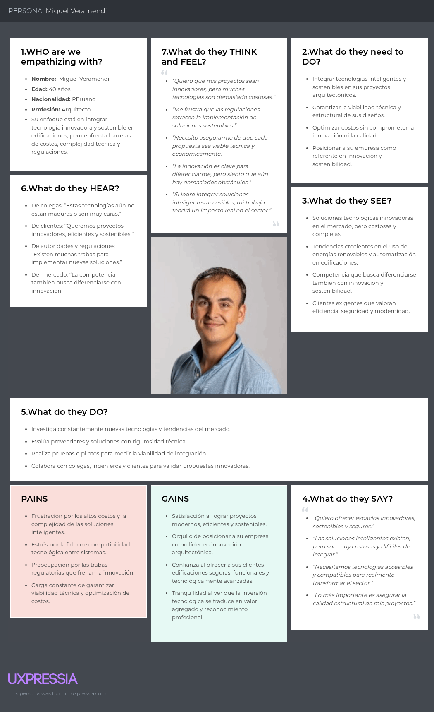

Desglose del Empathy Map 1

Piensa: “Quiero que mis proyectos sean innovadores, pero muchas tecnologías son demasiado costosas.”

Siente: “Me frustra que las regulaciones retrasen la implementación de soluciones sostenibles.”

Dice: “Quiero ofrecer espacios innovadores, sostenibles y seguros.”

Hace: Investiga constantemente nuevas tecnologías y tendencias del mercado.

<div style="page-break-before: always;"></div>

**Segmento 2:**


Desglose del Empathy Map 2

Piensa: “Si esta solución es confiable, podría integrarla sin problema en mi rutina diaria.”

Siente: “Me frustra cuando una aplicación promete mucho y no cumple con lo que necesito.”

Dice: “Necesito algo fácil de usar, que no me complique más de lo que ya estoy.”

Hace: Prueba aplicaciones o servicios digitales para evaluar su utilidad.

<div style="page-break-before: always;"></div>

### 2.4. Ubiquitous Language.


| Ubiquitous Term | Definición del Dominio Funcional |
| -------- | --------- |
| Client | Empresa constructora o inmobiliaria que contrata la suscripción SaaS para gestionar propiedades y dispositivos. |
| Property Manager | Usuario con rol de administrador de una o varias edificaciones, responsable de la configuración general y supervisión. |
| Resident | Usuario final (dueño o inquilino) que interactúa y controla los dispositivos IoT asignados a su unidad o cuarto específico. |
| Platform Administrator | Operador interno del SaaS, responsable del mantenimiento del sistema, gestión de clientes y configuraciones globales. |
| Property / Building | Edificación física (ej. edificio de apartamentos, condominio) que agrupa múltiples unidades y dispositivos gestionados. |
| Unit | Espacio individual dentro de una propiedad (ej. apartamento, oficina) al cual se le asignan dispositivos y residentes. |
| Device | Cualquier dispositivo físico IoT (termostato, cerradura, sensor) instalado en una unidad y conectado a la plataforma. |
| Device Profile | Plantilla de configuración predefinida para un tipo de dispositivo, que facilita su instalación y aprovisionamiento en masa. |
| Subscription | El plan de servicio contratado por el Cliente que define el acceso a funcionalidades, número de propiedades y dispositivos. |
| Provisioning | Proceso de registrar, configurar y activar un nuevo dispositivo en la plataforma para que sea operativo. |
| Alert | Notificación automática generada por un dispositivo ante un evento predefinido (ej. batería baja, puerta abierta, etc.). |
| Command | Instrucción enviada desde la plataforma a un dispositivo para ejecutar una acción específica (ej. "apagar luz", "ajustar T°"). |
| Telemetry | Flujo de datos y mediciones (ej. temperatura, consumo energético) enviado por un dispositivo hacia la plataforma. |
| Scene / Routine | Conjunto de comandos preconfigurados que se ejecutan sobre uno o varios dispositivos de forma simultánea o programada. |
| Dashboard | Interfaz visual principal que muestra el estado en tiempo real de los dispositivos, alertas y datos relevantes. |
| Device State | El estado operativo actual de un dispositivo, como 'En línea', 'Fuera de línea', 'Batería baja' o 'Error'. |
| Billing Cycle | Periodo recurrente en el que se factura al Cliente por el servicio de la suscripción. |

<div style="page-break-before: always;"></div>

# Capítulo III: Requirements Specification

## 3.1. User Stories.

### Epics

| Epic ID | Título | Descripción |
|---|---|---|
| EP01 | Landing page informativa | Como visitante del sitio, quiero tener acceso a una plataforma web, para conocer los servicios que brinda la aplicación. |
| EP02 | Gestión de cuentas y acceso | Como ingeniero quiero crear una cuenta para acceder a las funcionalidades de la aplicación |
| EP03 | Internacionalización de la plataforma | Como arquitecto, quiero que la aplicación esté disponible en más de un idioma para seleccionar el idioma de mi preferencia. |
| EP04 | Personalización de espacios inteligentes | Como propietario, quiero personalizar la configuración de mi vivienda y/o edificio, para adaptar el espacio a mis necesidades. |
| EP05 | Gestión de perfil de usuario | Como usuario propietario, quiero actualizar la información de mi perfil, para personalizar mi experiencia en la plataforma. |
| EP06 | Dashboard de personalización del espacio | Como propietario, quiero acceder a un dashboard, para supervisar los dispositivos de mi departamento. |
| EP07 | Gestión de clientes y entregables | Como ingeniero, quiero gestionar la información de mis clientes, para mantener un control organizado de los proyectos. |
| EP08 | Gestión de proyectos inteligentes | Como arquitecto, quiero gestionar proyectos de construcción en la plataforma, para integrar funcionalidades inteligentes desde la planificación. |
| EP09 | Gestión de dispositivos inteligentes | Como Desarrollador, quiero implementar un sistema de gestión de dispositivos inteligentes, para que permita registrar, modificar y asignar dispositivos disponibles dentro de un espacio. |
| EP10 | Gestión de energía en tiempo real | Como Desarrollador, quiero implementar un sistema de monitoreo energético, para que los usuarios puedan consultar el uso de energía en sus espacios. |
| EP11 | Gestión de usuarios | Como desarrollador, quiero gestionar a los usuarios de la plataforma, para asegurar un control adecuado de accesos, roles y permisos |

### 3.1.1. User Stories

<table>
    <tr><th>Story ID</th><th>User</th><th>Priority</th><th>Epic</th></tr>
    <tr><td>US01</td><td>visitante del sitio</td><td>Alta</td><td>EP01</td></tr>
    <tr><th>Title</th><td colspan="3">Conocer la sección "Sobre Nosotros"</td></tr>
    <tr><th colspan="4">Description</th></tr>
    <tr><td colspan="4">Como visitante del sitio, quiero conocer la historia y valores de la aplicación, para tener mayor conexión y confianza con la empresa.</td></tr>
    <tr><th colspan="4">Acceptance Criteria</th></tr>
    <tr><td colspan="4"><strong>Escenario 1: Llega a la sección “Sobre Nosotros”</strong><br>Dado que el visitante está explorando la landing page,<br> Cuando llega a la sección “Sobre Nosotros”, <br>Entonces debe visualizar una descripción breve de la historia de IoBuild, su equipo y valores, acompañada de imágenes.</td></tr>
</table>

---

<table>
    <tr><th>Story ID</th><th>User</th><th>Priority</th><th>Epic</th></tr>
    <tr><td>US02</td><td>visitante del sitio</td><td>Media</td><td>EP01</td></tr>
    <tr><th>Title</th><td colspan="3">Consultar los testimonios de clientes</td></tr>
    <tr><th colspan="4">Description</th></tr>
    <tr><td colspan="4">Como visitante del sitio, quiero consultar testimonios de otros clientes, para generar confianza en la propuesta de valor de la start up</td></tr>
    <tr><th colspan="4">Acceptance Criteria</th></tr>
    <tr><td colspan="4"><strong>Escenario 1: Consulta la sección de testimonios</strong><br>Dado que el visitante accede al sitio web<br>Cuando consulta la sección de testimonios<br>Entonces visualiza opiniones de clientes<br>Y percibe la experiencia de otros usuarios.<br><br><strong>Escenario 2: El visitante desea revisar más testimonios</strong><br>Dado que existen varios testimonios disponibles<br>Cuando el visitante desea revisar más testimonios<br>Entonces el sistema le muestra todos los testimonios</td></tr>
</table>

---

<table>
    <tr><th>Story ID</th><th>User</th><th>Priority</th><th>Epic</th></tr>
    <tr><td>US03</td><td>visitante del sitio</td><td>Alta</td><td>EP01</td></tr>
    <tr><th>Title</th><td colspan="3">Acceder a la información de contacto</td></tr>
    <tr><th colspan="4">Description</th></tr>
    <tr><td colspan="4">Como visitante del sitio, quiero acceder fácilmente a la información de contacto de IoBuild, para comunicarme en caso de dudas</td></tr>
    <tr><th colspan="4">Acceptance Criteria</th></tr>
    <tr><td colspan="4"><strong>Escenario 1: Consulta la sección de contacto</strong><br>Dado que el visitante accede a la landing page<br>Cuando consulta la sección de contacto<br>Entonces visualiza información clara como correo y teléfono <br>Y puede identificar rápidamente los medios de comunicación disponibles.</td></tr>
</table>

---

<table>
    <tr><th>Story ID</th><th>User</th><th>Priority</th><th>Epic</th></tr>
    <tr><td>US04</td><td>visitante del sitio</td><td>Alta</td><td>EP01</td></tr>
    <tr><th>Title</th><td colspan="3">Visualizar los servicios principales</td></tr>
    <tr><th colspan="4">Description</th></tr>
    <tr><td colspan="4">Como visitante del sitio, quiero conocer los servicios que ofrece IoBuild, para entender su propuesta de valor.</td></tr>
    <tr><th colspan="4">Acceptance Criteria</th></tr>
    <tr><td colspan="4"><strong>Escenario 1: Navega a la sección de servicios</strong><br>Dado que el visitante accede a la landing page<br>Cuando navega a la sección de servicios<br>Entonces visualiza una lista de los servicios principales<br><br><strong>Escenario 2: Quiere conocer más sobre un servicio de su interés</strong><br>Dado que el visitante accede a la landing page <br>Cuando quiere conocer más sobre un servicio de su interés<br>Entonces selecciona la opción de “ver más”<br>Y se muestra un texto más completo sobre el servicio seleccionado</td></tr>
</table>

---

<table>
    <tr><th>Story ID</th><th>User</th><th>Priority</th><th>Epic</th></tr>
    <tr><td>US05</td><td>visitante del sitio</td><td>Alta</td><td>EP02</td></tr>
    <tr><th>Title</th><td colspan="3">Registrarse en la aplicación</td></tr>
    <tr><th colspan="4">Description</th></tr>
    <tr><td colspan="4">Como visitante del sitio, quiero registrarme en la aplicación, para tener acceso a las funcionalidades de la aplicación</td></tr>
    <tr><th colspan="4">Acceptance Criteria</th></tr>
    <tr><td colspan="4"><strong>Escenario 1: Se dirige a la parte superior de la página</strong><br>Dado que el visitante accede a la landing page<br>Cuando se dirige a la parte superior de la página<br>Y selecciona la opción registrarse<br>Entonces la aplicación lo redirige al formulario de registro</td></tr>
</table>

---

<table>
    <tr><th>Story ID</th><th>User</th><th>Priority</th><th>Epic</th></tr>
    <tr><td>US06</td><td>visitante del sitio</td><td>Media</td><td>EP01</td></tr>
    <tr><th>Title</th><td colspan="3">Consultar las preguntas frecuentes</td></tr>
    <tr><th colspan="4">Description</th></tr>
    <tr><td colspan="4">Como visitante del sitio, quiero consultar una sección de preguntas frecuentes, para resolver dudas comunes sin necesidad de contactar a la start up</td></tr>
    <tr><th colspan="4">Acceptance Criteria</th></tr>
    <tr><td colspan="4"><strong>Escenario 1: Entra a la sección de preguntas frecuentes</strong><br>Dado que el visitante accede a la landing page<br>Cuando entra a la sección de preguntas frecuentes<br>Entonces puede desplegar las respuestas a cada pregunta común<br>Y encuentra información organizada y clara.<br><br><strong>Escenario 2: Revisa la lista de preguntas disponibles</strong><br>Dado que el visitante accede a la sección de preguntas frecuentes<br>Cuando revisa la lista de preguntas disponibles<br>Entonces el sistema debe mostrar múltiples preguntas frecuentes <br>Y cada pregunta debe poder expandirse para visualizar su respuesta correspondiente.</td></tr>
</table>

---

<table>
    <tr><th>Story ID</th><th>User</th><th>Priority</th><th>Epic</th></tr>
    <tr><td>US07</td><td>visitante del sitio</td><td>Media</td><td>EP03</td></tr>
    <tr><th>Title</th><td colspan="3">Seleccionar el idioma de la landing page</td></tr>
    <tr><th colspan="4">Description</th></tr>
    <tr><td colspan="4">Como visitante del sitio, quiero poder encontrar más de un idioma disponible, para poder elegir el idioma de mi preferencia.</td></tr>
    <tr><th colspan="4">Acceptance Criteria</th></tr>
    <tr><td colspan="4"><strong>Escenario 1: Selecciona un idioma distinto</strong><br>Dado que el visitante accede a la landing page<br>Cuando selecciona un idioma distinto<br>Entonces todo el contenido de la landing page debe mostrarse automáticamente en el idioma seleccionado.<br><br><strong>Escenario 2: Vuelve a ingresar al sitio</strong><br>Dado que el visitante seleccionó un idioma previamente<br>Cuando vuelve a ingresar al sitio<br>Entonces la landing page debe mostrarse en el último idioma elegido, sin necesidad de volver a configurarlo.</td></tr>
</table>

---

<table>
    <tr><th>Story ID</th><th>User</th><th>Priority</th><th>Epic</th></tr>
    <tr><td>US08</td><td>usuario (constructor o propietario)</td><td>Alta</td><td>EP06</td></tr>
    <tr><th>Title</th><td colspan="3">Visualizar dashboard de analíticas y métricas según el rol</td></tr>
    <tr><th colspan="4">Description</th></tr>
    <tr><td colspan="4">Como usuario de la plataforma (constructor o propietario), quiero acceder a un dashboard centralizado con métricas clave y datos en tiempo real de mis proyectos y dispositivos, para supervisar el rendimiento, ocupación y consumo energético de mis espacios.</td></tr>
    <tr><th colspan="4">Acceptance Criteria</th></tr>
    <tr><td colspan="4"><strong>Escenario 1: Visualización del Dashboard para Constructor (Builder)</strong><br>Dado que el usuario ha iniciado sesión con el rol de Constructor (Builder),<br>Cuando accede a la vista principal de analíticas / dashboard,<br>Entonces el sistema muestra tarjetas estadísticas con el total de proyectos, tasa de ocupación, unidades administradas y el gráfico de telemetría de consumo de energía en tiempo real.<br><br><strong>Escenario 2: Visualización del Dashboard para Propietario (Owner)</strong><br>Dado que el usuario ha iniciado sesión con el rol de Propietario (Owner),<br>Cuando accede a la vista de su dashboard,<br>Entonces el sistema muestra las unidades residenciales que tiene asignadas, el estado de sus dispositivos conectados y el consumo energético específico de su vivienda.<br><br><strong>Escenario 3: Actualización de datos de telemetría</strong><br>Dado que el usuario está visualizando su dashboard respectivo,<br>Cuando el sistema recibe nuevas lecturas o cambios en los dispositivos,<br>Entonces los indicadores numéricos y los gráficos de consumo se actualizan reflejando la información más reciente.</td></tr>
</table>

---

<table>
    <tr><th>Story ID</th><th>User</th><th>Priority</th><th>Epic</th></tr>
    <tr><td>US09</td><td>ingeniero</td><td>Alta</td><td>EP08</td></tr>
    <tr><th>Title</th><td colspan="3">Acceder a los proyectos activos</td></tr>
    <tr><th colspan="4">Description</th></tr>
    <tr><td colspan="4">Como ingeniero, quiero tener acceso a los proyectos que se encuentran activos, para poder realizar un seguimiento de su progreso y gestionar los recursos necesarios.</td></tr>
    <tr><th colspan="4">Acceptance Criteria</th></tr>
    <tr><td colspan="4"><strong>Escenario 1: Consulta la lista de proyectos</strong><br>Dado que el ingeniero accede al sistema,<br>Cuando consulta la lista de proyectos,<br>Entonces verá solo los proyectos con estado "activo".<br><br><strong>Escenario 2: Selecciona un proyecto</strong><br>Dado que el ingeniero tiene acceso a los proyectos activos,<br>Cuando selecciona un proyecto,<br>Entonces puede acceder a detalles como el progreso, recursos y métricas del proyecto.<br><br><strong>Escenario 3: Hay cambios en el estado de algún proyecto (e.g., transición a "completado")</strong><br>Dado que el ingeniero está visualizando proyectos activos,<br>Cuando hay cambios en el estado de algún proyecto (e.g., transición a "completado"),<br>Entonces la lista se actualiza automáticamente.</td></tr>
</table>

---

<table>
    <tr><th>Story ID</th><th>User</th><th>Priority</th><th>Epic</th></tr>
    <tr><td>US10</td><td>usuario</td><td>Alta</td><td>EP09</td></tr>
    <tr><th>Title</th><td colspan="3">Acceder a los dispositivos conectados</td></tr>
    <tr><th colspan="4">Description</th></tr>
    <tr><td colspan="4">Como usuario, quiero tener acceso a los dispositivos conectados, para poder monitorear su estado y uso.</td></tr>
    <tr><th colspan="4">Acceptance Criteria</th></tr>
    <tr><td colspan="4"><strong>Escenario 1: Consulta los dispositivos conectados</strong><br>Dado que el usuario accede a la aplicación,<br>Cuando consulta los dispositivos conectados,<br>Entonces verá una lista de dispositivos con su estado actual (activo, inactivo, etc.).<br><br><strong>Escenario 2: Selecciona un dispositivo</strong><br>Dado que el usuario tiene acceso a los dispositivos,<br>Cuando selecciona un dispositivo,<br>Entonces puede ver información detallada sobre su configuración, tipo y uso.<br><br><strong>Escenario 3: Un dispositivo cambia su estado</strong><br>Dado que hay dispositivos conectados,<br>Cuando un dispositivo cambia su estado,<br>Entonces la interfaz se actualiza automáticamente.</td></tr>
</table>

---

<table>
    <tr><th>Story ID</th><th>User</th><th>Priority</th><th>Epic</th></tr>
    <tr><td>US11</td><td>ingeniero</td><td>Media</td><td>EP10</td></tr>
    <tr><th>Title</th><td colspan="3">Acceder a la capacidad de ocupación por proyecto</td></tr>
    <tr><th colspan="4">Description</th></tr>
    <tr><td colspan="4">Como ingeniero, quiero tener acceso a la capacidad de ocupación de cada proyecto, para poder analizar el uso de los recursos y planificar de manera eficiente.</td></tr>
    <tr><th colspan="4">Acceptance Criteria</th></tr>
    <tr><td colspan="4"><strong>Escenario 1: Consulta la información de ocupación</strong><br>Dado que el ingeniero accede al sistema,<br>Cuando consulta la información de ocupación,<br>Entonces verá la capacidad de ocupación de cada proyecto, expresada como porcentaje o número de espacios ocupados.<br><br><strong>Escenario 2: Selecciona un proyecto</strong><br>Dado que el ingeniero tiene acceso a los proyectos,<br>Cuando selecciona un proyecto,<br>Entonces puede ver su capacidad de ocupación histórica y proyectada.<br><br><strong>Escenario 3: Cambia su ocupación</strong><br>Dado que un proyecto tiene capacidad de ocupación variable,<br>Cuando cambia su ocupación,<br>Entonces la información se actualiza en tiempo real.</td></tr>
</table>

---

<table>
    <tr><th>Story ID</th><th>User</th><th>Priority</th><th>Epic</th></tr>
    <tr><td>US12</td><td>ingeniero</td><td>Media</td><td>EP10</td></tr>
    <tr><th>Title</th><td colspan="3">Visualizar el gráfico de consumo de energía por hora</td></tr>
    <tr><th colspan="4">Description</th></tr>
    <tr><td colspan="4">Como ingeniero, quiero ver un gráfico sobre la energía que se consume por hora, para poder evaluar el rendimiento energético de los proyectos en tiempo real.</td></tr>
    <tr><th colspan="4">Acceptance Criteria</th></tr>
    <tr><td colspan="4"><strong>Escenario 1: Visualiza los datos</strong><br>Dado que el ingeniero accede a la sección de consumo energético,<br>Cuando visualiza los datos,<br>Entonces verá un gráfico que muestra el consumo de energía de cada proyecto por hora.<br><br><strong>Escenario 2: Se actualizan los datos de consumo</strong><br>Dado que el gráfico muestra el consumo energético,<br>Cuando se actualizan los datos de consumo,<br>Entonces el gráfico se refresca en tiempo real.<br><br><strong>Escenario 3: Selecciona un rango de tiempo específico</strong><br>Dado que el ingeniero necesita analizar tendencias,<br>Cuando selecciona un rango de tiempo específico,<br>Entonces el gráfico ajusta el intervalo de horas.</td></tr>
</table>

---

<table>
    <tr><th>Story ID</th><th>User</th><th>Priority</th><th>Epic</th></tr>
    <tr><td>US13</td><td>ingeniero</td><td>Media</td><td>EP10</td></tr>
    <tr><th>Title</th><td colspan="3">Visualizar el gráfico de registro de ocupación</td></tr>
    <tr><th colspan="4">Description</th></tr>
    <tr><td colspan="4">Como ingeniero, quiero ver un gráfico sobre el registro de ocupación, para poder analizar la evolución de la ocupación a lo largo del tiempo.</td></tr>
    <tr><th colspan="4">Acceptance Criteria</th></tr>
    <tr><td colspan="4"><strong>Escenario 1: Consulta los datos históricos</strong><br>Dado que el ingeniero accede a la sección de ocupación,<br>Cuando consulta los datos históricos,<br>Entonces verá un gráfico que representa la evolución de la ocupación de los proyectos a lo largo del tiempo.<br><br><strong>Escenario 2: El ingeniero selecciona diferentes proyectos</strong><br>Dado que el gráfico de ocupación está disponible,<br>Cuando el ingeniero selecciona diferentes proyectos,<br>Entonces puede visualizar la ocupación de cada uno por separado.<br><br><strong>Escenario 3: Se produce un cambio en la ocupación</strong><br>Dado que los datos de ocupación se actualizan con frecuencia,<br>Cuando se produce un cambio en la ocupación,<br>Entonces el gráfico se actualiza automáticamente.</td></tr>
</table>

---

<table>
    <tr><th>Story ID</th><th>User</th><th>Priority</th><th>Epic</th></tr>
    <tr><td>US14</td><td>ingeniero</td><td>Media</td><td>EP08</td></tr>
    <tr><th>Title</th><td colspan="3">Ver el resumen del proyecto</td></tr>
    <tr><th colspan="4">Description</th></tr>
    <tr><td colspan="4">Como ingeniero, quiero ver un resumen sobre cada proyecto, para saber si está activo, su ubicación y cuántos departamentos están ocupados.</td></tr>
    <tr><th colspan="4">Acceptance Criteria</th></tr>
    <tr><td colspan="4"><strong>Escenario 1: Selecciona un proyecto</strong><br>Dado que el ingeniero accede a los proyectos,<br>Cuando selecciona un proyecto,<br>Entonces verá un resumen con la información clave: estado (activo/inactivo), ubicación y número de departamentos ocupados.<br><br><strong>Escenario 2: Se actualiza algún dato clave del proyecto (e.g., cambio de ubicación o estado)</strong><br>Dado que el ingeniero puede ver el resumen,<br>Cuando se actualiza algún dato clave del proyecto (e.g., cambio de ubicación o estado),<br>Entonces el resumen se actualiza automáticamente.<br><br><strong>Escenario 3: Consulta la lista</strong><br>Dado que el ingeniero tiene acceso a múltiples proyectos,<br>Cuando consulta la lista,<br>Entonces puede ver una visión general de todos los proyectos activos con esta información resumida.</td></tr>
</table>

---

<table>
    <tr><th>Story ID</th><th>User</th><th>Priority</th><th>Epic</th></tr>
    <tr><td>US15</td><td>ingeniero</td><td>Media</td><td>EP09</td></tr>
    <tr><th>Title</th><td colspan="3">Visualizar los dispositivos y su distribución por tipo</td></tr>
    <tr><th colspan="4">Description</th></tr>
    <tr><td colspan="4">Como ingeniero, quiero ver cuáles son los dispositivos y cómo están distribuidos por tipo, para realizar un análisis más detallado de los recursos disponibles.</td></tr>
    <tr><th colspan="4">Acceptance Criteria</th></tr>
    <tr><td colspan="4"><strong>Escenario 1: Consulta los dispositivos</strong><br>Dado que el ingeniero accede a la sección de dispositivos,<br>Cuando consulta los dispositivos,<br>Entonces verá una lista detallada de todos los dispositivos conectados, clasificados por tipo.<br><br><strong>Escenario 2: Selecciona un tipo específico</strong><br>Dado que los dispositivos están clasificados por tipo,<br>Cuando selecciona un tipo específico,<br>Entonces verá solo los dispositivos de ese tipo.<br><br><strong>Escenario 3: Se agrega o elimina un dispositivo</strong><br>Dado que el ingeniero puede ver la distribución de dispositivos,<br>Cuando se agrega o elimina un dispositivo,<br>Entonces la distribución se actualiza automáticamente.</td></tr>
</table>

---

<table>
    <tr><th>Story ID</th><th>User</th><th>Priority</th><th>Epic</th></tr>
    <tr><td>US16</td><td>usuario</td><td>Media</td><td>EP05</td></tr>
    <tr><th>Title</th><td colspan="3">Acceder al perfil del usuario</td></tr>
    <tr><th colspan="4">Description</th></tr>
    <tr><td colspan="4">Como usuario, quiero tener acceso a mi perfil, para ver datos como mi nombre, email, número de teléfono y mi dirección.</td></tr>
    <tr><th colspan="4">Acceptance Criteria</th></tr>
    <tr><td colspan="4"><strong>Escenario 1: Consulta su perfil</strong><br>Dado que el usuario accede a la aplicación,<br>Cuando consulta su perfil,<br>Entonces verá una página o sección con la siguiente información: nombre, email, número de teléfono y dirección.<br><br><strong>Escenario 2: La información de contacto está desactualizada</strong><br>Dado que el usuario está visualizando su perfil,<br>Cuando la información de contacto está desactualizada,<br>Entonces puede identificar qué datos están desactualizados (si es el caso).<br><br><strong>Escenario 3: Realiza un cambio en la información personal</strong><br>Dado que el usuario accede a su perfil,<br>Cuando realiza un cambio en la información personal,<br>Entonces la información se guarda correctamente y se actualiza en la base de datos.</td></tr>
</table>

---

<table>
    <tr><th>Story ID</th><th>User</th><th>Priority</th><th>Epic</th></tr>
    <tr><td>US17</td><td>usuario</td><td>Alta</td><td>EP05</td></tr>
    <tr><th>Title</th><td colspan="3">Edición de Información del Perfil</td></tr>
    <tr><th colspan="4">Description</th></tr>
    <tr><td colspan="4">Como usuario, quiero poder editar alguna parte de mi información, como mi email, número de teléfono o dirección, para mantener mis datos actualizados.</td></tr>
    <tr><th colspan="4">Acceptance Criteria</th></tr>
    <tr><td colspan="4"><strong>Escenario 1: Selecciona la opción para editar su información</strong><br>Dado que el usuario accede a su perfil,<br>Cuando selecciona la opción para editar su información,<br>Entonces podrá modificar los siguientes campos: email, número de teléfono y dirección.<br><br><strong>Escenario 2: Hace un cambio en uno de estos campos</strong><br>Dado que el usuario está editando su información,<br>Cuando hace un cambio en uno de estos campos,<br>Entonces la aplicación valida que el formato del email y número de teléfono sea correcto antes de guardar los cambios.<br><br><strong>Escenario 3: Guarda los cambios</strong><br>Dado que el usuario ha editado la información,<br>Cuando guarda los cambios,<br>Entonces recibirá una confirmación de que los datos fueron actualizados exitosamente.<br><br>**Escenario 4: Validación**<br>Dado que el usuario intenta editar un campo,<br>Cuando el campo es obligatorio (por ejemplo, dirección),<br>Entonces se mostrará un mensaje de error si el campo está vacío.</td></tr>
</table>

---

<table>
    <tr><th>Story ID</th><th>User</th><th>Priority</th><th>Epic</th></tr>
    <tr><td>US18</td><td>usuario</td><td>Baja</td><td>EP05</td></tr>
    <tr><th>Title</th><td colspan="3">Ver Imagen que Representa al Usuario</td></tr>
    <tr><th colspan="4">Description</th></tr>
    <tr><td colspan="4">Como usuario, quiero poder ver una imagen que me represente, para tener una experiencia más personalizada.</td></tr>
    <tr><th colspan="4">Acceptance Criteria</th></tr>
    <tr><td colspan="4"><strong>Escenario 1: Visualiza la información personal</strong><br>Dado que el usuario accede a su perfil,<br>Cuando visualiza la información personal,<br>Entonces verá una imagen o avatar asociado a su cuenta (si está disponible).<br><br><strong>Escenario 2: Selecciona la opción para editar la foto de perfil</strong><br>Dado que el usuario desea cambiar su imagen,<br>Cuando selecciona la opción para editar la foto de perfil,<br>Entonces podrá cargar una nueva imagen desde su dispositivo.<br><br><strong>Escenario 3: La nueva imagen se guarda</strong><br>Dado que el usuario cambia su imagen de perfil,<br>Cuando la nueva imagen se guarda,<br>Entonces se actualiza correctamente en el perfil y se refleja en todas las pantallas donde se visualiza el avatar del usuario.<br><br>**Escenario 4: Validación**<br>Dado que el usuario no ha subido una imagen de perfil,<br>Cuando no se encuentra una imagen,<br>Entonces se muestra una imagen predeterminada (por ejemplo, un ícono de usuario genérico).</td></tr>
</table>

---

<table>
    <tr><th>Story ID</th><th>User</th><th>Priority</th><th>Epic</th></tr>
    <tr><td>US19</td><td>usuario</td><td>Media</td><td>EP11</td></tr>
    <tr><th>Title</th><td colspan="3">Ver el Rol de la Cuenta</td></tr>
    <tr><th colspan="4">Description</th></tr>
    <tr><td colspan="4">Como usuario, quiero poder ver el rol de mi cuenta, para entender qué permisos tengo dentro de la aplicación.</td></tr>
    <tr><th colspan="4">Acceptance Criteria</th></tr>
    <tr><td colspan="4"><strong>Escenario 1: Consulta los detalles de su cuenta</strong><br>Dado que el usuario accede a su perfil,<br>Cuando consulta los detalles de su cuenta,<br>Entonces verá un campo que indica su rol (por ejemplo: "Administrador", "Usuario", "Invitado").<br><br><strong>Escenario 2: El sistema identifica un cambio en el rol</strong><br>Dado que el usuario tiene un rol específico,<br>Cuando el sistema identifica un cambio en el rol,<br>Entonces actualizará la información visible en el perfil en tiempo real.<br><br><strong>Escenario 3: Accede a secciones de la aplicación</strong><br>Dado que el usuario ve su rol,<br>Cuando accede a secciones de la aplicación,<br>Entonces verá solo las opciones que correspondan a su nivel de acceso (por ejemplo, un "Administrador" verá opciones de configuración, mientras que un "Usuario" verá solo las opciones básicas).<br><br>**Escenario 4: Validación**<br>Dado que el rol puede cambiar,<br>Cuando un administrador o un usuario con permisos lo actualiza,<br>Entonces la modificación se refleja inmediatamente en el perfil del usuario.</td></tr>
</table>

---

<table>
    <tr><th>Story ID</th><th>User</th><th>Priority</th><th>Epic</th></tr>
    <tr><td>US20</td><td>ingeniero</td><td>Alta</td><td>EP08</td></tr>
    <tr><th>Title</th><td colspan="3">Ver lista de proyectos</td></tr>
    <tr><th colspan="4">Description</th></tr>
    <tr><td colspan="4">Como ingeniero, quiero ver una lista de todos mis proyectos para poder conocer el estado y detalles de cada uno.</td></tr>
    <tr><th colspan="4">Acceptance Criteria</th></tr>
    <tr><td colspan="4"><strong>Escenario 1: El constructor accede a la vista de “Proyectos”</strong><br>Dado que existen proyectos registrados para el constructor,<br>Cuando el constructor accede a la vista de “Proyectos”,<br>Entonces el sistema muestra una lista con todos los proyectos incluyendo imagen, nombre, estado, tasa de ocupación y fecha de creación.<br><br><strong>Escenario 2: El constructor accede a la vista de “Proyectos”</strong><br>Dado que no existen proyectos registrados para el constructor,<br>Cuando el constructor accede a la vista de “Proyectos”,<br>Entonces el sistema muestra un mensaje indicando que no hay proyectos disponibles.</td></tr>
</table>

---

<table>
    <tr><th>Story ID</th><th>User</th><th>Priority</th><th>Epic</th></tr>
    <tr><td>US21</td><td>arquitecto</td><td>Alta</td><td>EP08</td></tr>
    <tr><th>Title</th><td colspan="3">Agregar un nuevo proyecto</td></tr>
    <tr><th colspan="4">Description</th></tr>
    <tr><td colspan="4">Como arquitecto, quiero agregar un nuevo proyecto para poder registrar nuevos desarrollos inmobiliarios.</td></tr>
    <tr><th colspan="4">Acceptance Criteria</th></tr>
    <tr><td colspan="4"><strong>Escenario 1: El constructor envía la solicitud para agregar el proyecto</strong><br>Dado que el constructor proporciona datos válidos (nombre, imagen, estado, unidades totales, fecha de creación, etc.),<br>Cuando el constructor envía la solicitud para agregar el proyecto,<br>Entonces el sistema crea el proyecto y lo muestra en la lista de proyectos.<br><br><strong>Escenario 2: El constructor envía la solicitud para agregar el proyecto</strong><br>Dado que el constructor proporciona datos inválidos (por ejemplo, nombre vacío o formato incorrecto),<br>Cuando el constructor envía la solicitud para agregar el proyecto,<br>Entonces el sistema rechaza la creación y muestra un mensaje de error.</td></tr>
</table>

---

<table>
    <tr><th>Story ID</th><th>User</th><th>Priority</th><th>Epic</th></tr>
    <tr><td>US22</td><td>arquitecto</td><td>Alta</td><td>EP08</td></tr>
    <tr><th>Title</th><td colspan="3">Ver detalles de un proyecto</td></tr>
    <tr><th colspan="4">Description</th></tr>
    <tr><td colspan="4">Como arquitecto, quiero ver los detalles de un proyecto específico para poder revisar su información completa.</td></tr>
    <tr><th colspan="4">Acceptance Criteria</th></tr>
    <tr><td colspan="4"><strong>Escenario 1: El constructor selecciona la opción “Ver Detalles” de ese proyecto</strong><br>Dado que el proyecto existe en el sistema,<br>Cuando el constructor selecciona la opción “Ver Detalles” de ese proyecto,<br>Entonces el sistema muestra la información completa del proyecto seleccionado.<br><br><strong>Escenario 2: El constructor intenta acceder a los detalles del proyecto</strong><br>Dado que el proyecto no existe en el sistema,<br>Cuando el constructor intenta acceder a los detalles del proyecto,<br>Entonces el sistema muestra un mensaje de error indicando que el proyecto no se encuentra disponible.</td></tr>
</table>

---

<table>
    <tr><th>Story ID</th><th>User</th><th>Priority</th><th>Epic</th></tr>
    <tr><td>US23</td><td>Arquitecto</td><td>Alta</td><td>EP07</td></tr>
    <tr><th>Title</th><td colspan="3">Ver Lista de Clientes</td></tr>
    <tr><th colspan="4">Description</th></tr>
    <tr><td colspan="4">Como Arquitecto, quiero ver una lista de todos los clientes para poder gestionar sus proyectos asociados y el estado de su cuenta.</td></tr>
    <tr><th colspan="4">Acceptance Criteria</th></tr>
    <tr><td colspan="4"><strong>Escenario 1: El Arquitecto solicita la lista de clientes</strong><br>Dado que hay clientes en el sistema,<br>Cuando el Arquitecto solicita la lista de clientes,<br>Entonces el sistema devuelve todos los clientes con su Nombre Completo, Proyecto Asociado y Estado de Cuenta,<br>Y el sistema muestra las Acciones disponibles (Ver Perfil e ícono de Configuración/Engranaje).<br><br><strong>Escenario 2: El Arquitecto solicita la lista de clientes</strong><br>Dado que no hay clientes en el sistema,<br>Cuando el Arquitecto solicita la lista de clientes,<br>Entonces el sistema devuelve una lista vacía (o un mensaje indicando "No se encontraron clientes").<br><br><strong>Escenario 3: El Arquitecto ve la lista</strong><br>Dado que hay más clientes que el límite de visualización (ej., 10),<br>Cuando el Arquitecto ve la lista,<br>Entonces el sistema muestra los controles de paginación (número de página, botones siguiente/anterior).</td></tr>
</table>

---

<table>
    <tr><th>Story ID</th><th>User</th><th>Priority</th><th>Epic</th></tr>
    <tr><td>US24</td><td>Ingeniero</td><td>Media</td><td>EP07</td></tr>
    <tr><th>Title</th><td colspan="3">Buscar/Ordenar Clientes</td></tr>
    <tr><th colspan="4">Description</th></tr>
    <tr><td colspan="4">Como Ingeniero, quiero poder ordenar la lista de clientes por columnas (Nombre Completo, Proyecto Asociado, Estado de Cuenta) para poder encontrar u organizar clientes rápidamente según criterios específicos.</td></tr>
    <tr><th colspan="4">Acceptance Criteria</th></tr>
    <tr><td colspan="4"><strong>Escenario 1: El Ingeniero hace clic en el ícono de ordenar junto a Nombre Completo</strong><br>Dado que se muestra la lista de clientes,<br>Cuando el Ingeniero hace clic en el ícono de ordenar junto a Nombre Completo,<br>Entonces el sistema ordena la lista alfabéticamente por nombre del cliente (ascendente o descendente).<br><br><strong>Escenario 2: El Ingeniero hace clic en el ícono de ordenar junto a Proyecto Asociado</strong><br>Dado que se muestra la lista de clientes,<br>Cuando el Ingeniero hace clic en el ícono de ordenar junto a Proyecto Asociado,<br>Entonces el sistema ordena la lista por el nombre del proyecto asociado (ascendente o descendente).<br><br><strong>Escenario 3: El Ingeniero hace clic en el ícono de ordenar junto a Estado de Cuenta</strong><br>Dado que se muestra la lista de clientes,<br>Cuando el Ingeniero hace clic en el ícono de ordenar junto a Estado de Cuenta,<br>Entonces el sistema ordena la lista por el estado de la cuenta (ej., Activo, Stand by, Suspendido).</td></tr>
</table>

---

<table>
    <tr><th>Story ID</th><th>User</th><th>Priority</th><th>Epic</th></tr>
    <tr><td>US25</td><td>Arquitecto</td><td>Alta</td><td>EP07</td></tr>
    <tr><th>Title</th><td colspan="3">Agregar un Nuevo Cliente</td></tr>
    <tr><th colspan="4">Description</th></tr>
    <tr><td colspan="4">Como Arquitecto, quiero poder agregar un nuevo cliente para poder registrarlo en el sistema.</td></tr>
    <tr><th colspan="4">Acceptance Criteria</th></tr>
    <tr><td colspan="4"><strong>Escenario 1: El Arquitecto proporciona los datos válidos requeridos (ej., Nombre Completo)</strong><br>Dado que el Arquitecto hace clic en el botón + Add Client (Agregar Cliente),<br>Cuando el Arquitecto proporciona los datos válidos requeridos (ej., Nombre Completo),<br>Entonces el sistema crea el nuevo cliente y lo muestra en la lista.<br><br><strong>Escenario 2: El Arquitecto envía el formulario con datos obligatorios faltantes o inválidos</strong><br>Dado que el Arquitecto hace clic en el botón + Add Client (Agregar Cliente),<br>Cuando el Arquitecto envía el formulario con datos obligatorios faltantes o inválidos,<br>Entonces el sistema rechaza la creación y proporciona un mensaje de error.</td></tr>
</table>

---

<table>
    <tr><th>Story ID</th><th>User</th><th>Priority</th><th>Epic</th></tr>
    <tr><td>US26</td><td>Ingeniero</td><td>Media</td><td>EP07</td></tr>
    <tr><th>Title</th><td colspan="3">Ver Perfil del Cliente</td></tr>
    <tr><th colspan="4">Description</th></tr>
    <tr><td colspan="4">Como Ingeniero, quiero ver el perfil detallado de un cliente para poder acceder a toda su información y opciones de gestión.</td></tr>
    <tr><th colspan="4">Acceptance Criteria</th></tr>
    <tr><td colspan="4"><strong>Escenario 1: El Ingeniero hace clic en el botón de acción View Profile (Ver Perfil)</strong><br>Dado que un cliente existente se muestra en la lista,<br>Cuando el Ingeniero hace clic en el botón de acción View Profile (Ver Perfil),<br>Entonces el sistema navega a la vista detallada del perfil para ese cliente específico.</td></tr>
</table>

---

<table>
    <tr><th>Story ID</th><th>User</th><th>Priority</th><th>Epic</th></tr>
    <tr><td>US27</td><td>Arquitecto</td><td>Media</td><td>EP07</td></tr>
    <tr><th>Title</th><td colspan="3">Acceder a la Configuración del Cliente</td></tr>
    <tr><th colspan="4">Description</th></tr>
    <tr><td colspan="4">Como Arquitecto, quiero acceder a la configuración específica de un cliente para poder realizar acciones de gestión como editar o gestionar el estado de su cuenta.</td></tr>
    <tr><th colspan="4">Acceptance Criteria</th></tr>
    <tr><td colspan="4"><strong>Escenario 1: El Arquitecto hace clic en el botón de acción ícono de Configuración/Engranaje</strong><br>Dado que un cliente existente se muestra en la lista,<br>Cuando el Arquitecto hace clic en el botón de acción ícono de Configuración/Engranaje,<br>Entonces el sistema muestra un menú o navega a una pantalla con opciones de gestión para ese cliente (ej., Editar, Suspender, Activar, Eliminar).</td></tr>
</table>

---

<table>
    <tr><th>Story ID</th><th>User</th><th>Priority</th><th>Epic</th></tr>
    <tr><td>US28</td><td>ingeniero</td><td>Media</td><td>EP11</td></tr>
    <tr><th>Title</th><td colspan="3">Ver Plan de Suscripción Actual</td></tr>
    <tr><th colspan="4">Description</th></tr>
    <tr><td colspan="4">Como ingeniero, quiero ver mi plan de suscripción actual y su estado para confirmar los beneficios que tengo y el costo mensual.</td></tr>
    <tr><th colspan="4">Acceptance Criteria</th></tr>
    <tr><td colspan="4"><strong>Escenario 1: El sistema carga la vista</strong><br>Dado que el ingeniero accede a la sección de suscripción,<br>Cuando el sistema carga la vista,<br>Entonces el sistema muestra el nombre del plan actual (Enterprise), su costo total, el estado de la suscripción (Active) y una lista detallada de todos los beneficios incluidos.</td></tr>
</table>

---

<table>
    <tr><th>Story ID</th><th>User</th><th>Priority</th><th>Epic</th></tr>
    <tr><td>US29</td><td>ingeniero</td><td>Baja</td><td>EP11</td></tr>
    <tr><th>Title</th><td colspan="3">Ver Planes de Suscripción Alternativos</td></tr>
    <tr><th colspan="4">Description</th></tr>
    <tr><td colspan="4">Como ingeniero, quiero ver planes de suscripción alternativos (Professional y Starter) para poder comparar sus precios y beneficios con mi plan actual.</td></tr>
    <tr><th colspan="4">Acceptance Criteria</th></tr>
    <tr><td colspan="4"><strong>Escenario 1: El sistema carga la vista</strong><br>Dado que el ingeniero accede a la sección de suscripción,<br>Cuando el sistema carga la vista,<br>Entonces el sistema muestra, junto al plan actual, las tarjetas informativas de los planes Professional y Starter, incluyendo sus costos y sus listas de beneficios específicos.</td></tr>
</table>

---

<table>
    <tr><th>Story ID</th><th>User</th><th>Priority</th><th>Epic</th></tr>
    <tr><td>US30</td><td>arquitecto</td><td>Media</td><td>EP11</td></tr>
    <tr><th>Title</th><td colspan="3">Iniciar Cambio de Plan</td></tr>
    <tr><th colspan="4">Description</th></tr>
    <tr><td colspan="4">Como arquitecto, quiero iniciar el proceso de cambio de plan para poder seleccionar un nivel de servicio diferente que se ajuste mejor a mis necesidades.</td></tr>
    <tr><th colspan="4">Acceptance Criteria</th></tr>
    <tr><td colspan="4"><strong>Escenario 1: El arquitecto hace clic en el botón Change Plan (Cambiar Plan)</strong><br>Dado que el arquitecto se encuentra en la sección de suscripción,<br>Cuando el arquitecto hace clic en el botón Change Plan (Cambiar Plan),<br>Entonces el sistema inicia el flujo para seleccionar un nuevo plan (ej., navegando a una nueva página o mostrando un modal de selección).</td></tr>
</table>

---

<table>
    <tr><th>Story ID</th><th>User</th><th>Priority</th><th>Epic</th></tr>
    <tr><td>US31</td><td>arquitecto</td><td>Media</td><td>EP11</td></tr>
    <tr><th>Title</th><td colspan="3">Renovar Plan Activo</td></tr>
    <tr><th colspan="4">Description</th></tr>
    <tr><td colspan="4">Como arquitecto, quiero renovar mi plan actual para asegurar la continuidad del servicio si estoy cerca de la fecha de expiración o si mi plan no está configurado para renovación automática.</td></tr>
    <tr><th colspan="4">Acceptance Criteria</th></tr>
    <tr><td colspan="4"><strong>Escenario 1: El arquitecto hace clic en el botón Renew Plan (Renovar Plan)</strong><br>Dado que el arquitecto tiene un plan activo,<br>Cuando el arquitecto hace clic en el botón Renew Plan (Renovar Plan),<br>Entonces el sistema inicia el proceso de renovación del plan actual (ej., mostrando un resumen de la transacción o confirmando la fecha de renovación).</td></tr>
</table>

---

<table>
    <tr><th>Story ID</th><th>User</th><th>Priority</th><th>Epic</th></tr>
    <tr><td>US32</td><td>ingeniero</td><td>Media</td><td>EP11</td></tr>
    <tr><th>Title</th><td colspan="3">Cancelar Plan Actual</td></tr>
    <tr><th colspan="4">Description</th></tr>
    <tr><td colspan="4">Como ingeniero, quiero cancelar mi plan actual para finalizar mi suscripción al término del ciclo de facturación.</td></tr>
    <tr><th colspan="4">Acceptance Criteria</th></tr>
    <tr><td colspan="4"><strong>Escenario 1: El ingeniero hace clic en el botón Cancel Plan (Cancelar Plan)</strong><br>Dado que el ingeniero tiene un plan activo,<br>Cuando el ingeniero hace clic en el botón Cancel Plan (Cancelar Plan),<br>Entonces el sistema muestra una ventana de confirmación o inicia el flujo de cancelación (ej., pidiendo un motivo de la cancelación antes de confirmarla).</td></tr>
</table>

---

<table>
    <tr><th>Story ID</th><th>User</th><th>Priority</th><th>Epic</th></tr>
    <tr><td>US33</td><td>propietario</td><td>Alta</td><td>EP09</td></tr>
    <tr><th>Title</th><td colspan="3">Ver Lista de Dispositivos</td></tr>
    <tr><th colspan="4">Description</th></tr>
    <tr><td colspan="4">Como propietario, quiero ver una lista de todos los dispositivos registrados para poder monitorear su estado y ubicación.</td></tr>
    <tr><th colspan="4">Acceptance Criteria</th></tr>
    <tr><td colspan="4"><strong>Escenario 1: El Ingeniero/Arquitecto accede a la vista de Gestión de Dispositivos</strong><br>Dado que hay dispositivos registrados en el sistema,<br>Cuando el Ingeniero/Arquitecto accede a la vista de Gestión de Dispositivos,<br>Entonces el sistema muestra una lista con el Name (Nombre), Type (Tipo), Location (Ubicación) y Real-time Status (Estado en Tiempo Real) de cada dispositivo.<br>Y el sistema muestra las Actions (Acciones) disponibles (Configuración y Eliminar).<br><br><strong>Escenario 2: El Ingeniero/Arquitecto ve la lista</strong><br>Dado que hay dispositivos con estado "Offline",<br>Cuando el Ingeniero/Arquitecto ve la lista,<br>Entonces el sistema resalta claramente el estado "Offline" (ej., en color rojo) para esos dispositivos.<br><br><strong>Escenario 3: El Ingeniero/Arquitecto hace clic en los íconos de ordenar (flechas) junto a las columnas Name, Type o Location</strong><br>Dado que se muestra la lista de dispositivos,<br>Cuando el Ingeniero/Arquitecto hace clic en los íconos de ordenar (flechas) junto a las columnas Name, Type o Location,<br>Entonces el sistema ordena la lista según el campo seleccionado (ascendente o descendente).</td></tr>
</table>

---

<table>
    <tr><th>Story ID</th><th>User</th><th>Priority</th><th>Epic</th></tr>
    <tr><td>US34</td><td>propietario</td><td>Alta</td><td>EP09</td></tr>
    <tr><th>Title</th><td colspan="3">Agregar un Nuevo Dispositivo</td></tr>
    <tr><th colspan="4">Description</th></tr>
    <tr><td colspan="4">Como propietario, quiero agregar un nuevo dispositivo al sistema para expandir la cobertura de monitoreo y control.</td></tr>
    <tr><th colspan="4">Acceptance Criteria</th></tr>
    <tr><td colspan="4"><strong>Escenario 1: El Ingeniero/Arquitecto hace clic en el botón + Add Device (Agregar Dispositivo)</strong><br>Dado que el Ingeniero/Arquitecto está en la vista de Gestión de Dispositivos,<br>Cuando el Ingeniero/Arquitecto hace clic en el botón + Add Device (Agregar Dispositivo),<br>Entonces el sistema presenta un formulario o flujo para ingresar los detalles del nuevo dispositivo (ej., Nombre, Tipo, Ubicación y credenciales de conexión).<br><br><strong>Escenario 2: El formulario es enviado</strong><br>Dado que el Ingeniero/Arquitecto proporciona todos los datos requeridos y válidos,<br>Cuando el formulario es enviado,<br>Entonces el sistema registra el dispositivo, y este aparece en la lista con su estado inicial.</td></tr>
</table>

---

<table>
    <tr><th>Story ID</th><th>User</th><th>Priority</th><th>Epic</th></tr>
    <tr><td>US35</td><td>propietario</td><td>Media</td><td>EP09</td></tr>
    <tr><th>Title</th><td colspan="3">Editar/Configurar Ajustes de Dispositivo</td></tr>
    <tr><th colspan="4">Description</th></tr>
    <tr><td colspan="4">Como propietario, quiero acceder a la configuración específica de un dispositivo para modificar sus parámetros o revisar su información detallada.</td></tr>
    <tr><th colspan="4">Acceptance Criteria</th></tr>
    <tr><td colspan="4"><strong>Escenario 1: El Ingeniero hace clic en el ícono de Configuración en la columna de Acciones</strong><br>Dado que un dispositivo está listado,<br>Cuando el Ingeniero hace clic en el ícono de Configuración en la columna de Acciones,<br>Entonces el sistema navega a una vista detallada o abre un modal con la información editable del dispositivo (ej., cambiar nombre, ubicación, parámetros técnicos).</td></tr>
</table>

---

<table>
    <tr><th>Story ID</th><th>User</th><th>Priority</th><th>Epic</th></tr>
    <tr><td>US36</td><td>propietario</td><td>Media</td><td>EP09</td></tr>
    <tr><th>Title</th><td colspan="3">Eliminar un Dispositivo</td></tr>
    <tr><th colspan="4">Description</th></tr>
    <tr><td colspan="4">Como propietario, quiero poder eliminar un dispositivo que ya no está en uso o está defectuoso, para mantener la lista limpia y precisa.</td></tr>
    <tr><th colspan="4">Acceptance Criteria</th></tr>
    <tr><td colspan="4"><strong>Escenario 1: El Arquitecto hace clic en el ícono de Eliminar</strong><br>Dado que un dispositivo está listado,<br>Cuando el Arquitecto hace clic en el ícono de Eliminar,<br>Entonces el sistema solicita una confirmación de eliminación.<br><br><strong>Escenario 2: El sistema procesa la solicitud</strong><br>Dado que el Arquitecto ha solicitado la eliminación y confirma la acción,<br>Cuando el sistema procesa la solicitud,<br>Entonces el dispositivo es removido de la lista y se confirma la acción.<br><br><strong>Escenario 3: El Arquitecto solicita la eliminación</strong><br>Dado que un dispositivo está asociado a una función crítica o un tutorial (si aplicara),<br>Cuando el Arquitecto solicita la eliminación,<br>Entonces el sistema rechaza la eliminación y proporciona un mensaje de error indicando la dependencia.</td></tr>
</table>

---

<table>
    <tr><th>Story ID</th><th>User</th><th>Priority</th><th>Epic</th></tr>
    <tr><td>US37</td><td>Usuario</td><td>Media</td><td>EP05</td></tr>
    <tr><th>Title</th><td colspan="3">Acceder a Ayuda y Soporte</td></tr>
    <tr><th colspan="4">Description</th></tr>
    <tr><td colspan="4">Como Usuario, quiero acceder rápidamente a las secciones de Soporte para resolver mis dudas o contactar con el equipo de soporte.</td></tr>
    <tr><th colspan="4">Acceptance Criteria</th></tr>
    <tr><td colspan="4"><strong>Escenario 1: El Usuario hace clic en *FAQs*</strong><br>Dado que el Usuario está en la sección de Soporte y Ayuda,<br>Cuando el Usuario hace clic en *FAQs*,<br>Entonces el sistema navega a la página de preguntas frecuentes.<br><br><strong>Escenario 2: El Usuario hace clic en *Contact Support*</strong><br>Dado que el Usuario está en la sección de Soporte y Ayuda,<br>Cuando el Usuario hace clic en *Contact Support*,<br>Entonces el sistema navega a la página o abre un formulario para contactar directamente al equipo de soporte.</td></tr>
</table>

---

<table>
    <tr><th>Story ID</th><th>User</th><th>Priority</th><th>Epic</th></tr>
    <tr><td>US38</td><td>Usuario</td><td>Alta</td><td>EP02</td></tr>
    <tr><th>Title</th><td colspan="3">Registrarse en la plataforma</td></tr>
    <tr><th colspan="4">Description</th></tr>
    <tr><td colspan="4">Como Usuario, quiero crear una cuenta nueva proporcionando mis datos básicos y seleccionando mi rol, para poder acceder a las funcionalidades de la plataforma.</td></tr>
    <tr><th colspan="4">Acceptance Criteria</th></tr>
    <tr><td colspan="4"><strong>Escenario 1: Hace clic en el botón "Registrarse"</strong><br>Dado que el visitante se encuentra en el formulario de registro y proporciona un correo válido, una contraseña segura y selecciona su rol.<br>Cuando hace clic en el botón "Registrarse".<br>Entonces el sistema crea la cuenta, inicia la sesión automáticamente y redirige al usuario a la pantalla principal.<br><br><strong>Escenario 2: Envía el formulario</strong><br>Dado que el visitante intenta registrarse con un correo electrónico que ya existe en el sistema.<br>Cuando envía el formulario.<br>Entonces el sistema muestra un mensaje de error indicando que el correo ya está en uso.</td></tr>
</table>

---

<table>
    <tr><th>Story ID</th><th>User</th><th>Priority</th><th>Epic</th></tr>
    <tr><td>US39</td><td>Usuario</td><td>Alta</td><td>EP02</td></tr>
    <tr><th>Title</th><td colspan="3">Iniciar Sesión (Login)</td></tr>
    <tr><th colspan="4">Description</th></tr>
    <tr><td colspan="4">Como Usuario, quiero ingresar mis credenciales (correo y contraseña) para acceder a mi cuenta y utilizar las funciones protegidas.</td></tr>
    <tr><th colspan="4">Acceptance Criteria</th></tr>
    <tr><td colspan="4"><strong>Escenario 1: Hace clic en el botón "Ingresar"</strong><br>Dado que el usuario ingresa un correo y contraseña correctos.<br>Cuando hace clic en el botón "Ingresar".<br>Entonces el sistema valida las credenciales, le otorga acceso y lo redirige al Dashboard correspondiente a su rol.<br><br><strong>Escenario 2: Intenta iniciar sesión</strong><br>Dado que el usuario ingresa un correo no registrado o una contraseña errónea.<br>Cuando intenta iniciar sesión.<br>Entonces el sistema deniega el acceso y muestra un mensaje genérico de error ("Usuario o contraseña incorrectos").</td></tr>
</table>

---

<table>
    <tr><th>Story ID</th><th>User</th><th>Priority</th><th>Epic</th></tr>
    <tr><td>US40</td><td>Usuario</td><td>Alta</td><td>EP02</td></tr>
    <tr><th>Title</th><td colspan="3">Cerrar Sesión (Logout)</td></tr>
    <tr><th colspan="4">Description</th></tr>
    <tr><td colspan="4">Como Usuario, quiero cerrar mi sesión actual para proteger mi cuenta, especialmente si estoy en un dispositivo compartido.</td></tr>
    <tr><th colspan="4">Acceptance Criteria</th></tr>
    <tr><td colspan="4"><strong>Escenario 1: Selecciona la opción "Cerrar Sesión"</strong><br>Dado que el usuario tiene una sesión activa.<br>Cuando selecciona la opción "Cerrar Sesión".<br>Entonces el sistema invalida su acceso actual y lo redirige a la página de inicio o login pública.</td></tr>
</table>

### 3.1.2. Technical Stories

<table>
    <tr><th>Story ID</th><th>User</th><th>Priority</th><th>Epic</th></tr>
    <tr><td>TS01</td><td>desarrollador</td><td>Alta</td><td>EP08</td></tr>
    <tr><th>Title</th><td colspan="3">Listar proyectos por Constructor</td></tr>
    <tr><th colspan="4">Description</th></tr>
    <tr><td colspan="4">Como desarrollador, quiero solicitar a la API que liste todos los proyectos asociados a un constructor específico, para poder mostrar la vista principal de Proyectos.</td></tr>
    <tr><th colspan="4">Acceptance Criteria</th></tr>
    <tr><td colspan="4"><strong>Escenario 1: Flujo principal</strong><br>Dado que se recibe una solicitud para listar proyectos filtrados por el identificador del constructor (ej. *builderId*),<br>Cuando la API encuentra uno o más recursos de proyecto que coinciden,<br>Entonces la API responde con **200 OK** y devuelve un arreglo no vacío de recursos de proyecto, cada uno incluyendo los campos: *id, imagen, nombre, estado, tasaDeOcupacion y fechaDeCreacion.*<br><br><strong>Escenario 2: Flujo alterno</strong><br>Dado que se recibe una solicitud para listar proyectos de un constructor,<br>Cuando la API no encuentra recursos que coincidan,<br>Entonces la API responde con **200 OK** y devuelve un arreglo vacío.</td></tr>
</table>

---

<table>
    <tr><th>Story ID</th><th>User</th><th>Priority</th><th>Epic</th></tr>
    <tr><td>TS02</td><td>desarrollador</td><td>Alta</td><td>EP08</td></tr>
    <tr><th>Title</th><td colspan="3">Crear un Proyecto</td></tr>
    <tr><th colspan="4">Description</th></tr>
    <tr><td colspan="4">Como desarrollador, quiero añadir un nuevo proyecto a través de la API para poder implementar la funcionalidad de registro de nuevos desarrollos.</td></tr>
    <tr><th colspan="4">Acceptance Criteria</th></tr>
    <tr><td colspan="4"><strong>Escenario 1: Flujo principal</strong><br>Dado que se recibe una solicitud de creación que incluye todos los campos obligatorios y válidos (ej. *nombre, unidadesTotales, fechaDeCreacion*),<br>Cuando la API valida y persiste el nuevo recurso de proyecto exitosamente,<br>Entonces la API responde con **201 Created**, y devuelve la representación del recurso creado (incluyendo *id* y los datos proporcionados).<br><br><strong>Escenario 2: Flujo alterno</strong><br>Dado que se recibe una solicitud de creación con campos obligatorios faltantes o con valores inválidos (ej. un campo numérico incorrecto),<br>Cuando la validación de la API falla,<br>Entonces la API responde con **400 Bad Request** y un payload de error que describe los errores de validación específicos.</td></tr>
</table>

---

<table>
    <tr><th>Story ID</th><th>User</th><th>Priority</th><th>Epic</th></tr>
    <tr><td>TS03</td><td>desarrollador</td><td>Alta</td><td>EP08</td></tr>
    <tr><th>Title</th><td colspan="3">Recuperar un Proyecto por ID</td></tr>
    <tr><th colspan="4">Description</th></tr>
    <tr><td colspan="4">Como desarrollador, quiero solicitar un proyecto por su *{id}* para poder mostrar la vista de detalles del proyecto.</td></tr>
    <tr><th colspan="4">Acceptance Criteria</th></tr>
    <tr><td colspan="4"><strong>Escenario 1: Flujo principal</strong><br>Dado que se recibe una solicitud para un proyecto identificado por *{id}*,<br>Cuando la API encuentra el recurso,<br>Entonces la API responde con **200 OK** y devuelve el recurso de proyecto completo (con todos sus atributos detallados).<br><br><strong>Escenario 2: Flujo alterno</strong><br>Dado que se recibe una solicitud para un proyecto identificado por un *{id}* no existente,<br>Cuando la API no encuentra el recurso,<br>Entonces la API responde con **404 Not Found** y un payload de error indicando que el proyecto no existe.</td></tr>
</table>

---

<table>
    <tr><th>Story ID</th><th>User</th><th>Priority</th><th>Epic</th></tr>
    <tr><td>TS04</td><td>desarrollador</td><td>Media</td><td>EP07</td></tr>
    <tr><th>Title</th><td colspan="3">Actualizar la información de un cliente</td></tr>
    <tr><th colspan="4">Description</th></tr>
    <tr><td colspan="4">Como desarrollador, quiero enviar a la API una solicitud para modificar los datos de un cliente existente, para poder implementar la edición de su perfil y la gestión de su estado de cuenta.</td></tr>
    <tr><th colspan="4">Acceptance Criteria</th></tr>
    <tr><td colspan="4"><strong>Escenario 1: Flujo principal</strong><br>Dado que se recibe una solicitud **PUT** o **PATCH** para actualizar el cliente identificado por *{id}* con datos válidos (ej. un nuevo *accountStatement*),<br>Cuando la API valida y persiste los cambios exitosamente,<br>Entonces la API responde con **200 OK** y devuelve la representación del recurso de cliente actualizado.<br><br><strong>Escenario 2: Flujo alterno</strong><br>Dado que se recibe una solicitud de actualización con campos obligatorios faltantes o que contienen valores inválidos,<br>Cuando la validación de la API falla,<br>Entonces la API responde con **400 Bad Request** y un payload de error que describe los errores de validación.<br><br><strong>Escenario 3: Variación</strong><br>Dado que se recibe una solicitud para actualizar un cliente con un *{id}* no existente,<br>Cuando la API no encuentra el recurso,<br>Entonces la API responde con **404 Not Found** y un payload de error.</td></tr>
</table>

---

<table>
    <tr><th>Story ID</th><th>User</th><th>Priority</th><th>Epic</th></tr>
    <tr><td>TS05</td><td>desarrollador</td><td>Media</td><td>EP07</td></tr>
    <tr><th>Title</th><td colspan="3">Eliminar un cliente</td></tr>
    <tr><th colspan="4">Description</th></tr>
    <tr><td colspan="4">Como desarrollador, quiero solicitar a la API la eliminación de un cliente por su *{id}*, para poder implementar la funcionalidad de dar de baja clientes que ya no se utilizarán.</td></tr>
    <tr><th colspan="4">Acceptance Criteria</th></tr>
    <tr><td colspan="4"><strong>Escenario 1: Flujo principal</strong><br>Dado que se recibe una solicitud **DELETE** para eliminar un cliente identificado por *{id}*,<br>Cuando la API elimina el recurso exitosamente,<br>Entonces la API responde con **204 No Content** (estándar para eliminación exitosa).<br><br><strong>Escenario 2: Flujo alterno</strong><br>Dado que se recibe una solicitud para eliminar un cliente identificado por un *{id}* no existente,<br>Cuando la API no encuentra el recurso,<br>Entonces la API responde con **404 Not Found** y un payload de error.<br><br><strong>Escenario 3: Variación</strong><br>Dado que se recibe una solicitud para eliminar un cliente identificado por *{id}* que tiene proyectos activos o dependencias críticas,<br>Cuando la API detecta una restricción de dependencia,<br>Entonces la API responde con **409 Conflict** y un payload de error explicando que la acción fue rechazada debido a dependencias.</td></tr>
</table>

---

<table>
    <tr><th>Story ID</th><th>User</th><th>Priority</th><th>Epic</th></tr>
    <tr><td>TS06</td><td>desarrollador</td><td>Media</td><td>EP07</td></tr>
    <tr><th>Title</th><td colspan="3">Soportar ordenación en la lista de clientes</td></tr>
    <tr><th colspan="4">Description</th></tr>
    <tr><td colspan="4">Como desarrollador, quiero poder enviar parámetros de ordenación a la API (nombre de columna y dirección), para poder implementar las funcionalidades de Buscar/Ordenar Clientes.</td></tr>
    <tr><th colspan="4">Acceptance Criteria</th></tr>
    <tr><td colspan="4"><strong>Escenario 1: Flujo principal</strong><br>Dado que se recibe una solicitud para listar clientes incluyendo parámetros de ordenación válidos (ej. *sort=fullName,desc* o *sort=accountStatement,asc*),<br>Cuando la API procesa los datos y aplica la ordenación,<br>Entonces la API responde con **200 OK** y los clientes son devueltos en el orden especificado.<br><br><strong>Escenario 2: Flujo alterno</strong><br>Dado que se recibe una solicitud para listar clientes incluyendo un parámetro de ordenación inválido o una columna no soportada,<br>Cuando la API valida los parámetros de entrada,<br>Entonces la API responde con **400 Bad Request** y un payload de error indicando que el parámetro de ordenación es incorrecto o no está permitido.</td></tr>
</table>

---

<table>
    <tr><th>Story ID</th><th>User</th><th>Priority</th><th>Epic</th></tr>
    <tr><td>TS07</td><td>desarrollador</td><td>Alta</td><td>EP07</td></tr>
    <tr><th>Title</th><td colspan="3">Listar clientes</td></tr>
    <tr><th colspan="4">Description</th></tr>
    <tr><td colspan="4">Como desarrollador, quiero solicitar a la API que liste los clientes, opcionalmente filtrados por estado o nombre, para poder mostrar la vista de la lista de clientes.</td></tr>
    <tr><th colspan="4">Acceptance Criteria</th></tr>
    <tr><td colspan="4"><strong>Escenario 1: Flujo principal</strong><br>Dado que se recibe una solicitud para listar clientes, potencialmente incluyendo parámetros de paginación (*límite*, *offset*) y ordenamiento,<br>Cuando la API encuentra uno o más clientes,<br>Entonces la API responde con **200 OK** y devuelve un arreglo de recursos de cliente, incluyendo *id*, *fullName*, *associatedProject* y *accountStatement*, junto con metadatos de paginación.<br><br><strong>Escenario 2: Flujo alterno</strong><br>Dado que se recibe una solicitud para listar clientes,<br>Cuando la API no encuentra recursos que coincidan,<br>Entonces la API responde con **200 OK** y devuelve un arreglo vacío.</td></tr>
</table>

---

<table>
    <tr><th>Story ID</th><th>User</th><th>Priority</th><th>Epic</th></tr>
    <tr><td>TS08</td><td>desarrollador</td><td>Alta</td><td>EP07</td></tr>
    <tr><th>Title</th><td colspan="3">Crear un cliente</td></tr>
    <tr><th colspan="4">Description</th></tr>
    <tr><td colspan="4">Como desarrollador, quiero añadir un nuevo cliente a través de la API para poder implementar la funcionalidad de creación de clientes.</td></tr>
    <tr><th colspan="4">Acceptance Criteria</th></tr>
    <tr><td colspan="4"><strong>Escenario 1: Flujo principal</strong><br>Dado que se recibe una solicitud de creación que incluye campos obligatorios (ej. *fullName*),<br>Cuando la API valida y persiste el nuevo cliente exitosamente,<br>Entonces la API responde con **201 Created** y devuelve la representación del recurso de cliente creado (incluyendo *id*).<br><br><strong>Escenario 2: Flujo alterno</strong><br>Dado que se recibe una solicitud de creación con campos obligatorios faltantes o que contienen valores inválidos,<br>Cuando la validación de la API falla,<br>Entonces la API responde con **400 Bad Request** y un payload de error que describe los errores de validación.<br><br><strong>Escenario 3: Variación</strong><br>Dado que se recibe una solicitud de creación para un *fullName* que ya existe,<br>Cuando la API detecta la violación de la restricción de duplicado,<br>Entonces la API responde con **409 Conflict** y un payload de error explicativo.</td></tr>
</table>

---

<table>
    <tr><th>Story ID</th><th>User</th><th>Priority</th><th>Epic</th></tr>
    <tr><td>TS09</td><td>desarrollador</td><td>Media</td><td>EP07</td></tr>
    <tr><th>Title</th><td colspan="3">Recuperar un cliente por id</td></tr>
    <tr><th colspan="4">Description</th></tr>
    <tr><td colspan="4">Como desarrollador, quiero solicitar un recurso de cliente por su *{id}* para poder implementar la vista detallada del perfil.</td></tr>
    <tr><th colspan="4">Acceptance Criteria</th></tr>
    <tr><td colspan="4"><strong>Escenario 1: Flujo principal</strong><br>Dado que se recibe una solicitud para un cliente identificado por *{id}*,<br>Cuando la API encuentra el recurso,<br>Entonces la API responde con **200 OK** y devuelve el recurso de cliente completo.<br><br><strong>Escenario 2: Flujo alterno</strong><br>Dado que se recibe una solicitud para un cliente identificado por un *{id}* no existente,<br>Cuando la API no encuentra el recurso,<br>Entonces la API responde con **404 Not Found** y un payload de error.</td></tr>
</table>

---

<table>
    <tr><th>Story ID</th><th>User</th><th>Priority</th><th>Epic</th></tr>
    <tr><td>TS10</td><td>desarrollador</td><td>Alta</td><td>EP09</td></tr>
    <tr><th>Title</th><td colspan="3">Listar dispositivos</td></tr>
    <tr><th colspan="4">Description</th></tr>
    <tr><td colspan="4">Como desarrollador, quiero solicitar a la API que liste todos los dispositivos, filtrados por ubicación o estado, para poder mostrar la lista de Gestión de Dispositivos.</td></tr>
    <tr><th colspan="4">Acceptance Criteria</th></tr>
    <tr><td colspan="4"><strong>Escenario 1: Flujo principal</strong><br>Dado que se recibe una solicitud para listar dispositivos,<br>Cuando la API encuentra uno o más recursos de dispositivo,<br>Entonces la API responde con **200 OK** y devuelve un arreglo no vacío de recursos de dispositivo, cada uno incluyendo *id*, *name*, *type*, *location* y *realTimeStatus*.<br><br><strong>Escenario 2: Flujo alterno</strong><br>Dado que se recibe una solicitud para listar dispositivos,<br>Cuando la API no encuentra recursos que coincidan,<br>Entonces la API responde con **200 OK** y devuelve un arreglo vacío.<br><br><strong>Escenario 3: Variación</strong><br>Dado que se recibe una solicitud para listar dispositivos filtrados por un parámetro de *status* (ej. “Offline”),<br>Cuando la API filtra los recursos,<br>Entonces la API responde con **200 OK** y devuelve solo los dispositivos que coinciden con el estado solicitado.</td></tr>
</table>

---

<table>
    <tr><th>Story ID</th><th>User</th><th>Priority</th><th>Epic</th></tr>
    <tr><td>TS11</td><td>desarrollador</td><td>Media</td><td>EP09</td></tr>
    <tr><th>Title</th><td colspan="3">Eliminar un dispositivo por id</td></tr>
    <tr><th colspan="4">Description</th></tr>
    <tr><td colspan="4">Como desarrollador, quiero solicitar a la API que elimine un dispositivo por su *{id}* para poder retirar hardware que ya no se utiliza del sistema.</td></tr>
    <tr><th colspan="4">Acceptance Criteria</th></tr>
    <tr><td colspan="4"><strong>Escenario 1: Flujo principal</strong><br>Dado que se recibe una solicitud para eliminar un dispositivo identificado por *{id}*,<br>Cuando la API elimina el recurso exitosamente,<br>Entonces la API responde con **204 No Content** (estándar para eliminación exitosa).<br><br><strong>Escenario 2: Flujo alterno</strong><br>Dado que se recibe una solicitud para eliminar un dispositivo identificado por un *{id}* no existente,<br>Cuando la API no encuentra el recurso,<br>Entonces la API responde con **404 Not Found** y un payload de error.<br><br><strong>Escenario 3: Variación</strong><br>Dado que se recibe una solicitud para eliminar un dispositivo identificado por *{id}* que está actualmente en uso o vinculado a datos críticos,<br>Cuando la API detecta una restricción de dependencia,<br>Entonces la API responde con **409 Conflict** y un payload de error explicando la dependencia.</td></tr>
</table>

---

<table>
    <tr><th>Story ID</th><th>User</th><th>Priority</th><th>Epic</th></tr>
    <tr><td>TS12</td><td>desarrollador</td><td>Media</td><td>EP08</td></tr>
    <tr><th>Title</th><td colspan="3">Actualizar información de un proyecto</td></tr>
    <tr><th colspan="4">Description</th></tr>
    <tr><td colspan="4">Como desarrollador, quiero solicitar a la API que actualice la información de un proyecto (nombre, ubicación y descripción) para mantener los datos actualizados en la vista de gestión de proyectos.</td></tr>
    <tr><th colspan="4">Acceptance Criteria</th></tr>
    <tr><td colspan="4"><strong>Escenario 1: Flujo principal</strong><br>Dado que se recibe una solicitud para actualizar un proyecto identificado por *{id}*, incluyendo campos válidos como *name*, *location* y *description*,<br>Cuando la API valida y persiste los cambios correctamente,<br>Entonces la API responde con **200 OK** y devuelve la representación actualizada del recurso de proyecto.<br><br><strong>Escenario 2: Flujo alterno</strong><br>Dado que se recibe una solicitud de actualización con campos faltantes o valores inválidos,<br>Cuando la validación de la API falla,<br>Entonces la API responde con **400 Bad Request** y un payload que describe los errores de validación.<br><br><strong>Escenario 3: Variación</strong><br>Dado que se recibe una solicitud para actualizar un proyecto identificado por un *{id}* inexistente,<br>Cuando la API no encuentra el recurso,<br>Entonces la API responde con **404 Not Found** y un mensaje de error apropiado.</td></tr>
</table>

---

<table>
    <tr><th>Story ID</th><th>User</th><th>Priority</th><th>Epic</th></tr>
    <tr><td>TS13</td><td>desarrollador</td><td>Media</td><td>EP09</td></tr>
    <tr><th>Title</th><td colspan="3">Actualizar información de un dispositivo</td></tr>
    <tr><th colspan="4">Description</th></tr>
    <tr><td colspan="4">Como desarrollador, quiero solicitar a la API que actualice la información de un dispositivo (nombre y ubicación) para reflejar los cambios en la gestión de dispositivos.</td></tr>
    <tr><th colspan="4">Acceptance Criteria</th></tr>
    <tr><td colspan="4"><strong>Escenario 1: Flujo principal</strong><br>Dado que se recibe una solicitud para actualizar un dispositivo identificado por *{id}*, incluyendo campos válidos como *name* y *location*,<br>Cuando la API valida y persiste los cambios exitosamente,<br>Entonces la API responde con **200 OK** y devuelve el recurso de dispositivo actualizado.<br><br><strong>Escenario 2: Flujo alterno</strong><br>Dado que se recibe una solicitud con campos inválidos o formatos incorrectos,<br>Cuando la API valida la información y detecta errores,<br>Entonces la API responde con **400 Bad Request** y un payload con los detalles del error.<br><br><strong>Escenario 3: Variación</strong><br>Dado que se recibe una solicitud para actualizar un dispositivo con un *{id}* inexistente,<br>Cuando la API no encuentra el recurso,<br>Entonces la API responde con **404 Not Found** y un mensaje de error.</td></tr>
</table>

---

<table>
    <tr><th>Story ID</th><th>User</th><th>Priority</th><th>Epic</th></tr>
    <tr><td>TS14</td><td>desarrollador</td><td>Alta</td><td>EP09</td></tr>
    <tr><th>Title</th><td colspan="3">Crear un nuevo dispositivo</td></tr>
    <tr><th colspan="4">Description</th></tr>
    <tr><td colspan="4">Como desarrollador, quiero solicitar a la API que cree un nuevo dispositivo especificando su nombre, tipo y ubicación, para registrar nuevos equipos en el sistema.</td></tr>
    <tr><th colspan="4">Acceptance Criteria</th></tr>
    <tr><td colspan="4"><strong>Escenario 1: Flujo principal</strong><br>Dado que se recibe una solicitud de creación de un dispositivo con los campos obligatorios (*name*, *type*, *location*),<br>Cuando la API valida y persiste el nuevo recurso,<br>Entonces la API responde con **201 Created** y devuelve la representación del dispositivo creado, incluyendo su *id*.<br><br><strong>Escenario 2: Flujo alterno</strong><br>Dado que se recibe una solicitud con campos faltantes o datos inválidos,<br>Cuando la API detecta errores de validación,<br>Entonces la API responde con **400 Bad Request** y un payload con los mensajes de error.<br><br><strong>Escenario 3: Variación</strong><br>Dado que se recibe una solicitud para crear un dispositivo con un *name* duplicado,<br>Cuando la API detecta una violación de unicidad,<br>Entonces la API responde con **409 Conflict** y un mensaje explicativo.</td></tr>
</table>

---

<table>
    <tr><th>Story ID</th><th>User</th><th>Priority</th><th>Epic</th></tr>
    <tr><td>TS15</td><td>desarrollador</td><td>Alta</td><td>EP11</td></tr>
    <tr><th>Title</th><td colspan="3">Crear ruta segura y mostrar datos específicos</td></tr>
    <tr><th colspan="4">Description</th></tr>
    <tr><td colspan="4">Como desarrollador, quiero proteger el dashboard de fabricantes para que solo los fabricantes puedan visualizarlo</td></tr>
    <tr><th colspan="4">Acceptance Criteria</th></tr>
    <tr><td colspan="4"><strong>Escenario 1: Flujo principal</strong><br>Dado que el desarrollador configura una ruta protegida para el rol de fabricante<br>Cuando un usuario con rol válido accede al dashboard<br>Entonces el sistema permite la visualización del contenido del dashboard.<br><br><strong>Escenario 2: Flujo alterno</strong><br>Dado que el desarrollador implementa validación de roles en la ruta protegida<br>Cuando un usuario sin el rol de fabricante intenta acceder al dashboard<br>Entonces el sistema redirige al usuario a una vista alternativa</td></tr>
</table>

---

<table>
    <tr><th>Story ID</th><th>User</th><th>Priority</th><th>Epic</th></tr>
    <tr><td>TS16</td><td>desarrollador</td><td>Media</td><td>EP02</td></tr>
    <tr><th>Title</th><td colspan="3">Obtener suscripción actual</td></tr>
    <tr><th colspan="4">Description</th></tr>
    <tr><td colspan="4">Como desarrollador, quiero solicitar la información de la suscripción activa del usuario actual, para mostrar el plan, costo y beneficios en la vista principal de suscripciones.</td></tr>
    <tr><th colspan="4">Acceptance Criteria</th></tr>
    <tr><td colspan="4"><strong>Escenario 1: Flujo principal</strong><br>Dado que se recibe una solicitud GET para recuperar la suscripción del usuario autenticado<br>Cuando la API encuentra una suscripción activa asociada al usuario.<br>Entonces la API responde con **200 OK** y devuelve un objeto con los detalles del plan.<br><br><strong>Escenario 2: Flujo alterno</strong><br>Dado que el usuario no cuenta con una suscripción vigente.<br>Cuando la API procesa la solicitud.<br>Entonces la API responde con **404 Not Found** indicando que no hay plan contratado.</td></tr>
</table>

---

<table>
    <tr><th>Story ID</th><th>User</th><th>Priority</th><th>Epic</th></tr>
    <tr><td>TS17</td><td>desarrollador</td><td>Baja</td><td>EP02</td></tr>
    <tr><th>Title</th><td colspan="3">Listar catálogo de planes</td></tr>
    <tr><th colspan="4">Description</th></tr>
    <tr><td colspan="4">Como desarrollador, quiero solicitar la lista de todos los planes de suscripción disponibles en el sistema, para mostrarlos como alternativas en la interfaz de comparación.</td></tr>
    <tr><th colspan="4">Acceptance Criteria</th></tr>
    <tr><td colspan="4"><strong>Escenario 1: Flujo principal</strong><br>Dado que se recibe una solicitud GET al endpoint de catálogo de planes.<br>Cuando la API recupera la configuración de planes disponibles en la base de datos.<br>Entonces la API responde con **200 OK** y devuelve un arreglo de objetos, donde cada uno contiene el nombre del plan, precio mensual y la lista de beneficios específicos.</td></tr>
</table>

---

<table>
    <tr><th>Story ID</th><th>User</th><th>Priority</th><th>Epic</th></tr>
    <tr><td>TS18</td><td>desarrollador</td><td>Media</td><td>EP02</td></tr>
    <tr><th>Title</th><td colspan="3">Cambiar plan de suscripción</td></tr>
    <tr><th colspan="4">Description</th></tr>
    <tr><td colspan="4">Como desarrollador, quiero enviar una solicitud para actualizar el plan de suscripción del usuario, para hacer efectivo el cambio de nivel de servicio seleccionado en la interfaz.</td></tr>
    <tr><th colspan="4">Acceptance Criteria</th></tr>
    <tr><td colspan="4"><strong>Escenario 1: Flujo principal</strong><br>Dado que se recibe una solicitud PUT con el identificador del nuevo plan seleccionado.<br>Cuando la API valida que el plan existe y procesa la actualización de la suscripción.<br>Entonces la API responde con **200 OK** y devuelve los detalles de la suscripción actualizada con el nuevo plan.<br><br><strong>Escenario 2: Flujo alterno</strong><br>Dado que se intenta cambiar a un plan inválido o no disponible.<br>Cuando la validación de la API falla.<br>Entonces la API responde con **400 Bad** Request indicando que el plan seleccionado no es válido para la transición.</td></tr>
</table>

---

<table>
    <tr><th>Story ID</th><th>User</th><th>Priority</th><th>Epic</th></tr>
    <tr><td>TS19</td><td>desarrollador</td><td>Media</td><td>EP02</td></tr>
    <tr><th>Title</th><td colspan="3">Renovar suscripción</td></tr>
    <tr><th colspan="4">Description</th></tr>
    <tr><td colspan="4">Como desarrollador, quiero solicitar la renovación de la suscripción actual, para extender la vigencia del servicio cuando el usuario confirma la acción.</td></tr>
    <tr><th colspan="4">Acceptance Criteria</th></tr>
    <tr><td colspan="4"><strong>Escenario 1: Flujo principal</strong><br>Dado que se recibe una solicitud POST al endpoint de renovación para la suscripción actual.<br>Cuando la API procesa el pago o extiende la fecha de expiración exitosamente.<br>Entonces la API responde con **200 OK** y devuelve la suscripción con la nueva fecha de vencimiento actualizada.<br><br><strong>Escenario 2: Flujo alterno</strong><br>Dado que hay un problema con el método de pago o el estado de la cuenta.<br>Cuando el proceso de renovación falla en el backend.<br>Entonces la API responde con **402 Payment Required** o **400 Bad Request** con el detalle del error.</td></tr>
</table>

---

<table>
    <tr><th>Story ID</th><th>User</th><th>Priority</th><th>Epic</th></tr>
    <tr><td>TS20</td><td>desarrollador</td><td>Media</td><td>EP02</td></tr>
    <tr><th>Title</th><td colspan="3">Cancelar suscripción</td></tr>
    <tr><th colspan="4">Description</th></tr>
    <tr><td colspan="4">Como desarrollador, quiero solicitar la cancelación de la suscripción activa, para detener la renovación automática y finalizar el servicio al terminar el ciclo.</td></tr>
    <tr><th colspan="4">Acceptance Criteria</th></tr>
    <tr><td colspan="4"><strong>Escenario 1: Flujo principal</strong><br>Dado que se recibe una solicitud DELETE sobre la suscripción activa.o<br>Cuando la API registra la solicitud de cancelación y actualiza el estado a "Cancelled" o "Pending Cancellation".<br>Entonces la API responde con **200 OK** confirmando que la suscripción no se renovará, pero manteniendo el acceso hasta el final del periodo actual si aplica.</td></tr>
</table>

---

<table>
    <tr><th>Story ID</th><th>User</th><th>Priority</th><th>Epic</th></tr>
    <tr><td>TS21</td><td>desarrollador</td><td>Alta</td><td>EP02</td></tr>
    <tr><th>Title</th><td colspan="3">Registrar nuevo usuario</td></tr>
    <tr><th colspan="4">Description</th></tr>
    <tr><td colspan="4">Como desarrollador, quiero enviar los datos de registro (nombre, email, password, rol) a la API, para crear una nueva identidad en el sistema y permitir el acceso futuro.</td></tr>
    <tr><th colspan="4">Acceptance Criteria</th></tr>
    <tr><td colspan="4"><strong>Escenario 1: Flujo principal</strong><br>Dado que se recibe una solicitud POST con payload válido (email único, password cumple requisitos).<br>Cuando la API persiste el nuevo usuario y encripta la contraseña.<br>Entonces la API responde con **201 Created** y devuelve los datos del usuario creado o un token de acceso inicial.<br><br><strong>Escenario 2: Flujo alterno</strong><br>Dado que se recibe un email que ya está registrado en la base de datos.<br>Cuando la API valida la unicidad del usuario.<br>Entonces la API responde con **409 Conflict** indicando que el recurso ya existe.</td></tr>
</table>

---

<table>
    <tr><th>Story ID</th><th>User</th><th>Priority</th><th>Epic</th></tr>
    <tr><td>TS22</td><td>desarrollador</td><td>Alta</td><td>EP11</td></tr>
    <tr><th>Title</th><td colspan="3">Validar token de sesión</td></tr>
    <tr><th colspan="4">Description</th></tr>
    <tr><td colspan="4">Como desarrollador, quiero que la API valide que el token enviado en los headers es legítimo y no ha expirado, para proteger las rutas privadas.</td></tr>
    <tr><th colspan="4">Acceptance Criteria</th></tr>
    <tr><td colspan="4"><strong>Escenario 1: Flujo principal</strong><br>Dado que se realiza una petición a un recurso protegido con un header Authorization: Bearer {token}.<br>Cuando la API verifica la firma y fecha del token.<br>Entonces la API permite el acceso y devuelve el recurso solicitado.<br><br><strong>Escenario 2: Flujo alterno</strong><br>Dado que el token está caducado o malformado.<br>Cuando la API intenta decodificarlo.<br>Entonces la API responde con **401 Unauthorized** o **403 Forbidden**.</td></tr>
</table>

## 3.2. Product Backlog

A continuación, se presenta el Product Backlog, el cual reúne las historias de usuario y las tareas técnicas priorizadas para el desarrollo del proyecto. Cada elemento incluye su identificador, título, descripción y la estimación correspondiente en puntos de historia.

Para la gestión y organización del backlog se utilizó la herramienta Trello, la cual permitió estructurar y visualizar las tareas de forma clara, dinámica y colaborativa. Este backlog se organizó en columnas que representan las distintas etapas del proceso de desarrollo, lo que facilita el seguimiento del avance, la identificación de bloqueos y la adecuada priorización de actividades.

Link de colaboración en trello: https://shorturl.at/FrDjk


| #Orden | User Story ID | Titulo | Sprint | Story Points (1/2/3/5/8) |
|--------|---------------|--------|-------------|--------------------------|
| 1 | US12 | Visualizar el gráfico de consumo de energía por hora | 3 | 8 |
| 2 | US15 | Visualizar los dispositivos y su distribución por tipo | 2 | 8 |
| 3 | US21 | Agregar un nuevo proyecto | 1 | 8 |
| 4 | US26 | Ver Perfil del Cliente | 2 | 8 |
| 5 | US28 | Ver Plan de Suscripción Actual | 3 | 8 |
| 6 | US32 | Cancelar Plan Actual | 3 | 8 |
| 7 | US34 | Agregar un Nuevo Dispositivo | 2 | 8 |
| 8 | US36 | Eliminar un Dispositivo | 2 | 8 |
| 9 | US37 | Acceder a Ayuda y Soporte | 3 | 8 |
| 10 | TS04 | Actualizar la información de un cliente | 2 | 8 |
| 11 | TS06 | Soportar ordenación en la lista de clientes | 2 | 8 |
| 12 | TS08 | Crear un cliente | 2 | 8 |
| 13 | TS12 | Actualizar información de un proyecto | 1 | 8 |
| 14 | TS14 | Crear un nuevo dispositivo | 2 | 8 |
| 15 | TS15 | Crear ruta segura y mostrar datos específicos | 1 | 8 |
| 16 | US02 | Consultar los testimonios de clientes | 1 | 5 |
| 17 | US03 | Acceder a la información de contacto | 1 | 5 |
| 18 | US06 | Consultar las preguntas frecuentes | 1 | 5 |
| 19 | US08 | Visualizar dashboard de analíticas y métricas según el rol | 3 | 5 |
| 20 | US09 | Acceder a los proyectos activos | 1 | 5 |
| 21 | US10 | Acceder a los dispositivos conectados | 2 | 5 |
| 22 | US11 | Acceder a la capacidad de ocupación por proyecto | 3 | 5 |
| 23 | US13 | Visualizar el gráfico de registro de ocupación | 3 | 5 |
| 24 | US14 | Ver el resumen del proyecto | 3 | 5 |
| 25 | US19 | Ver el Rol de la Cuenta | 3 | 5 |
| 26 | US20 | Ver lista de proyectos | 1 | 5 |
| 27 | US22 | Ver detalles de un proyecto | 1 | 5 |
| 28 | US23 | Ver Lista de Clientes | 2 | 5 |
| 29 | US24 | Buscar/Ordenar Clientes | 2 | 5 |
| 30 | US27 | Acceder a la Configuración del Cliente | 2 | 5 |
| 31 | US29 | Ver Planes de Suscripción Alternativos | 3 | 5 |
| 32 | US31 | Renovar Plan Activo | 3 | 5 |
| 33 | US33 | Ver Lista de Dispositivos | 2 | 5 |
| 34 | US35 | Editar/Configurar Ajustes de Dispositivo | 2 | 5 |
| 35 | US38 | Registrarse en la plataforma | 1 | 5 |
| 36 | TS01 | Listar proyectos por Constructor | 1 | 5 |
| 37 | TS03 | Recuperar un Proyecto por ID | 1 | 5 |
| 38 | TS05 | Eliminar un cliente | 2 | 5 |
| 39 | TS07 | Listar clientes | 2 | 5 |
| 40 | TS09 | Recuperar un cliente por id | 2 | 5 |
| 41 | TS10 | Listar dispositivos | 2 | 5 |
| 42 | TS13 | Actualizar información de un dispositivo | 2 | 5 |
| 43 | TS18 | Cambiar plan de suscripción | 3 | 5 |
| 44 | TS21 | Registrar nuevo usuario | 1 | 5 |
| 45 | SP02 | Evaluar proveedores de LLM para el Asistente Inteligente (Smart Assistant) | 3 | 5 |
| 46 | SP05 | Analizar la viabilidad de RabbitMQ vs Apache Kafka para el manejo masivo de telemetría | 3 | 5 |
| 47 | US04 | Visualizar los servicios principales | 1 | 3 |
| 48 | US05 | Registrarse en la aplicación | 1 | 3 |
| 49 | US07 | Seleccionar el idioma de la landing page | 1 | 3 |
| 50 | US16 | Acceder al perfil del usuario | 3 | 3 |
| 51 | US17 | Editar la información del perfil | 3 | 3 |
| 52 | US18 | Ver Imagen que Representa al Usuario | 3 | 3 |
| 53 | US25 | Agregar un Nuevo Cliente | 2 | 3 |
| 54 | US39 | Iniciar Sesión (Login) | 1 | 3 |
| 55 | TS11 | Eliminar un dispositivo por id | 2 | 3 |
| 56 | TS16 | Obtener suscripción actual | 3 | 3 |
| 57 | TS17 | Listar catálogo de planes | 3 | 3 |
| 58 | TS19 | Renovar suscripción | 3 | 3 |
| 59 | TS20 | Cancelar suscripción | 3 | 3 |
| 60 | TS22 | Validar token de sesión | 1 | 3 |
| 61 | SP01 | Investigar el uso de MQTT vs WebSockets para la telemetría en tiempo real | 3 | 3 |
| 62 | SP03 | Analizar librerías de OCR para el escaneo de dispositivos en Android | 3 | 3 |
| 63 | SP04 | Explorar la integración de Webhooks de Stripe para la gestión de suscripciones | 3 | 3 |
| 64 | SP06 | Investigar la implementación de Firebase Cloud Messaging (FCM) para notificaciones | 3 | 3 |
| 65 | SP07 | Evaluar alternativas para la implementación de Autenticación de Dos Factores (2FA) | 3 | 3 |
| 66 | US01 | Conocer la sección "Sobre Nosotros" | 1 | 2 |
| 67 | US30 | Iniciar Cambio de Plan | 3 | 2 |
| 68 | TS02 | Crear un Proyecto | 1 | 2 |
| 69 | SP08 | Explorar la integración del SDK de Cloudinary para optimización de imágenes | 3 | 2 |
| 70 | US40 | Cerrar Sesión (Logout) | 1 | 2 |

---

### 3.3. Impact Mapping.

El Impact Mapping es una metodología visual que permite alinear los objetivos estratégicos de un negocio con las acciones concretas de los usuarios y las funcionalidades de un producto digital. A través de una estructura jerárquica en forma de árbol, esta técnica evidencia cómo las metas empresariales se traducen en cambios de comportamiento esperados en los actores clave, así como en los entregables que hacen posible dichos cambios.

En el desarrollo de este proyecto, esta herramienta se empleó para organizar de manera clara la relación entre las metas SMART del modelo digital, los User Personas previamente definidos y las funcionalidades necesarias para alcanzar los objetivos. El trabajo consideró los siguientes elementos:

* Business Goals SMART: metas específicas, medibles y con plazos definidos, orientadas tanto a la adquisición de usuarios como a su retención a largo plazo.

* Actores principales: representados por Miguel Veramendi y Carla Flores, definidos a partir de sus motivaciones y del rol que desempeñan en el uso de la solución.

* Impactos esperados: formulados como comportamientos observables que cada actor debe adoptar para contribuir al logro de los objetivos (por ejemplo, integrar la solución en propuestas de diseño o personalizar espacios del hogar).

* Deliverables funcionales: características o componentes del producto diseñados para generar dichos impactos, como plantillas de propuestas, paneles de métricas o notificaciones guiadas.

El mapa se elaboró bajo un enfoque de diseño centrado en el usuario, apoyado en dinámicas visuales colaborativas que facilitan la alineación entre los objetivos de negocio y el desarrollo técnico de la solución.

"Anexo: Impact Mapping"

https://drive.google.com/drive/folders/1EJW8bNS65Z4DgjwuNBIIRwbDrMOgehws?usp=sharing

**Business Goal 1: Alcanzar 600 suscripciones activas al plan inicial en un periodo de 8 meses.**

Este objetivo constituye el primer hito estratégico para consolidar el modelo de negocio digital. Su enfoque principal está en la captación de usuarios iniciales que permitan validar la propuesta de valor y establecer un flujo de ingresos sostenible durante la fase temprana del proyecto. La meta de alcanzar 600 suscripciones en 8 meses no solo es concreta y medible, sino también viable según el análisis de mercado, y responde a la necesidad de lograr un punto de equilibrio en el corto plazo, asegurando una rápida tracción de la solución.

Además, este objetivo se encuentra alineado con el rol de los actores clave identificados, Miguel Veramendi y Carla Flores, quienes, mediante comportamientos estratégicos como integrar la solución en sus proyectos, utilizarla de manera constante y recomendarla activamente, impulsan el crecimiento de la base de usuarios. En este sentido, se busca evidenciar que el producto aporta valor desde sus primeras etapas, incentivando tanto a profesionales como a usuarios finales a convertirse en promotores orgánicos de la plataforma.


**Business Goal 2: Automatizar el 70 % de los procesos de personalización en un periodo de 6 meses y aumentar la retención de clientes recurrentes en un 25 % en 9 meses**

Este objetivo está orientado a fortalecer la eficiencia operativa y la sostenibilidad del negocio en el mediano plazo. Tras consolidar una base inicial de usuarios, el siguiente paso consiste en reducir la fricción en la interacción con la solución mediante la implementación de automatizaciones que hagan la experiencia más ágil, intuitiva y atractiva. Alcanzar un 70 % de automatización en los procesos de personalización en un periodo de 6 meses permitirá a los usuarios percibir mayor comodidad y ahorro de tiempo, incrementando así su satisfacción y confianza en la plataforma.

De forma complementaria, se plantea aumentar la retención de clientes recurrentes en un 25 % en 9 meses, con el objetivo de consolidar relaciones a largo plazo y disminuir la tasa de abandono. Este crecimiento en la retención se sustenta en la mejora continua de la experiencia del usuario, el acompañamiento constante y la entrega de valor tangible a lo largo del tiempo.

En conjunto, este objetivo no solo impulsa la optimización de los procesos internos, sino que también refuerza la viabilidad del modelo de negocio a largo plazo, promoviendo la fidelización de los clientes y su evolución hacia usuarios recurrentes.


# Capítulo IV: Product Design 
## 4.1. Style Guideline
### 4.1.1. General Style Guidelines
#### **Tipografía**
La tipografía seleccionada para los encabezados de nuestra marca es **Poppins**, debido a su estilo moderno. Su diseño elegante permite destacar títulos y secciones importantes, generando un impacto claro y atractivo para los usuarios. Esto la convierte en una elección ideal para comunicar innovación y profesionalismo dentro de la identidad visual.

Para el cuerpo de texto, se eligió **Roboto**, una tipografía ampliamente reconocida por su legibilidad en entornos digitales. Su diseño asegura una experiencia de lectura cómoda incluso en párrafos extensos. Al combinarse con Poppins, se logra un contraste armónico que refuerza la jerarquía tipográfica y facilita la comprensión del contenido.

Los tamaños tipográficos definidos, desde los **12px (0.75rem)** para detalles secundarios hasta los **36px (2.25rem)** para títulos principales, garantizan una estructura clara y ordenada. En conjunto, las elecciones tipográficas y de tamaños consolidan una comunicación visual coherente y funcional.

#### **Colores**
La elección de la paleta de colores en nuestro proyecto obedece a una estrategia visual cuidadosamente planificada, orientada a reflejar tecnología, confianza y sofisticación, valores fundamentales en la propuesta de CcaritaTech.

- **Landing Page** <br>
  

En la identidad visual, el color **verde menta primario (#10B981)** cumple el rol principal como color distintivo de la marca. Su tono fresco y vibrante transmite innovación y confianza, características que refuerzan la propuesta de valor de nuestro proyecto. Al mismo tiempo, este color genera una sensación positiva y cercana, lo que ayuda a establecer una conexión emocional con el usuario desde el primer contacto.

Para lograr versatilidad y equilibrio, se incorporan dos variaciones del color primario. El color **menta claro (#ECFDF5)** se utiliza en fondos y áreas de descanso visual, ofreciendo luminosidad y amplitud sin perder coherencia cromática. Por su parte, el color **menta oscuro (#059669)** se reserva para realizar el contraste en los botones ya que para estos se usa el color menta claro. Este color aporta estructura y profesionalismo, asegurando que la información crítica sea fácilmente distinguible.

En cuanto a la gama neutra, el **gris muy claro (#F9FAFB)** funciona como base para pantallas y secciones de contenido. Su neutralidad transmite orden y simplicidad, garantizando legibilidad y claridad al dar protagonismo a los elementos interactivos. En contraste, el **gris muy oscuro (#111827)** se emplea en títulos, encabezados y áreas que requieren solidez visual. Este color aporta estructura y profesionalismo, asegurando que la información crítica sea fácilmente distinguible.

Para complementar la lectura, el sistema tipográfico integra dos niveles de color en los textos. El **texto primario (#111827)**, de alto contraste sobre fondos claros, asegura una comprensión inmediata y sin esfuerzo. En paralelo, el **texto secundario (#6B7280)** se aplica en descripciones, anotaciones o contenidos de menor jerarquía. Este gris intermedio suaviza la presentación de la información y evita la saturación visual, manteniendo un estilo moderno y equilibrado.

En conjunto, esta paleta de verdes menta combinados con grises neutros y acentos bien definidos construye una interfaz clara, fresca y profesional. La coherencia cromática no solo mejora la experiencia de usuario, sino que también refuerza los valores de accesibilidad, confianza y modernidad que nuestra marca desea transmitir.

#### **Lenguaje**
En IoBuild, utilizaremos un lenguaje que refleje nuestra visión de transformar la construcción residencial mediante la integración inteligente de tecnología desde el diseño. Queremos conectar tanto con constructoras y desarrolladores como con los futuros propietarios, manteniendo siempre una comunicación clara, cercana y profesional. La combinación de tonos que emplearemos es la siguiente:

1. **Profesional pero accesible:** Nuestro objetivo es transmitir seriedad y conocimiento en la aplicación de soluciones tecnológicas a la construcción, sin dejar de ser comprensibles para todos los actores involucrados. Nuestro lenguaje estará planteado de manera clara y cercana, de modo que tanto expertos como clientes puedan comprender el valor de nuestra propuesta sin barreras.

2. **Formal pero cálido:** Si bien mantenemos un tono formal que exprese compromiso, seguridad y confiabilidad, también buscamos acercarnos a nuestros usuarios de una manera humana y auténtica. Queremos que desarrolladores y propietarios sientan que IoBuild no solo ofrece tecnología, sino también acompañamiento y confianza en cada etapa del proceso.

3. **Respetuoso y empático:** Reconocemos la diversidad de necesidades en el sector, desde constructoras que buscan eficiencia hasta propietarios que desean hogares adaptables y modernos. Nuestro lenguaje transmitirá respeto, promoviendo una relación colaborativa y de apoyo mutuo.

4. **Inspirador y optimista:** En IoBuild creemos que el futuro de la construcción es más sostenible, adaptable y tecnológico. Por ello, nos comunicaremos con entusiasmo y convicción, motivando a nuestros usuarios a visualizar y construir una nueva forma de habitar hogares inteligentes.

## 4.2 Information Architecture
### 4.2.1. Organization Systems

En esta sección se define cómo se organiza la información dentro de la Landing Page de IoBuild, considerando la estructura visual del contenido y su distribución dentro de la plataforma. Estas decisiones buscan facilitar la comprensión y navegación de los usuarios, permitiendo que encuentren de manera sencilla la propuesta de valor y los recursos más importantes, reduciendo la carga mental y dirigiendo la atención hacia los elementos esenciales.

#### Organización visual del contenido

La organización visual en IoBuild se basa principalmente en los enfoques jerárquico y temático, aplicados de acuerdo con la prioridad y naturaleza de la información presentada en la Landing Page.

**a) Organización jerárquica (Visual Hierarchy)**

La organización jerárquica constituye la base de la estructura de la Landing Page. La información se presenta siguiendo una lógica de prioridad, comenzando por los elementos principales de la propuesta de valor y continuando con información complementaria.

En IoBuild, esta jerarquía se organiza de la siguiente manera:

Hero section: presenta un mensaje directo sobre la propuesta de valor y un llamado a la acción destacado: “Explora IoBuild”.
Beneficios de la plataforma: presentan información dirigida a arquitectos, ingenieros y propietarios de viviendas.
Presentación del equipo: incorpora información complementaria sobre las personas detrás del proyecto.
Objetivos del proyecto: permiten conocer los propósitos de IoBuild.
Canales de contacto: proporcionan los medios para establecer comunicación.
Esta jerarquía permite que los usuarios comprendan de manera inmediata qué es IoBuild, para quién está dirigido y cómo pueden empezar a interactuar con la solución.

**b) Organización temática**

La organización temática se aplica mediante la división de la Landing Page en diferentes bloques de contenido. Cada bloque aborda un aspecto específico de IoBuild, permitiendo presentar la información de manera ordenada.

Los principales bloques temáticos son:

Propuesta de valor
Beneficios de la plataforma
Presentación del equipo
Objetivos del proyecto
Canales de contacto
Esta distribución facilita la comprensión del contenido al presentar cada aspecto de la plataforma dentro de una sección específica.

**c) Organización responsiva**

La Landing Page implementa un diseño responsivo, permitiendo que la organización del contenido se adapte tanto a dispositivos móviles como de escritorio.

Esta característica busca asegurar una experiencia fluida y clara independientemente del dispositivo desde el cual el usuario acceda a IoBuild.

#### Sistemas de categorización de contenido

Complementando la organización visual, IoBuild agrupa su contenido de acuerdo con diferentes aspectos relacionados con la información presentada y los usuarios a los que está dirigida.

**a) Categorización por audiencia**

La información de la Landing Page se orienta hacia tres grupos principales de usuarios:

Arquitectos
Ingenieros
Propietarios de viviendas
Esta categorización permite presentar los beneficios de la plataforma considerando los diferentes perfiles a los que está dirigida la propuesta de IoBuild.

**b) Categorización por contenido**

El contenido se organiza en diferentes secciones según el tipo de información que se desea comunicar. Entre ellas se encuentran la propuesta de valor, los beneficios de la plataforma, la presentación del equipo, los objetivos del proyecto y los canales de contacto.

Esta organización permite que cada sección cumpla con una función específica dentro de la comunicación general de la Landing Page.

**c) Categorización por navegación**

La navegación de IoBuild se refuerza mediante el header y el footer, los cuales centralizan los diferentes accesos disponibles en la Landing Page.

El header contiene los accesos principales de navegación:

Inicio
Características
Contacto
Por su parte, el footer incorpora elementos secundarios, como redes sociales y enlaces informativos.

Esta disposición facilita el acceso a las diferentes secciones y recursos disponibles dentro de la Landing Page.

Finalmente, IoBuild aplica el principio de progressive disclosure, permitiendo presentar la información de manera progresiva y evitando mostrar todos los contenidos al mismo tiempo. De esta forma, la estructura de la Landing Page facilita que los usuarios comprendan qué es IoBuild, para quién está dirigido y cómo pueden empezar a interactuar con la solución.

### 4.2.2. Labelling Systems

En el marco del diseño de la arquitectura de información, los Labeling Systems cumplen la función de comunicar de forma clara, coherente y predecible los elementos de interacción presentes en la interfaz. En IoBuild, cada etiqueta textual utilizada en botones, menús, enlaces y secciones está orientada a guiar al usuario en su recorrido por la Landing Page, facilitando la comprensión del propósito del proyecto y motivando la interacción con los elementos principales.

La siguiente tabla resume las etiquetas implementadas, su ubicación y su función en la experiencia de usuario:

| Etiqueta | Ubicación/Componente | Función |
|----------|----------------------|---------|
| Inicio | Header | Enlace a la página principal. Término estándar y familiar para usuarios. |
| Sobre Nosotros | Header | Presentación del propósito y misión del proyecto. Genera cercanía y confianza. |
| Equipo | Header | Sección dedicada al grupo desarrollador, destacando transparencia y credibilidad. |
| Contacto | Header | Canal directo para comunicación con el equipo. Claro y orientado a la acción. |
| Explora IoBuild | Hero Section (CTA principal) | Llamada a la acción inmediata para iniciar interacción con la plataforma. Imperativo motiva al usuario. |
| Objetivos | Sección informativa | Describe las metas del proyecto. Etiqueta concisa y orientada al valor. |
| Proyecto | Sección informativa | Explica en detalle la propuesta tecnológica. Término claro y descriptivo. |
| Contáctanos | Footer | Refuerzo del canal de comunicación, mantiene consistencia semántica. |
| Síguenos | Footer / Redes sociales | Agrupa accesos a redes sociales. Etiqueta convencional y reconocida globalmente. |
| IoBuild | Marca | Nombre distintivo en mayúsculas. Actúa como ancla visual e identitaria del sitio. |

El sistema de etiquetado en la Landing Page de IoBuild refleja una aplicación consistente de principios de usabilidad y arquitectura de información. Las etiquetas emplean un lenguaje simple, reconocible y orientado a la acción, lo que facilita tanto la navegación como la comprensión inmediata de los contenidos. Asimismo, existe una coherencia semántica entre el header, el cuerpo de la página y el footer, acompañada de un uso de imperativos y sustantivos comunes que refuerzan la accesibilidad cognitiva. Este Labeling System contribuye a la claridad, consistencia y escalabilidad de la experiencia web, garantizando que tanto profesionales técnicos como usuarios finales puedan interactuar sin fricciones con la plataforma.

### 4.2.3. SEO Tags and Meta Tags

Los meta tags y etiquetas SEO son elementos esenciales dentro de la sección <head> de cualquier página web, ya que permiten definir cómo es interpretado, indexado y presentado el contenido de un sitio por parte de los motores de búsqueda (como Google) y las redes sociales (como Facebook, Twitter o LinkedIn). Aunque estos elementos no son visibles de forma directa para los usuarios, desempeñan un papel crucial en el posicionamiento orgánico, en la forma en que los enlaces se muestran al compartirse y en la claridad con la que se comunica la propuesta de valor del sitio.

En el caso de la Landing Page de IoBuild, se han incorporado meta etiquetas específicas con el objetivo de optimizar la indexación y visibilidad de la plataforma. La meta descripción resume de manera breve y clara la propuesta de IoBuild como una solución tecnológica orientada a la gestión y personalización de espacios inteligentes. Asimismo, se han definido meta keywords que incluyen términos relevantes como IoT, domótica, arquitectura inteligente, automatización de espacios y gestión de hogares inteligentes, lo que refuerza la capacidad del sitio para aparecer en búsquedas relacionadas.

#### 1. Index
La página principal de IoBuild incorpora un conjunto de etiquetas SEO que fortalecen su posicionamiento y presencia digital. Se incluyen una meta descripción clara sobre la propuesta de valor, palabras clave relacionadas con IoT y automatización residencial, así como etiquetas Open Graph y Twitter Card que aseguran una visualización atractiva y coherente al compartir el sitio en redes sociales. Estas configuraciones, junto con el ajuste de vista responsiva y la codificación adecuada, contribuyen a una experiencia accesible, profesional y optimizada para buscadores y usuarios.


#### 2. About Us
La página Sobre Nosotros de IoBuild incluye etiquetas SEO básicas que refuerzan su propósito informativo y de marca. Se define un título claro y directo, junto con una meta descripción que comunica la misión del proyecto y presenta al equipo como motor de la propuesta de innovación en la industria de la construcción mediante tecnología IoT. Además, se configuran los parámetros técnicos de codificación (UTF-8) y de vista responsiva, asegurando accesibilidad, correcta interpretación del contenido y una experiencia de navegación óptima en distintos dispositivos.


#### 3. FAQ
La página FAQ - Preguntas Frecuentes de IoBuild incorpora etiquetas SEO orientadas a brindar claridad y accesibilidad al usuario. Se define un título descriptivo y directo que comunica de inmediato el propósito de la sección, acompañado de una meta descripción que resume su función como espacio de resolución de dudas sobre la plataforma SaaS y sus aplicaciones en proyectos de construcción con IoT. Asimismo, se incluyen configuraciones técnicas esenciales como la codificación UTF-8 y la vista responsiva, garantizando una correcta interpretación del contenido y una experiencia de navegación fluida en diversos dispositivos.


### 4.2.4. Searching Systems

Al ingresar a la landing page de IoBuild, el usuario será recibido con una sección principal que introduce la propuesta de valor de la plataforma, acompañada de un botón destacado que invita a conocer más sobre sus funcionalidades. En la parte superior, la navegación se organiza mediante un menú claro y accesible que permite desplazarse hacia las secciones clave, como Sobre Nosotros, Preguntas Frecuentes y Contacto. Esta estructura busca brindar una experiencia fluida y ordenada, evitando confusiones y facilitando el acceso a la información más relevante.

La navegación está reforzada con etiquetas descriptivas, jerarquía visual y un diseño responsivo, de manera que el usuario siempre tenga claridad sobre en qué parte del sitio se encuentra y cómo puede avanzar o retroceder dentro del flujo. El enfoque de la interfaz prioriza la simplicidad y la claridad, asegurando que el visitante pueda comprender rápidamente la misión de IoBuild y decidir explorar más a fondo sus soluciones tecnológicas.

### 4.2.5. Navigation Systems

La navegación es un elemento central en la landing page de IoBuild, ya que estructura el recorrido del usuario y facilita el acceso a la información clave sobre la plataforma. Bajo principios de simplicidad, accesibilidad y jerarquía visual, el sistema de navegación ha sido diseñado para garantizar una experiencia clara e intuitiva, tanto en dispositivos de escritorio como en móviles.

IoBuild implementa un sistema de navegación global, persistente y horizontal, ubicado en la parte superior de la página. Este está compuesto por siete elementos principales:
- **Home:** vinculado al logotipo de IoBuild, que permite regresar a la página de inicio desde cualquier sección.
- **Beneficios:** apartado que resalta las ventajas concretas para constructoras y propietarios.
- **Características:** detalle funcional de la plataforma.
- **Planes:** presenta las opciones comerciales y niveles de servicio adecuados para distintos tamaños de proyecto.
- **Sobre Nosotros:** ofrece información acerca de la misión, visión y equipo detrás del proyecto.
- **FAQ:** presenta un apartado de preguntas frecuentes que resuelve las dudas más comunes de los usuarios.
- **Empezar ahora (CTA):** botón destacado que impulsa la conversión (registro o contacto para proyecto), visualmente diferenciado del resto de enlaces.

El diseño del header utiliza un fondo uniforme y elementos textuales de alto contraste, siguiendo un estilo minimalista que evita distracciones y centra la atención en las decisiones de navegación. La organización de los enlaces sigue una estructura en tres zonas: el logotipo alineado a la izquierda, las secciones principales al centro y las acciones de contacto alineadas a la derecha.

En cuanto a adaptabilidad, la barra de navegación está construida bajo un enfoque mobile-first, ajustándose dinámicamente a distintas resoluciones. En pantallas pequeñas, el menú horizontal se convierte en un menú tipo hamburguesa, asegurando que todas las secciones permanezcan accesibles sin comprometer la usabilidad.

Finalmente, la navegación en IoBuild cumple con principios fundamentales de usabilidad:
- **Claridad:** los enlaces son directos y fácilmente identificables.
- **Consistencia:** la barra se mantiene visible y uniforme en todo momento.
- **Jerarquía:** las secciones más consultadas están ubicadas estratégicamente en el centro de la navegación.
- **Retroalimentación visual:** se incluyen estados hover y focus que refuerzan la interacción del usuario.

## 4.3. Landing Page UI Design

La sección de Landing Page UI Design busca definir, estructurar y validar la interfaz visual de la página principal de IoBuild, garantizando una experiencia clara, accesible y centrada en los distintos perfiles de usuario interesados en soluciones IoT para la construcción. Para esta fase se diseñaron los primeros wireframes, los cuales permitieron organizar los contenidos clave como la propuesta de valor de la plataforma, los beneficios, características principales, planes de servicio, sección “Sobre Nosotros”, preguntas frecuentes y un footer con enlaces a contacto y redes sociales. Posteriormente, se elaboraron mockups de alta fidelidad aplicando un sistema de diseño minimalista y funcional, priorizando la jerarquía informativa, la coherencia visual y la consistencia entre dispositivos.


El sitio web de "lobuild" está construido como un viaje lógico y persuasivo, diseñado para guiar a un potencial cliente desde la primera impresión hasta la conversión final, construyendo valor y confianza en cada paso.

El recorrido comienza en la sección de inicio, que capta la atención de inmediato con un titular audaz: "Revoluciona Tus Proyectos Residenciales". Esta primera sección establece la propuesta de valor central, explicando que la plataforma beneficia tanto a los administradores (con gestión centralizada) como a los futuros propietarios (con control personalizado), posicionándose como una solución integral desde el principio.

A continuación, la sección "¿Por qué elegir ioBuild?" profundiza en esta promesa inicial, desglosándola en seis beneficios claros y tangibles. Aborda directamente las motivaciones del cliente, hablando de valor agregado para el proyecto, ahorro de energía, y una integración desde la construcción que evita costos futuros. Esta parte responde a la pregunta fundamental del cliente: "¿Qué gano yo con esto?".

Una vez que el cliente entiende los beneficios, el sitio pasa a demostrar su capacidad técnica en la sección de "Características Técnicas Avanzadas". Aquí se muestra cómo se cumplen las promesas, presentando el dashboard intuitivo, la compatibilidad con un amplio ecosistema de dispositivos y las herramientas especializadas para la gestión de áreas comunes. Esta sección es crucial para generar credibilidad y demostrar que la plataforma es robusta y bien diseñada.

Con el valor y la tecnología ya establecidos, el enfoque se desplaza hacia la construcción de confianza a un nivel más humano. La sección de "Testimonios de clientes" utiliza la prueba social, mostrando a líderes de otras empresas constructoras que validan el éxito, la fiabilidad y el retorno de inversión de la plataforma. Poco después, la página "Sobre Nosotros" complementa esto humanizando la marca, presentando la misión, los valores y, más importante, al equipo de expertos detrás del proyecto. Juntas, estas secciones le dicen al cliente: "Somos expertos en lo que hacemos y otras empresas como la tuya ya confían en nosotros".

Finalmente, el sitio se enfoca en eliminar las últimas barreras para la compra. La página de "Preguntas Frecuentes" se anticipa a cualquier duda restante sobre implementación, precios o soporte, ofreciendo respuestas claras y transparentes. Esto conduce de forma natural a la sección de "Planes de la aplicación", donde la decisión se vuelve tangible. Con una estructura de precios escalable y un plan "Más Popular" claramente destacado, se facilita al cliente la elección de la opción que mejor se adapte a su escala. Por último, el "Footer" o pie de página actúa como una red de seguridad: ofrece un último llamado a la acción y un mapa completo del sitio para quienes necesiten más información, asegurando que ninguna pregunta quede sin respuesta y que el camino para empezar sea siempre accesible.


### 4.3.1. Landing Page Wireframe

[Link ded Figma]<https://shorturl.at/ZkQuE>

#### 1. Home
- La interfaz sigue una estructura en Z con un header fijo con logo y menú principal, un hero section con título, subtítulo y un llamado a la acción destacado (“Empezar ahora”). En las secciones intermedias se presentan los beneficios en formato de tarjetas, seguidos de testimonios y planes de precios. El footer reúne enlaces organizados por categorías, accesos a redes sociales y aviso de copyright. El diseño es claro, escaneable y enfocado en la conversión, guiando al usuario de manera natural desde el primer contacto hasta la acción final.<br>


<br>

#### 2. About Us
- El wireframe de About se organiza en un esquema de columnas, a la izquierda se ubican el título y los párrafos descriptivos, mientras que a la derecha se reserva un espacio para la imagen. La página integra secciones jerarquizadas que construyen una narrativa clara sobre la identidad de la marca. En la parte inferior se disponen tarjetas con íconos y descripciones, seguidas de la presentación del equipo con un miembro destacado y cuatro integrantes adicionales. La composición se enmarca con una navegación principal en la parte superior y un footer completo al final, manteniendo coherencia visual y un flujo narrativo fluido.<br>


<br>

#### 3. FAQ
- La sección adopta un acordeón vertical, donde cada pregunta se despliega para mostrar respuestas detalladas. Los contenidos abarcan temas clave como precios, diseño, edición y alianzas. En la parte superior, filtros por categoría facilitan la exploración del material, mientras que en la parte inferior un CTA “Didn’t Find Your Answer?” dirige a la página de contacto. El diseño mantiene un estilo minimalista y ordenado, y una jerarquía visual clara, optimizada para la legibilidad y una experiencia sin distracciones.<br>


<br>

### 4.3.2. Landing Page Mock-up

#### 1. Home
- El mockup de la página principal presenta una estética moderna y minimalista, enfocada en la claridad y la atracción visual. En la parte superior, el header integra el logo junto con enlaces a Benefits, Features, Plans, About Us y FAQ, además de un botón de llamado a la acción “Get Started”. El hero section concentra la atención con un título llamativo y un botón CTA (“I want it!”) sobre un fondo verde claro. Más abajo, el contenido se organiza en bloques visuales con imágenes y una tipografía legible, destacando secciones como “Advanced Technical Features” y “Plans Designed for Your Scale”. Finalmente, el footer reúne enlaces estructurados (Home Page, Community, Legal, Company), íconos de redes sociales y un mensaje de marca que refuerza la identidad visual del sitio.


<br>

#### 2. About Us
- Esta sección presenta una introducción sobre la misión de CcaritaTech, destacando su enfoque en la innovación y el impacto social. Le siguen las secciones “Our Values” y “Our Team”, que reflejan los principios de la organización y presentan a su equipo. Cada apartado combina textos con imágenes representativas, creando una composición equilibrada. Predomina un estilo limpio y luminoso, con fondos claros, amplio espaciado y jerarquía tipográfica definida, lo que refuerza la coherencia visual y facilita una experiencia clara y atractiva para el usuario.


<br>

#### 3. FAQ
- El mockup de la sección FAQ utiliza una estructura de acordeón que organiza las preguntas frecuentes de forma clara y accesible. Al desplegar cada entrada, se muestra una respuesta concisa y comprensible, manteniendo la coherencia con el branding visual de la plataforma. Además, se incorpora una sección complementaria con canales de contacto para ofrecer soporte adicional. La interfaz destaca por su simplicidad, legibilidad y enfoque en la eficiencia, facilitando que el usuario encuentre rápidamente la información que necesita.


<br>

## 4.4. Mobile Applications UX/UI Design
La sección de Diseño UX/UI de Aplicaciones Móviles se enfoca en la creación de interfaces intuitivas y la definición de experiencias de usuario optimizadas para dispositivos móviles dentro de las soluciones de IoBuild. Este proceso comprende desde la conceptualización de pantallas funcionales hasta el diseño de flujos de interacción adaptados al entorno móvil, considerando las necesidades específicas de nuestros dos segmentos clave: Arquitectos/Ingenieros y Propietarios.

En esta etapa inicial, se desarrollaron mockups de alta fidelidad alineados con el sistema visual y la identidad de marca de IoBuild, asegurando una experiencia coherente y moderna en cada pantalla de la aplicación móvil. El diseño prioriza la simplicidad, la claridad visual y la facilidad de uso en contextos de movilidad.

Los componentes de la interfaz fueron organizados cuidadosamente siguiendo patrones de navegación mobile-first y flujos de usuario previamente validados, tomando como referencia los Empathy Map definidos en fases anteriores. Esto permite que cada interacción sea rápida, intuitiva y orientada a cumplir tareas específicas de manera eficiente desde dispositivos móviles.

La arquitectura de navegación fue diseñada para ofrecer una experiencia fluida e inclusiva, incorporando principios de accesibilidad (a11y) y soporte multilenguaje (i18n), garantizando así que la aplicación pueda ser utilizada por una amplia variedad de usuarios en distintos contextos y regiones.

Asimismo, la aplicación móvil integrará servicios RESTful para la comunicación con el backend y contará con prototipos interactivos que permitirán validar las funcionalidades críticas y la experiencia de usuario en escenarios reales. De esta manera, IoBuild busca ofrecer una solución móvil que combine eficiencia, usabilidad y una experiencia moderna alineada con las expectativas de sus usuarios.

### 4.4.1. Mobile Applications Wireframes

#### Vista del segmento #1: Arquitectos e Ingenieros Civiles
#### 1. Login
-Esta interfaz muestra un formulario de acceso para la plataforma "IoBuild", subtitulado como "Builder Panel Access". Presenta un campo para el correo electrónico con un ejemplo predeterminado y un campo para la contraseña que incluye un icono de candado, la opción de visualizar el texto y un enlace para recuperar la cuenta titulado "Forgot Password?". En la parte inferior, destaca un botón negro sólido con el texto "Sign In" para iniciar sesión. 


<br>

#### 2. Dashboard
- La pantalla muestra el "Builder Dashboard" para el monitoreo de instalaciones. Incluye cuatro tarjetas con indicadores sobre proyectos activos, dispositivos, unidades ocupadas y eficiencia energética. También presenta un gráfico circular de "Device Distribution" por categorías y una tarjeta inferior del proyecto "Torres del Pacífico" que detalla alertas, personal y actualizaciones, junto con un botón para "View Project Details".


<br>

#### 3. Profile
- La pantalla muestra el perfil de "Juan Pérez", incluyendo su foto y correo electrónico, con un botón destacado para "Edit Profile". Debajo, se presenta un menú de opciones que incluye Account, Notifications, Privacy y Help & Support, seguido de un botón de "Logout". En la parte inferior, se visualiza la versión de la aplicación y una barra de navegación con accesos a Home, Stats, Profile y Settings.


<br>

#### 4. Projects
- La pantalla muestra los "Project Details" del edificio "Torres del Pacífico". En la parte superior se observa un resumen del estado de los dispositivos (Total, Online y Offline), seguido de una "Device List" que detalla el estado en tiempo real de sensores de temperatura, medidores de energía, bombas de agua y sistemas de seguridad. Además, incluye un botón de "Filter" para organizar la lista y un botón flotante con el símbolo "+" para agregar nuevos dispositivos.


<br>

### 4.4.2. Mobile Applications Wireflow Diagrams
#### Segmento Objetivo #1: Arquitectos e Ingenieros Civiles
Los arquitectos e ingenieros civiles utilizan la plataforma IoBuild para gestionar sus proyectos residenciales, centralizar la información de clientes, monitorear dispositivos IoT implementados en los edificios y configurar opciones de administración de manera eficiente.

**Login / Create Account**

**1. Login:**
- El usuario de la constructora introduce su correo corporativo y contraseña.
-  Selecciona la opción “Login” para acceder a su cuenta empresarial.

**Create Account:**
- Si es un nuevo usuario, completa un formulario con datos de la empresa, representante y correo corporativo.
- Selecciona “Create” para registrar la cuenta en el sistema.

**Acción esperada:** Autenticarse exitosamente en la plataforma y acceder al Dashboard principal.<br><br>

**2. Dashboard**
-	Una vez autenticado, el usuario accede al panel principal, donde se visualiza un menú lateral con accesos a secciones clave:
    - Home
    - Profile
    - Projects
    - Client Management
    - Configuration
-	El Dashboard sirve como centro de navegación para todas las funciones de la plataforma.

**Acción esperada:** Orientarse rápidamente en la aplicación y seleccionar la sección que desea administrar.<br><br>

**3. Profile**
-	Visualiza y edita información del usuario administrador como el nombre, logo, contacto, etc.
-	Opciones para gestionar miembros del equipo y asignar roles.

**Acción esperada:** Actualizar datos corporativos, ver plan y administrar accesos del equipo.<br><br>


### 4.4.3. Mobile Applications Mock-ups

#### Vista del segmento #1: Arquitectos e Ingenieros Civiles
#### 1. Login
- La pantalla presenta una interfaz de inicio de sesión minimalista. El diseño incluye dos campos de entrada de texto: uno para el correo electrónico (Email) y otro para la contraseña (Password). Debajo de estos campos, destaca un botón principal de color verde con el texto "Sign In" para acceder al sistema, seguido de una opción de registro en la parte inferior que dice "Don’t have an account? Register".


<br>

#### 2. Dashboard
- El "Builder Dashboard" muestra métricas clave como proyectos activos, dispositivos conectados y ocupación. Incluye un gráfico circular de "Device Distribution" (temperatura, agua, energía y control de acceso), un gráfico de líneas sobre la tasa de ocupación mensual y una sección de "Project Overview" con detalles específicos del proyecto "Torres del Pacífico".


<br>

#### 3. Profile
- La pantalla muestra el perfil de usuario de "Juan Pérez", identificado con el cargo de "Builder". Incluye una sección con datos personales como nombre completo, nombre de usuario, teléfono, dirección en San Isidro, Lima, y edad. En la parte inferior, destaca un botón verde con la opción "Edit Profile".


<br>

- Esta interfaz corresponde a la edición del perfil de "Juan Pérez", bajo el rol de "Builder". Presenta cinco campos de texto editables con la información del usuario: nombre completo, nombre de usuario, teléfono, dirección y edad. En la parte inferior, se incluyen dos opciones principales: un botón verde para "Save Changes" (Guardar cambios) y un enlace de texto para "Cancel" (Cancelar).


<br>

#### 4. Projects
- La interfaz muestra una lista de proyectos de "IoBuild" organizados en tarjetas cuadrículas. Cada tarjeta presenta el nombre del edificio, como "Torres del Pacífico" o "Torre Ccarita", su ubicación o descripción breve, y una barra de progreso que indica el estado de las unidades ocupadas (por ejemplo, 68/80 o 90/90 unidades). Además, la pantalla incluye un botón flotante en la esquina inferior derecha con el símbolo "+" para añadir nuevos elementos.


<br>

### 4.4.4. Mobile Applications User Flow Diagrams
#### Segmento Objetivo #1: Arquitectos e Ingenieros Civiles

**1. Login**
**User Goal:** Como ingeniero, poder ingresar a mi cuenta de IoBuild.


**1. Profile**
**User Goal:** Como ingeniero, quiero ver y editar mi infomación.


##### 4.5. Mobile Applications Prototyping
En esta etapa se presentan los prototipos de la aplicación móvil IoBuild, diseñados para smartphones y tablets. El enfoque está en simular los flujos principales de cada segmento objetivo, garantizando una experiencia intuitiva, accesible y optimizada para pantallas táctiles y entornos de movilidad.

**Segmento constructoras**
<br>
Los ingenieros utilizan la aplicación móvil para supervisar proyectos residenciales, acceder rápidamente a información de clientes, monitorear dispositivos IoT y gestionar configuraciones desde cualquier lugar y en tiempo real.

- Desde la pantalla principal, pueden acceder al Dashboard móvil, donde se muestran indicadores clave de los proyectos, estados de dispositivos y notificaciones importantes en un formato adaptado a dispositivos móviles.

- La navegación de la aplicación se organiza mediante una barra inferior y menús desplegables que incluyen las principales secciones: Home, Profile, Projects, Device Management y Configuration, permitiendo una interacción rápida y sencilla con una sola mano.

- En la sección Device Management, los usuarios pueden visualizar la lista de clientes junto con información relevante como nombre, proyecto asociado, estado de cuenta y opciones de administración. El diseño prioriza tarjetas responsivas y elementos táctiles para facilitar la interacción.

- Al seleccionar un cliente, la aplicación permite consultar el estado de los dispositivos IoT vinculados al proyecto, mostrando información en tiempo real y alertas visuales cuando existen restricciones, errores o problemas de conectividad. Esto facilita una supervisión eficiente y una rápida toma de decisiones desde cualquier ubicación.

Con estos flujos, los prototipos evidencian cómo cada tipo de usuario interactúa con la aplicación, asegurando una navegación coherente y ajustada a sus necesidades.

## 4.6. Web Applications UX/UI Design
La sección de Diseño UX/UI de Aplicaciones Web se enfoca en la creación de interfaces y la definición de la experiencia de usuario para las soluciones web de IoBuild. Este proceso abarca desde la conceptualización de las vistas funcionales hasta la definición de flujos de interacción completos, diseñados específicamente para satisfacer las necesidades de nuestros dos segmentos clave: Arquitectos/Ingenieros y Propietarios.

En esta etapa inicial, se procedió al diseño de mockups de alta fidelidad, los cuales se alinearon con el sistema visual y la identidad de marca adoptados para la plataforma IoBuild. Este enfoque garantiza la consistencia, simplicidad y una clara orientación a la tarea en todas las interacciones.

Los componentes de la interfaz fueron meticulosamente organizados siguiendo flujos de usuario validados previamente, tomando como referencia los Empathy Map desarrollados en fases anteriores. Esto asegura que cada acción del usuario tenga un propósito claro y un recorrido intuitivo dentro de la experiencia de la plataforma.

La estructura de navegación ha sido concebida para ofrecer una experiencia inclusiva y eficiente, aplicando criterios de accesibilidad (a11y) para garantizar que la plataforma sea usable para todos, y soporte multilenguaje (i18n) para una adopción global.

Se integrarán servicios RESTful para la comunicación con el backend y se crearán prototipos navegables que permitan validar funcionalmente las interacciones más críticas del sistema con usuarios reales. Esto asegurará que la solución digital de IoBuild no solo sea atractiva visualmente, sino también robusta, intuitiva y alineada con las expectativas de sus usuarios.

### 4.6.1. Web Applications Wireframes

#### Vista del segmento #1: Arquitectos e Ingenieros Civiles
#### 1. Home
- El área principal está dedicada a la "Project Overview", que incluye varios gráficos informativos: un gráfico circular sobre el estado de los proyectos (diseño, planificación, implementación), gráficos de barras sobre el presupuesto y la asignación de dispositivos IoT, y un gráfico de líneas para el proceso general.

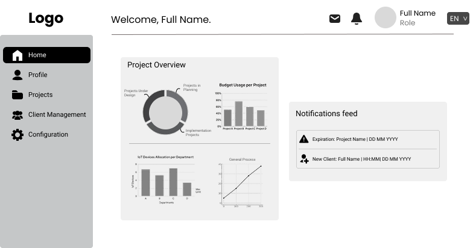
<br>

#### 2. Proflie
- El área principal de contenido está estructurada para mostrar primero un resumen del perfil del usuario ("Full Name", "Role") junto con un botón "Edit Profile". Debajo, se detallan los "Account Information", que incluyen campos para el nombre completo, correo electrónico y número de teléfono. Más abajo, se presentan opciones de configuración adicionales como el "Current Plan" con una opción para renovar, la "Time Zone"y el "App language".

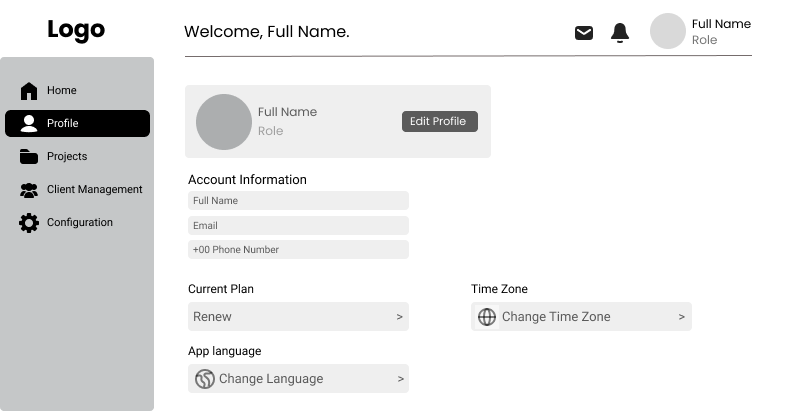
<br>

#### 3. Projects
- El área principal de contenido presenta un encabezado "My Projects" y un botón prominente "+ Add Project", sugiriendo la capacidad de crear nuevas iniciativas. Debajo, se visualizan tres tarjetas de proyecto idénticas en su estructura, cada una con un marcador de posición para una imagen, un título "Name Project", etiquetas indicando "In implementation" y la cantidad de dispositivos asociados, y una barra de progreso.

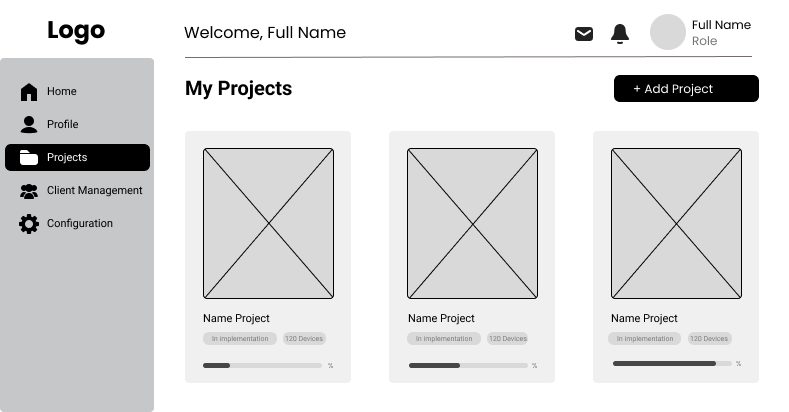
<br>

#### 4. Client Managment
- El área principal del contenido presenta el encabezado "My Clients" y un botón "+ Add Client" , lo que sugiere la capacidad de incorporar nuevos clientes al sistema. Debajo, se presenta una tabla organizada con columnas para "Full Name", "Associated Project", "Account Statement" y "Actions".

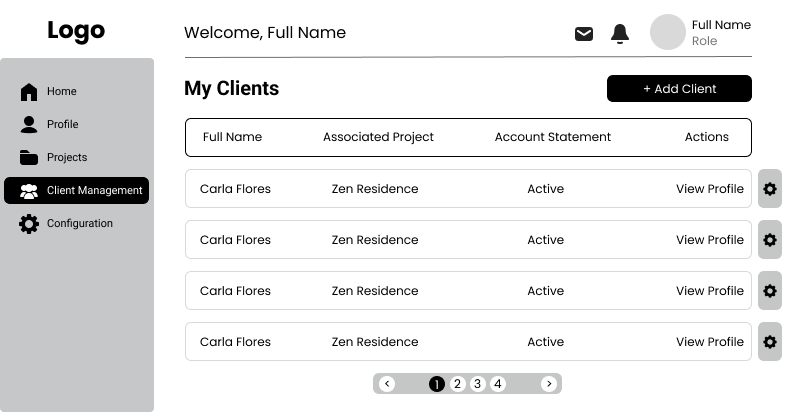
<br>

#### 5. Configuration
- El área principal del contenido se divide en tres secciones claras: "Notifications", "Security and Privacy", y "Support and Help". En la sección de Notificaciones, los usuarios pueden activar o desactivar alertas de expiración, actualizaciones del sistema y notificaciones de clientes mediante interruptores. La sección de Seguridad y Privacidad ofrece opciones para cambiar la contraseña, configurar la autenticación de dos factores y gestionar las sesiones activas, cada una con un icono de configuración para mayor detalle. Finalmente, la sección de Soporte y Ayuda proporciona enlaces a un Centro de ayuda y Contacto de Soporte.

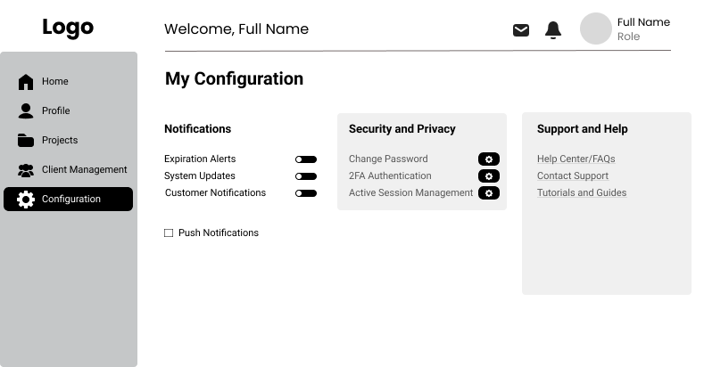
<br><br>

#### Vista del segmento #2: Propietarios de departamentos
#### 1. Home
- El área principal está dedicada a la "Project Overview", que incluye varios gráficos informativos: un gráfico circular sobre el estado de los proyectos (diseño, planificación, implementación), gráficos de barras sobre el presupuesto y la asignación de dispositivos IoT, y un gráfico de líneas para el proceso general.

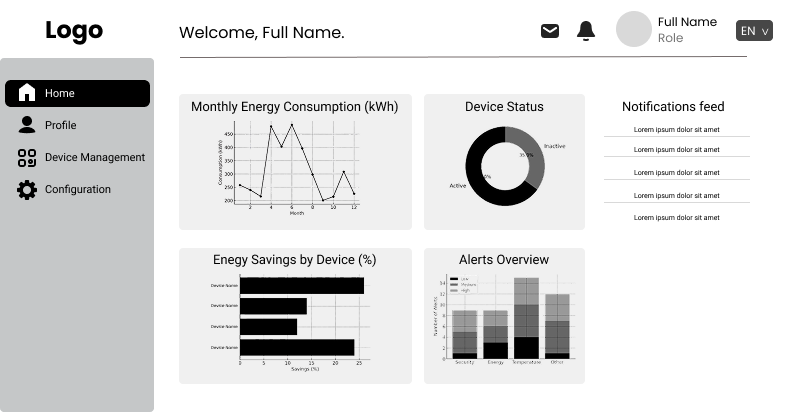
<br>

#### 2. Profile
- El área principal de contenido está estructurada para mostrar primero un resumen del perfil del usuario ("Full Name", "Role") junto con un botón "Edit Profile". Debajo, se detallan los "Account Information", que incluyen campos para el nombre completo, correo electrónico y número de teléfono. Además, se introduce una nueva sección titulada "Favorite Scene Configuration" (Configuración de Escena Favorita), que lista múltiples opciones de "Energy-Saving Mode" con botones "Use", indicando la capacidad de configurar escenarios o modos preestablecidos para dispositivos. Más abajo, se presentan opciones de configuración adicionales como el "Current Plan" con una opción para renovar, la "Time Zone"y el "App language".

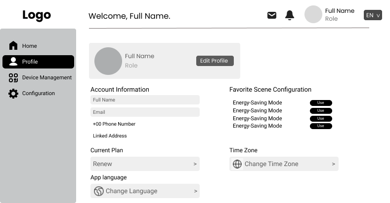
<br>

#### 3. Device Management
- El encabezado "My Devices" es prominente, acompañado de dos botones de acción principales: "+ Create Scene", que permite agrupar y automatizar múltiples dispositivos, y "+ Add Device", para incorporar nuevos equipos al sistema. La información de los dispositivos se presenta en una tabla con columnas para "Name", "Category", "Real-time status" y "Actions". La tabla lista dispositivos con estados alternos de "On" y "Off", y cada uno incluye un icono de configuración para acceder a ajustes específicos.

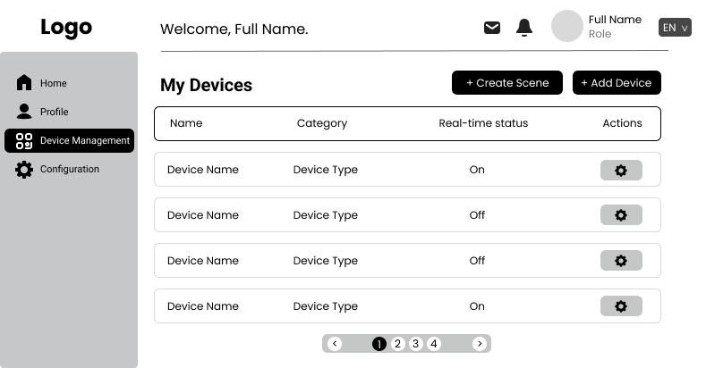
<br>

#### 4. Configuration
- El área principal del contenido se divide en tres secciones claras: "Notifications", "Security and Privacy", y "Support and Help". En la sección de Notificaciones, los usuarios pueden activar o desactivar alertas de expiración, actualizaciones del sistema y notificaciones de clientes mediante interruptores. La sección de Seguridad y Privacidad ofrece opciones para cambiar la contraseña, configurar la autenticación de dos factores y gestionar las sesiones activas, cada una con un icono de configuración para mayor detalle. Finalmente, la sección de Soporte y Ayuda proporciona enlaces a un Centro de ayuda y Contacto de Soporte. La sección "Advanced Device Management", que incluye opciones para "Automated Scenes" y "User Permissions".

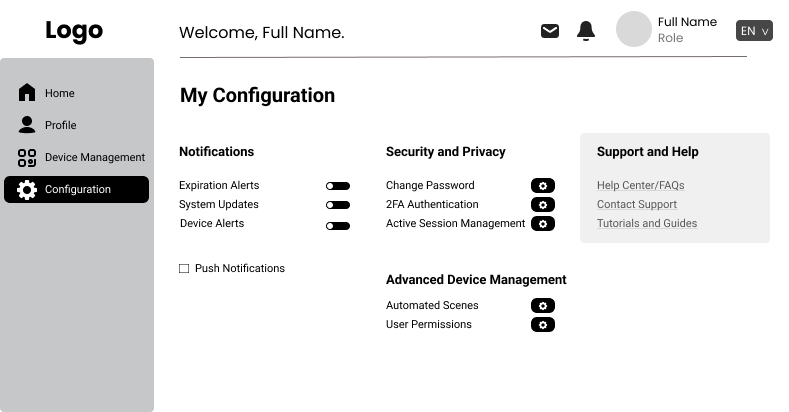
<br>

### 4.6.2. Web Applications Wireflow Diagrams.
#### Segmento Objetivo #1: Arquitectos e Ingenieros Civiles
Los arquitectos e ingenieros civiles utilizan la plataforma IoBuild para gestionar sus proyectos residenciales, centralizar la información de clientes, monitorear dispositivos IoT implementados en los edificios y configurar opciones de administración de manera eficiente.

**Login / Create Account**

**1. Login:**
- El usuario de la constructora introduce su correo corporativo y contraseña.
-  Selecciona la opción “Login” para acceder a su cuenta empresarial.

**Create Account:**
- Si es un nuevo usuario, completa un formulario con datos de la empresa, representante y correo corporativo.
- Selecciona “Create” para registrar la cuenta en el sistema.

**Acción esperada:** Autenticarse exitosamente en la plataforma y acceder al Dashboard principal.<br><br>

**2. Dashboard**
-	Una vez autenticado, el usuario accede al panel principal, donde se visualiza un menú lateral con accesos a secciones clave:
    - Home
    - Profile
    - Projects
    - Client Management
    - Configuration
-	El Dashboard sirve como centro de navegación para todas las funciones de la plataforma.

**Acción esperada:** Orientarse rápidamente en la aplicación y seleccionar la sección que desea administrar.<br><br>

**3. Profile**
-	Visualiza y edita información del usuario administrador como el nombre, logo, contacto, etc.
-	Opciones para gestionar miembros del equipo y asignar roles.

**Acción esperada:** Actualizar datos corporativos, ver plan y administrar accesos del equipo.<br><br>

**4. Project Management**
-	El usuario accede a la sección Projects, donde puede ver un listado de proyectos residenciales activos.
-	Cada proyecto incluye nombre, estado, fecha y acceso a detalles.
-	Puede pulsar “+ Add Project” para registrar un nuevo proyecto en la plataforma.

**Acción esperada:** Visualizar, gestionar o crear proyectos residenciales vinculados a la constructora.<br><br>

**5. Client Management**
-	En la sección Client Management, se despliega una tabla con los clientes asociados a cada proyecto.
-	Se muestran datos como nombre completo, proyecto asociado, estado y opciones de acción.
-	El usuario puede añadir nuevos clientes con el botón “+ Add Client”.

**Acción esperada:** Gestionar información de clientes vinculados a los proyectos residenciales.<br><br>


**6. Configuration**
-	En el apartado Configuration, la constructora puede administrar aspectos como notificaciones, seguridad, idioma de la aplicación y soporte técnico.
-	Incluye secciones de seguridad y privacidad (cambio de contraseña, autenticación en dos pasos), así como alertas del sistema.

**Acción esperada:** Personalizar la configuración de la plataforma para ajustarla a las necesidades de la empresa.<br><br>

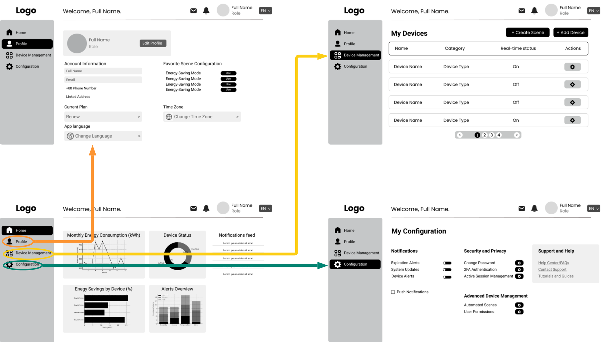


#### Segmento Objetivo #2: Dueños de apartamentos


**Login / Create Account**

**1. Login:**
- El usuario introduce su correo electrónico y contraseña.
- Pulsa “Login” para acceder a su cuenta personal.

**Create Account:**
- Si es nuevo, completa un formulario con nombre completo, correo, dirección (unidad), y contraseña.
- Pulsa “Create” para registrar la cuenta.

**Acción esperada:** Autenticarse correctamente y acceder al Dashboard personal.<br><br>

**2. Dashboard**
-	Una vez autenticado, el usuario accede al panel principal, donde se visualiza un menú lateral con accesos a secciones clave::
    - Home
    - Profile
    - Device Management
    - Configuration
-	Al ingresar, el dueño visualiza un Dashboard con widgets clave: consumo energético mensual (gráfico), estado general de dispositivos (rueda/donut), resumen de ahorros por dispositivo (gráfica) y un Notifications feed con alertas recientes.

**Acción esperada:** Obtener un panorama rápido del estado del apartamento y acceder en un clic a control de dispositivos o a la configuración.<br><br>

**3. Profile**
-	Vista para ver/editar datos personales y de la unidad: nombre, contacto, dirección vinculada, Current Plan, zona horaria e idioma.
-	Secciones: Edit Profile, Favorite Scene Configuration (botones Use para escenas guardadas), opciones para invitar a familiares o delegar accesos.

**Acción esperada:** Actualizar información del propietario, gestionar quién tiene acceso y elegir escenas favoritas para uso rápido.<br><br>

**4. Device Management**
-	Acciones principales: + Add Device y + Create Scene.
-	Dentro de cada dispositivo: estado en tiempo real, historial básico y acceso a ajustes

**Acción esperada:** Añadir, identificar y controlar dispositivos individuales de forma ágil.<br><br>

**5. Configuration**
-	Panel con secciones: Notifications, Security and Privacy (cambio de contraseña, 2FA, gestión de sesiones), Support and Help y Advanced Device Management
-	Opciones para activar/desactivar notificaciones críticas, administrar permisos de invitados y configurar preferencias globales de la unidad.

**Acción esperada:** Personalizar la experiencia y garantizar seguridad y soporte.<br>

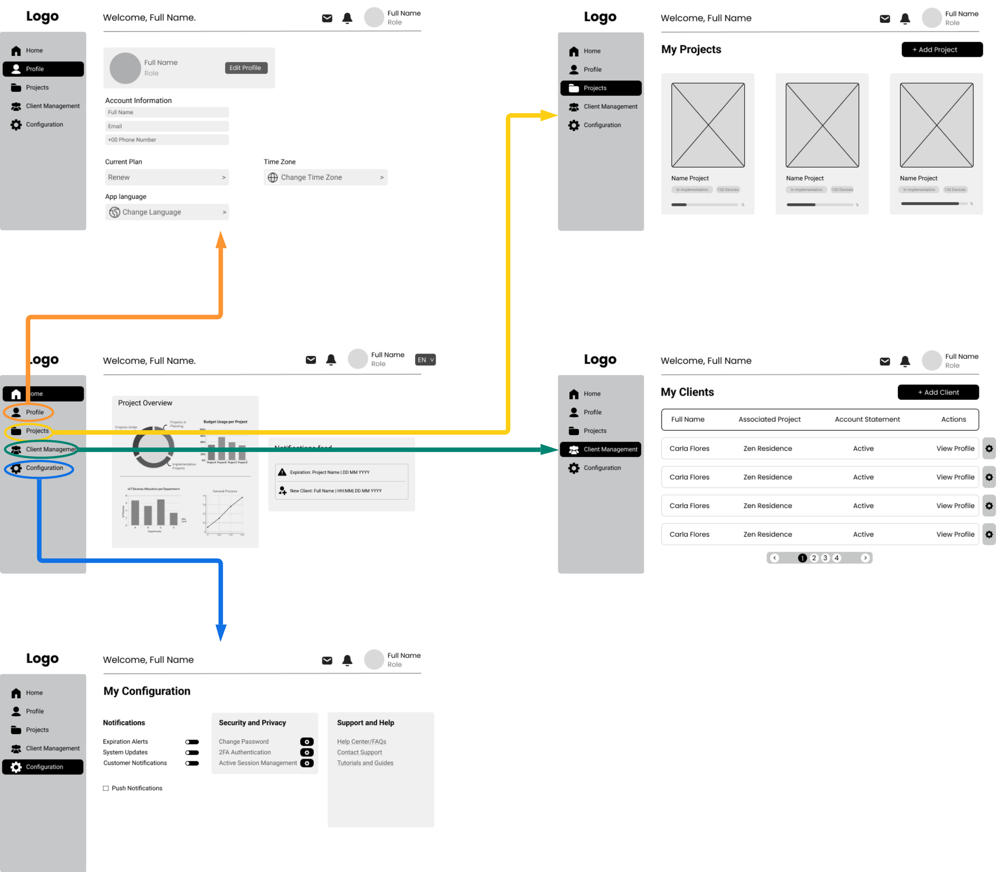

### 4.6.3. Web Applications Mock-ups.
#### Vista del segmento #1: Arquitectos e Ingenieros Civiles
#### 1. Home
- En el área principal del panel, hay una sección de "Project Overview" que incluye dos gráficos: uno de barras titulado "Budget Allocated" y uno de líneas llamado "Devices Implemented", que proporcionan una visión rápida del rendimiento. A la derecha, se encuentra un "Notification Feed" con mensajes sobre la expiración de un proyecto y la adición de un nuevo cliente.

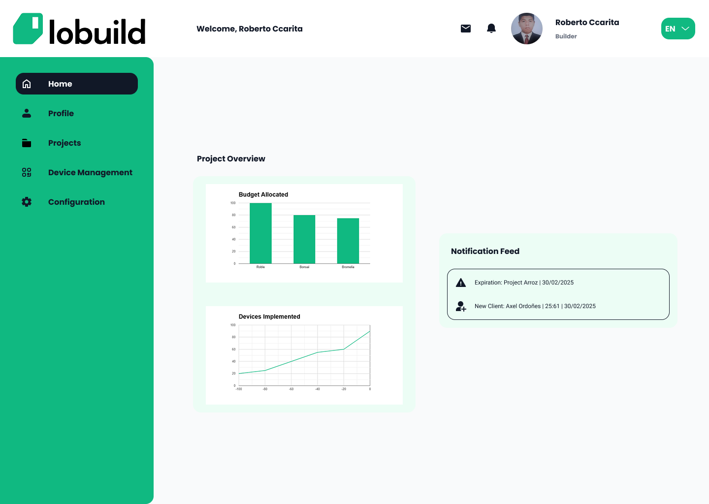
<br>

#### 2. Proflie
- En esta pantalla, se destacan los detalles del perfil del usuario, "Roberto Ccarita", con un botón prominente para "Edit Profile". La información se organiza en varias secciones claras: "Account Information", donde se muestran el nombre completo, el correo electrónico y el número de teléfono del usuario; "Time Zone", "Current Plan" y "App Language", establecido en "English".

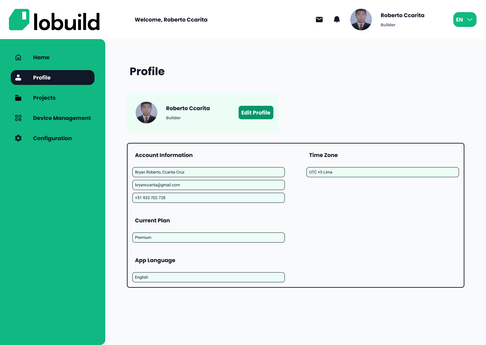
<br>

#### 3. Projects
- En esta pantalla, se presenta una galería de proyectos individuales, cada uno ilustrado con una imagen de un edificio moderno. Cada tarjeta de proyecto incluye el nombre del proyecto, su estado y la fecha de su última actualización. Un botón "More Details" para acceder a información más profunda sobre cada proyecto. Además, en la parte superior derecha, un botón "+ Add Project" indica la funcionalidad para crear nuevos proyectos dentro de la aplicación.

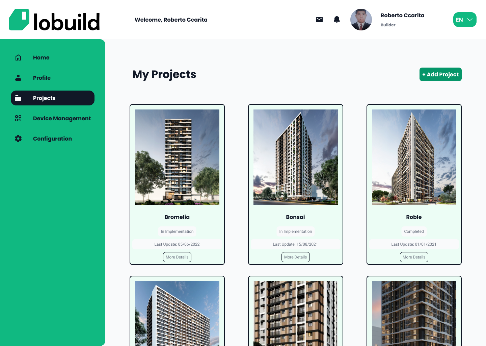
<br>

#### 4. Clients
- Esta vista presenta una tabla detallada con información de los clientes, incluyendo su "Full Name", "Associated Project", "Account Statement" y "Actions". El estado de la cuenta varía entre "Active", "Suspended" y "Stand by". Para cada cliente, se ofrecen opciones como "View Profile" y un icono de configuración, permitiendo al usuario gestionar los detalles del cliente. En la esquina superior derecha, un botón "+ Add Client" facilita la incorporación de nuevos clientes.

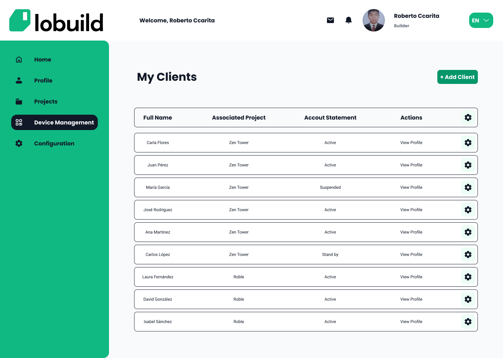
<br>

#### 5. Configuration
- Esta vista está organizada en tres áreas principales que permiten al usuario personalizar y gestionar su experiencia. La sección "Notifications" incluye toggles para activar o desactivar alertas de expiración, actualizaciones del sistema, notificaciones de clientes y notificaciones push. La sección "Security and Privacy" ofrece opciones para cambiar la contraseña, configurar la autenticación de dos factores, gestionar sesiones y añadir una dirección de correo electrónico alternativa, todas ellas con un icono de engranaje que sugiere configuraciones adicionales. Finalmente, la sección "Support and Help" proporciona enlaces a FAQs y contacto de soporte.

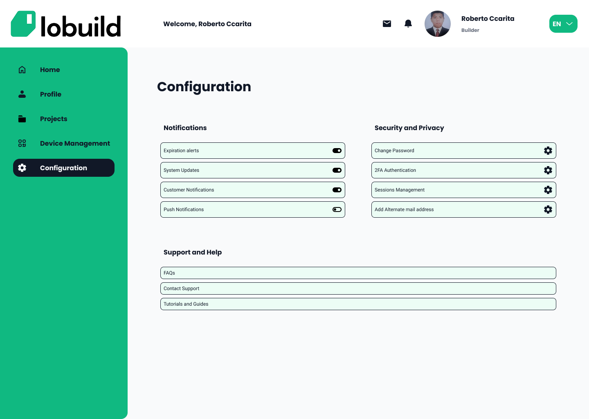
<br><br>

#### Vista del segmento #2: Propietarios de departamentos
#### 1. Home
- La sección principal, "Overview" (Resumen), incluye dos gráficos: uno de líneas que detalla el "Energy Consumption" (Consumo de Energía) a lo largo del tiempo, y un gráfico de barras que ilustra los "Energy Savings By Device (%)" (Ahorros de Energía por Dispositivo) para elementos como luces, termostatos, aire acondicionado y cámaras. A la derecha, el "Notification Feed" (Feed de Notificaciones) alerta sobre "High power consumption detected" (Se detectó un alto consumo de energía) y "Air conditioner may need maintenance" (El aire acondicionado puede necesitar mantenimiento). Esta pantalla ofrece al propietario una visión integral y en tiempo real del consumo energético y el estado de los dispositivos, facilitando la gestión eficiente de las propiedades.

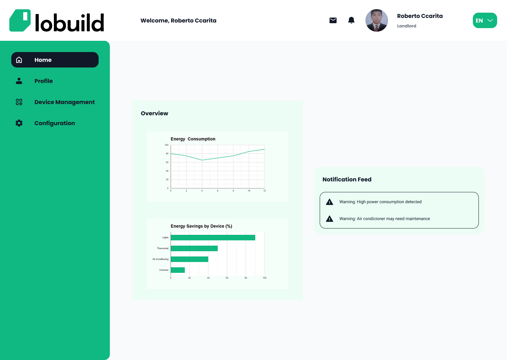
<br>

#### 2. Proflie
- En la sección "Account Information", se detallan los datos personales del usuario, incluyendo un campo adicional con una dirección. A la derecha, una sección llamada "Scenes", que presenta toggles para activar o desactivar modos como "Energy Saving Mode", "Movie" y varias opciones de "Push Notifications". La "Time Zone" (Zona Horaria) se mantiene como "UTC +5 Lima".

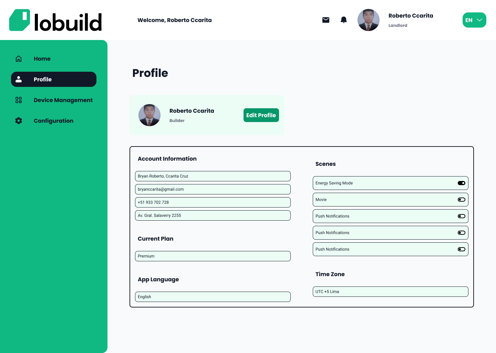
<br>

#### 3. Device Management
- Esta pantalla presenta una tabla que lista los dispositivos asociados al usuario, con columnas para "Name", "Category" y "Real Time Status". Los dispositivos mostrados incluyen termostatos, aire acondicionado, luces (exteriores e interiores), cerraduras inteligentes y cámaras de video, clasificados en categorías como "Climatization", "Zen Tower" y "Security". Los estados en tiempo real varían entre "Online", "Offline" y "Damaged", lo que proporciona una visión clara del funcionamiento de cada dispositivo. Para cada entrada, un icono de engranaje en la columna de configuración. En la parte superior derecha, un botón "+ Add Device" permite al usuario incorporar nuevos dispositivos a su sistema, lo que hace de esta sección una herramienta central para el control y monitoreo de la infraestructura inteligente.

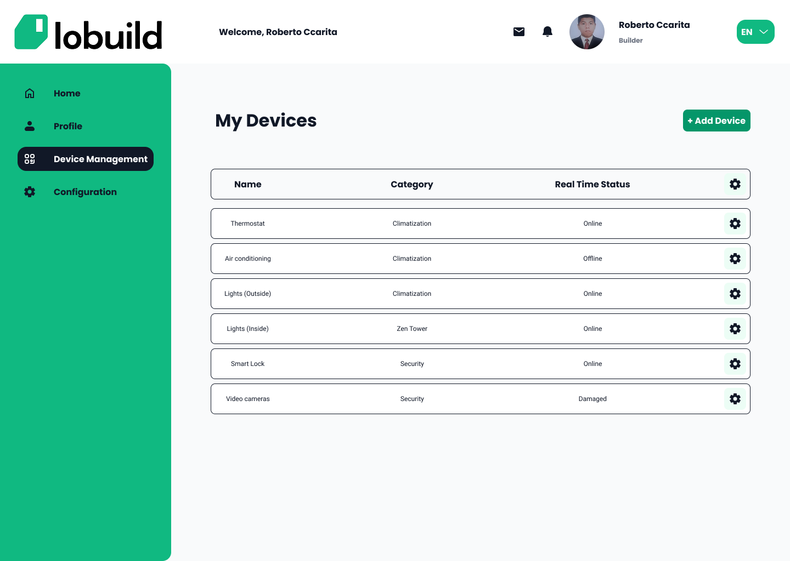
<br>

#### 4. Configuration
- Esta vista está organizada en tres áreas principales que permiten al usuario personalizar y gestionar su experiencia. La sección "Notifications" incluye toggles para activar o desactivar alertas de expiración, actualizaciones del sistema, notificaciones de clientes y notificaciones push. La sección "Security and Privacy" ofrece opciones para cambiar la contraseña, configurar la autenticación de dos factores, gestionar sesiones y añadir una dirección de correo electrónico alternativa, todas ellas con un icono de engranaje que sugiere configuraciones adicionales. Finalmente, la sección "Support and Help" proporciona enlaces a FAQs y contacto de soporte.

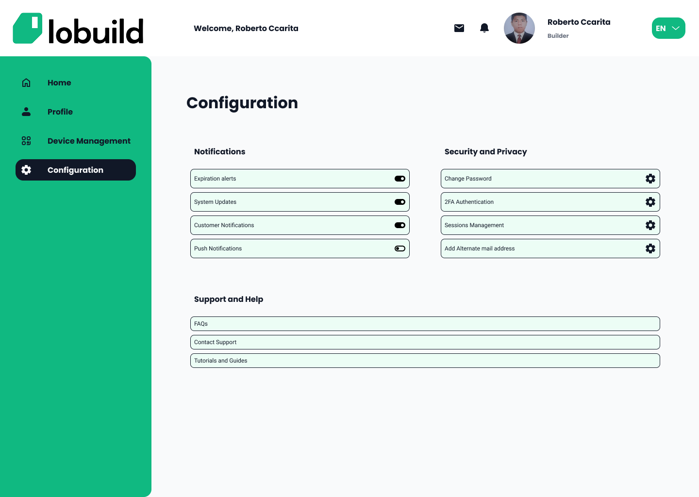
<br>

### 4.6.4. Web Applications User Flow Diagrams
#### Segmento Objetivo #1: Arquitectos e Ingenieros Civiles

**1. Profile**
**User Goal:** Como ingeniero, quiero ver y editar mi infomación.
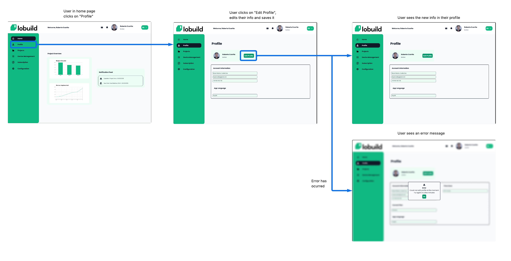

**2. Project Management**
**User Goal:** Como ingeniero, quiero ver, editar y añadir projects en los que estoy trabajando.
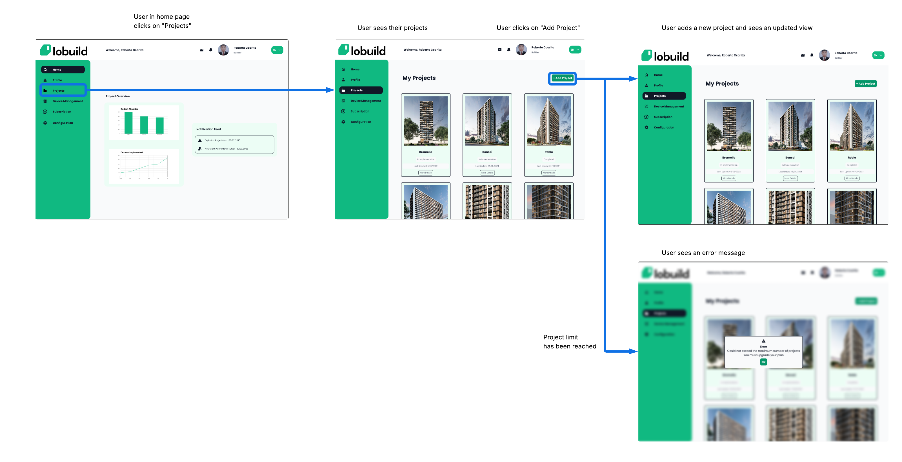

**3. Client Management**
**User Goal:** Como ingeniero, quiero monitorear los dispositivos de los projectos en los que estoy trabajando.
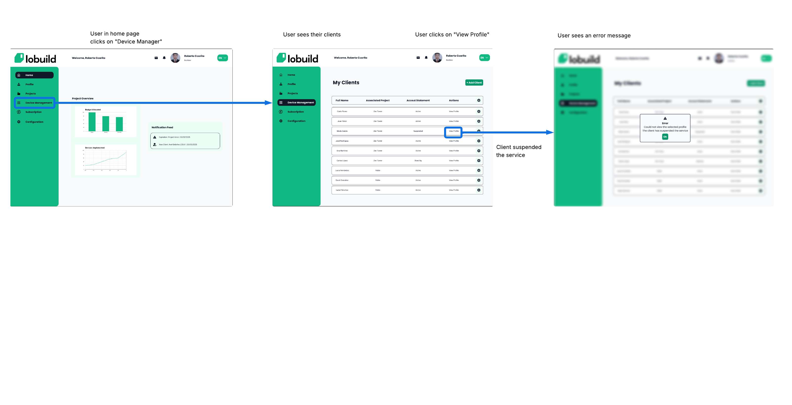

**4. Configuration**
**User Goal:** Como ingeniero, quiero personalizar la configuración de la plataforma.
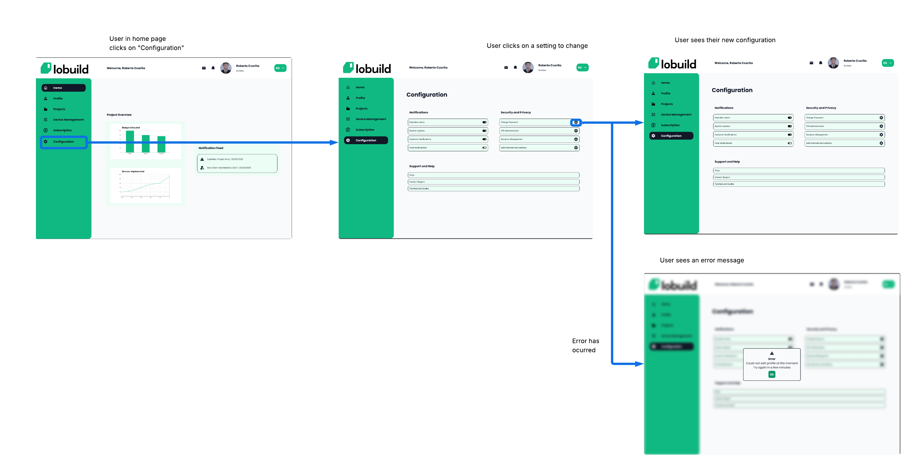

#### Segmento Objetivo #2: Dueños de apartamentos

**1. Profile**
**User Goal:** Como propietario, quiero ver y editar mi infomación.
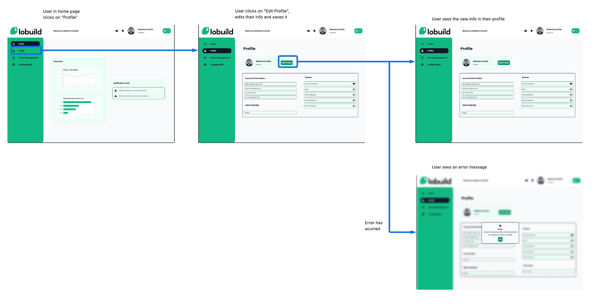

**2. Device Management**
**User Goal:** Como propietario, quiero monitorear y configurar mis dispositivos.
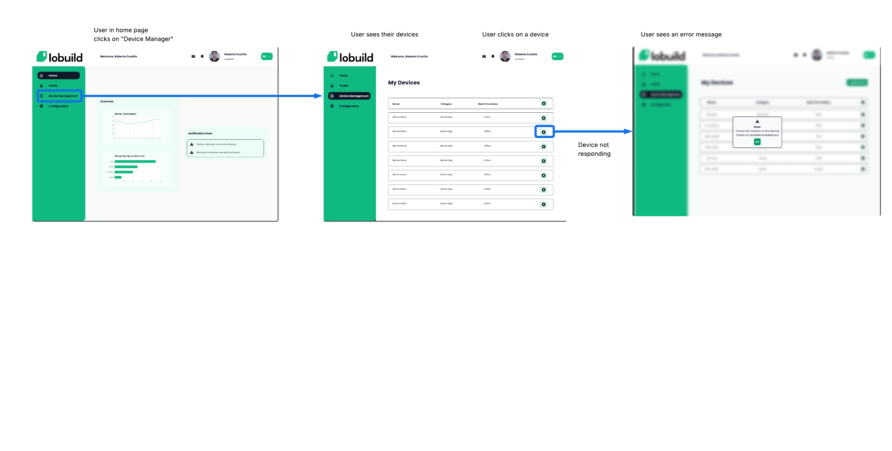

**3. Configuration**
**User Goal:** Como propietario, quiero personalizar la configuración de la plataforma.
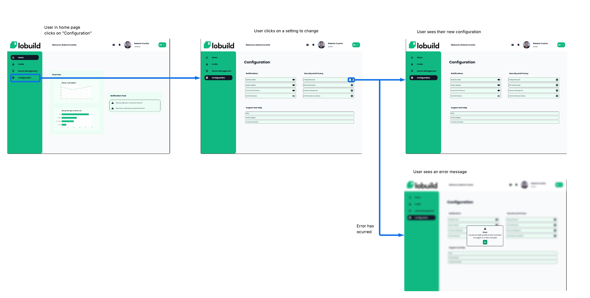

## 4.7. Web Applications Prototyping
En esta etapa se presentan los prototipos de la aplicación web IoBuild, diseñados para navegadores de escritorio. El enfoque está en simular los flujos principales de cada segmento objetivo, garantizando una experiencia clara y funcional en pantallas grandes.

**Segmento constructoras**
<br>
Los ingenieros usan la plataforma para gestionar proyectos residenciales, centralizar información de clientes, monitorear dispositivos IoT y configurar opciones de administración.

- Desde el menú Home, acceden al Dashboard con datos de sus proyectos.

- La barra lateral incluye cinco menús principales: Home, Profile, Project, Device Management y Configuration.

- En Device Management se despliega la lista de clientes con datos como nombre, proyecto, estado de cuenta y opciones de gestión.

- Al seleccionar un cliente, pueden visualizar el estado de los dispositivos IoT relacionados; si hay restricciones o errores, el sistema muestra un aviso.

**Segmento Dueños de Departamentos**<br>
Los propietarios buscan controlar de forma remota sus dispositivos y conocer su rendimiento.

- El recorrido inicia en Home, donde se muestra un Dashboard con información general de los dispositivos.

- En este caso, el menú lateral incluye cuatro opciones: Home, Profile, Device Management y Configuration.

- En Device Management aparece la lista de aparatos conectados al departamento, con datos como nombre, categoría y estado.

- El usuario puede ingresar al detalle de cada dispositivo o recibir un mensaje de error en caso de restricciones.

Con estos flujos, los prototipos evidencian cómo cada tipo de usuario interactúa con la aplicación, asegurando una navegación coherente y ajustada a sus necesidades.

A continuación se presenta el video con los prototipos navegables de ambos segmentos: https://goo.su/Cor4Q

## 4.8. Domain-Driven Software Architecture
### 4.8.1. Software Architecture Context Diagram
El diagrama de contexto muestra la vista más general de IoBuild, destacando a sus actores principales y cómo se relacionan con la plataforma. En este nivel aparecen dos roles clave: las Constructoras, que usan IoBuild para agregar funciones inteligentes a sus proyectos y darles un valor diferencial; y los Propietarios, que ingresan al sistema para personalizar su hogar o espacio de trabajo de forma fácil y sin necesidad de conocimientos técnicos.

Aunque sus objetivos son distintos, ambos se conectan a la misma plataforma, que hace posible que los edificios y viviendas se conviertan en entornos más cómodos, accesibles y personalizables.

Este modelo refuerza la misión de IoBuild: acercar la tecnología de los espacios inteligentes a constructoras y propietarios con herramientas prácticas, simples y útiles. Además, gracias a su diseño modular, la plataforma puede adaptarse a diferentes mercados y necesidades sin perder su esencia.

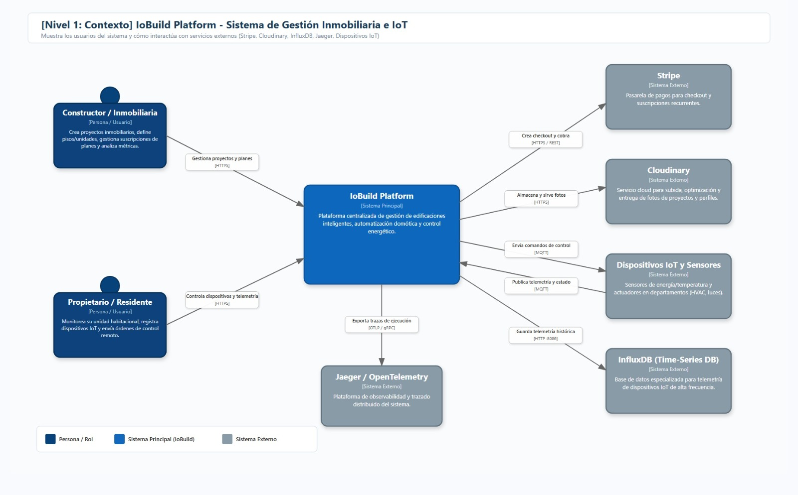

### 4.8.2. Software Architecture Container Diagrams

El diagrama de contenedores profundiza en la estructura interna del sistema y muestra cómo está organizado IoBuild en términos de sus principales componentes de ejecución. La aplicación se compone de tres contenedores principales: la Landing Page, la Web App en SPA y el API Backend. Cada uno cumple un rol específico dentro del modelo de negocio.

La Landing Page funciona como el punto de entrada, mostrando la propuesta de valor de IoBuild y diferenciando la experiencia según el tipo de usuario, ya sea una constructora o un propietario. Desde allí, los usuarios acceden a la Web App, una interfaz de una sola página (SPA) que reúne las funcionalidades principales: configuración de espacios inteligentes, personalización de ambientes, gestión de dispositivos y administración de perfiles.

Esta SPA se conecta con un API Backend central, encargado de coordinar las operaciones entre los distintos módulos de la plataforma, como la gestión de proyectos, la administración de dispositivos y la configuración de automatizaciones.

Gracias a este diseño modular, IoBuild mantiene una separación clara entre la experiencia de usuario y la lógica de negocio, lo que permite escalar sus funciones y reducir el tiempo de despliegue de nuevas capacidades.

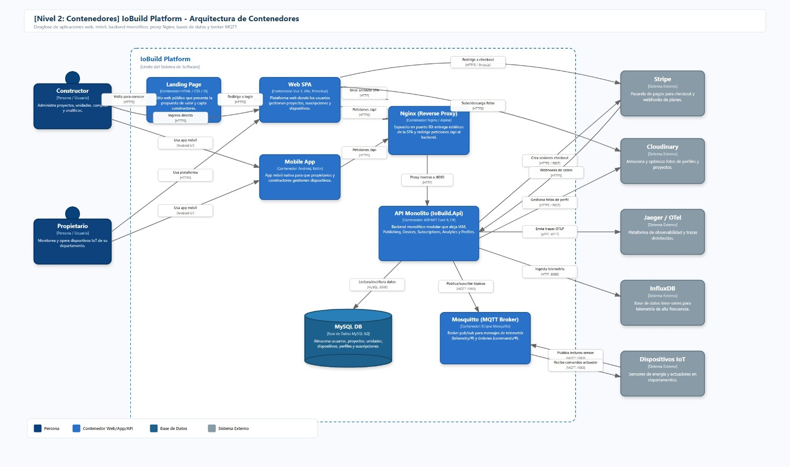

### 4.8.3. Software Architecture Components Diagrams

El diagrama de componentes muestra la estructura interna de la **IoBuild Platform API Application**, destacando cómo sus capacidades principales se organizan en **bounded contexts**, cada uno implementado como un componente independiente en ASP.NET Core.

Dentro de la aplicación API, el dominio está dividido en los siguientes componentes:

- **IAM**  
  Gestiona la autenticación, autorización e identidades mediante JWT y BCrypt.

- **Devices**  
  Administra dispositivos IoT, sus configuraciones y operaciones relacionadas.

- **Projects**  
  Maneja la creación, administración y ciclo de vida de proyectos, incluyendo gestión de medios con **Cloudinary**.

- **Profiles**  
  Gestiona la información y los datos de perfil de los usuarios.

- **Clients**  
  Administra la información de clientes y sus relaciones.

- **Subscriptions**  
  Gestiona planes de suscripción, ciclos de facturación y se integra con **Stripe** para pagos.

- **Analytics**  
  Procesa y provee datos analíticos sobre dispositivos, proyectos y clientes.

- **Shared**  
  Contiene funcionalidades compartidas, como repositorios base, patrones de mediación, utilidades y abstracciones comunes.

En conjunto, este diagrama muestra cómo la aplicación API está modularizada, cómo colaboran los diferentes componentes y cómo se conectan tanto con servicios externos como con la base de datos central.

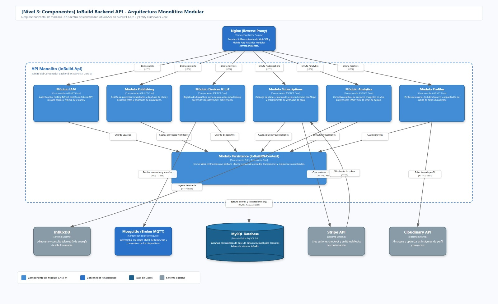

## 4.9. Software Object-Oriented Design
### 4.9.1. Class Diagrams

**Identity and Access Management**

El bounded context de Identity and Access Management (IAM) se encarga de gestionar la autenticación, autorización y administración de usuarios dentro de la plataforma IoBuild. Este contexto define las entidades principales como User (usuario) y Role (rol), estableciendo la base para controlar quién tiene acceso al sistema y qué permisos posee. Además, implementa servicios de hashing de contraseñas mediante BCryptPasswordHasher y generación de tokens JWT a través de JwtTokenService, asegurando la seguridad en cada interacción. Los repositorios y servicios de comandos/consultas facilitan la creación, actualización y consulta de usuarios, mientras que las políticas de autorización protegen los recursos críticos del sistema.

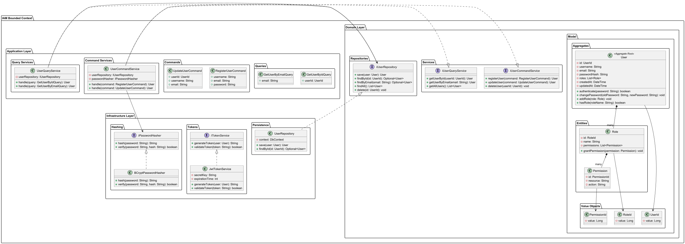

**Subscriptions and Payments Management**

El diagrama de clases de Subscriptions representa la estructura del modelo de negocio de suscripciones siguiendo Domain-Driven Design (DDD). Los agregados principales son Subscription (que vincula un builder con un plan específico, controlando estado y vigencia) y Plan (que define características, precio y límites de cada nivel de servicio). El diagrama muestra la separación clara entre capas: Domain (agregados, commands, queries, servicios e interfaces de repositorios), Application (implementación de servicios de comandos y consultas, además del ACL SubscriptionsContextFacade que expone funcionalidades a otros bounded contexts), e Infrastructure (repositorios concretos con Entity Framework y servicios de pago con Stripe). Los commands y queries implementan el patrón CQRS, separando operaciones de escritura (crear/actualizar) de las de lectura (consultas). Este diseño facilita la evolución independiente del contexto, manteniendo bajo acoplamiento con otros módulos del sistema.

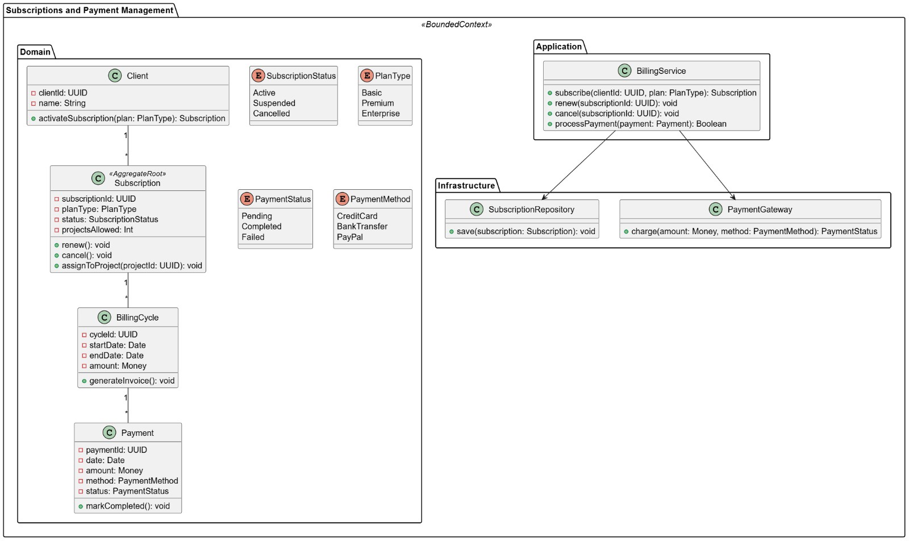

**Projects Management**

El bounded context de Projects Management gestiona el ciclo de vida de los proyectos de construcción inteligentes dentro de IoBuild. El agregado principal Project encapsula información como nombre, descripción, ubicación, estado y unidades asociadas, permitiendo que arquitectos e ingenieros organicen y supervisen sus desarrollos inmobiliarios. Las entidades Unit representan los espacios individuales (apartamentos, oficinas) dentro de cada proyecto, incluyendo detalles como número de unidad, piso, área y estado de ocupación. Este contexto también define servicios de comandos y consultas que permiten crear, actualizar, listar y eliminar proyectos, manteniendo una separación clara entre la lógica de dominio y la infraestructura de persistencia.

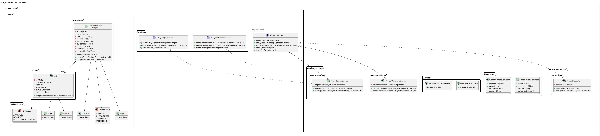

**Profile and Preferences Management**

El bounded context de Profiles Management administra la información personal y las preferencias de los usuarios dentro de la plataforma IoBuild. El agregado Profile encapsula datos como nombre, teléfono, dirección y configuraciones de usuario, vinculándose directamente con el User del contexto IAM. Las entidades UserPreferences y NotificationSettings permiten personalizar aspectos como idioma, zona horaria y canales de notificación (correo, push, SMS), adaptando la experiencia a las necesidades individuales de cada propietario o ingeniero. Los servicios de comandos y consultas facilitan la creación, actualización y consulta de perfiles, asegurando que la información del usuario esté siempre disponible y actualizada.

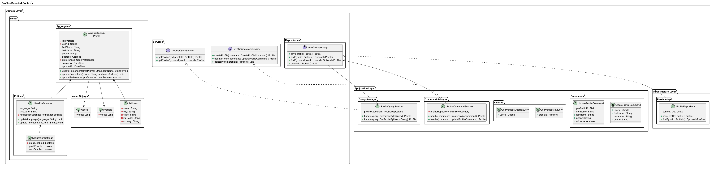

**Devices Management**

El bounded context de Devices Management se enfoca en la administración y monitoreo de dispositivos IoT dentro de los espacios inteligentes. El agregado raíz Device representa cada dispositivo físico conectado (luces, termostatos, cámaras, cerraduras, sensores), almacenando su tipo, ubicación, estado operativo y configuración. Las entidades TelemetryData permiten registrar métricas en tiempo real, mientras que DeviceConfiguration facilita la personalización de parámetros específicos de cada equipo. Los servicios de comandos y consultas posibilitan el registro, actualización, eliminación y búsqueda de dispositivos, garantizando que propietarios e ingenieros puedan gestionar su infraestructura inteligente de forma centralizada y eficiente.

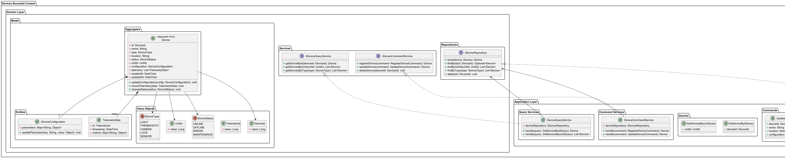

**Analytics**

El bounded context de Analytics se especializa en la recopilación, procesamiento y visualización de métricas operativas dentro de IoBuild. Los agregados principales EnergyConsumption y OccupancyRecord registran datos clave como el consumo energético por dispositivo/unidad y los niveles de ocupación en diferentes períodos de tiempo. Estos datos permiten a ingenieros y propietarios tomar decisiones informadas sobre eficiencia energética, planificación de recursos y optimización de espacios. Los servicios de consulta y repositorios asociados facilitan la extracción de información histórica y la generación de reportes personalizados, contribuyendo al objetivo de crear edificios inteligentes, sostenibles y eficientes.

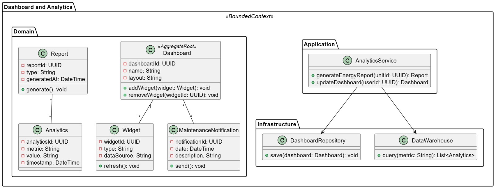

## 4.10. Database Design
### 4.10.1. Database Diagram

**Identity and Access Management**

El diagrama de base de datos de Identity and Access Management (IAM) modela la estructura para gestionar usuarios, roles y permisos dentro de la plataforma IoBuild. La tabla users almacena la información básica de autenticación (nombre de usuario, email y hash de contraseña). Los roles (roles) definen conjuntos de permisos que pueden ser asignados a usuarios mediante la tabla intermedia user_roles. Los permisos específicos (permissions) detallan qué acciones están permitidas sobre qué recursos, y se vinculan a roles mediante role_permissions. Este diseño permite una gestión flexible y escalable de la seguridad, facilitando la asignación dinámica de permisos según el contexto y las necesidades del negocio.


**Subscriptions and Payments Management**

El diagrama de base de datos de Subscriptions modela la persistencia del sistema de suscripciones y facturación. La tabla plans almacena los diferentes niveles de servicio disponibles (Basic, Pro, Enterprise), incluyendo precio, descripción, características (en formato texto delimitado), límites de dispositivos y administradores, nivel de soporte, y acceso a API/analytics. La tabla subscriptions vincula cada builder con un plan específico, registrando el estado (active, cancelled, expired), fechas de inicio y fin, facilitando el control de vigencia y renovaciones. Las transacciones financieras se registran en payments, que incluye integración con Stripe mediante el campo stripe_payment_intent_id, almacenando monto, moneda, método de pago y estado. Finalmente, invoices documenta las facturas generadas por cada pago, con número de factura único, montos totales e impuestos, y fechas de emisión, vencimiento y pago. Los índices estratégicos optimizan consultas por builder, plan, estado de suscripción y transacciones de Stripe.

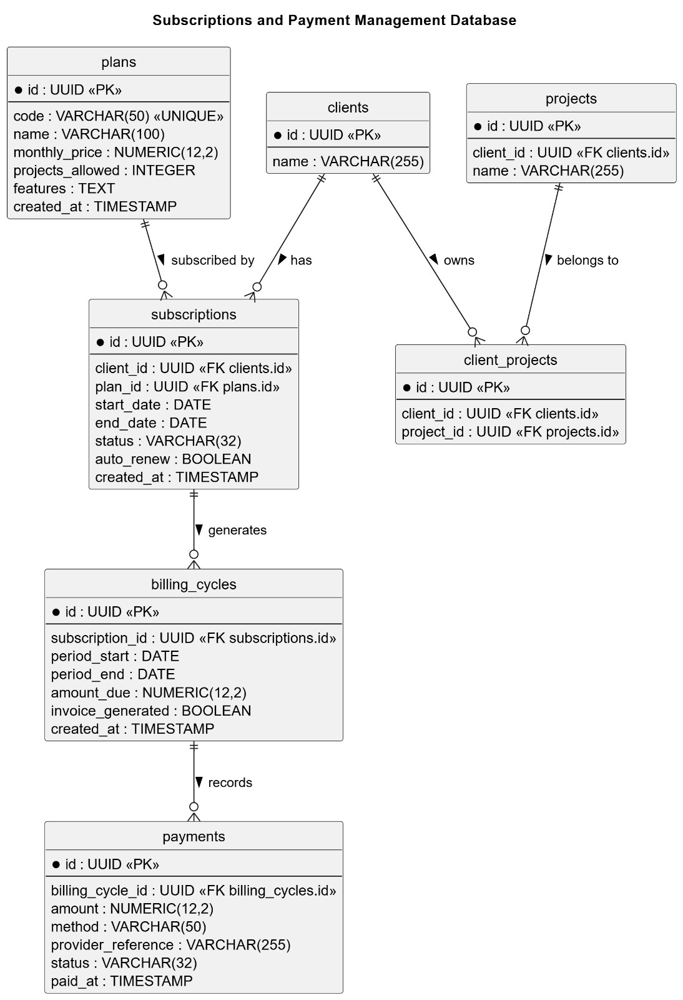

**Profile and Preferences Management**

El diagrama de Profile and Preferences Management modela la información personal y preferencias de los usuarios dentro de IoBuild. La tabla profiles contiene datos como nombre completo, teléfono y dirección completa (calle, ciudad, estado, código postal y país), vinculándose directamente con los usuarios del sistema. Las preferencias del usuario se almacenan en user_preferences, incluyendo idioma, zona horaria y configuraciones de notificaciones (email, push y SMS). Este modelo permite personalizar la experiencia de cada usuario, adaptando el sistema a sus necesidades individuales y facilitando la gestión de su información personal de forma centralizada.

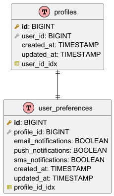

**Devices Management**

El diagrama de Devices Management representa la gestión y monitoreo de dispositivos IoT dentro de la plataforma. La tabla devices almacena información esencial de cada dispositivo (nombre, tipo, ubicación, estado y configuración en formato JSON). Los datos de telemetría se registran en telemetry_data, capturando métricas en tiempo real con sus timestamps correspondientes. La tabla device_configurations mantiene un historial versionado de las configuraciones aplicadas a cada dispositivo, incluyendo parámetros en JSON y fecha de aplicación. Este diseño permite un control granular sobre el estado operativo de los dispositivos, facilita el análisis histórico de su comportamiento y soporta la toma de decisiones basada en datos para optimización energética y mantenimiento predictivo.

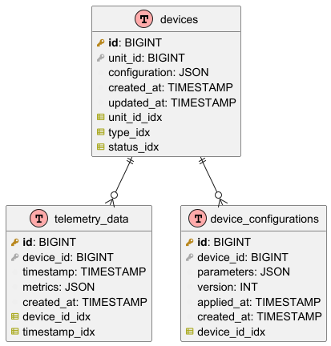


**Projects Management**

El diagrama de Projects Management describe la estructura para gestionar proyectos de construcción inteligentes y las unidades asociadas. La tabla projects almacena información clave como nombre, descripción, ubicación, estado actual y el constructor responsable (referenciado por builder_id). Cada proyecto puede contener múltiples unidades (units), que representan espacios individuales (apartamentos, oficinas) con detalles como número de unidad, piso, área y estado de ocupación. La relación con builders permite identificar al responsable del proyecto, mientras que residents vincula a los ocupantes de cada unidad. Este diseño facilita la administración centralizada de proyectos inmobiliarios y sus componentes.

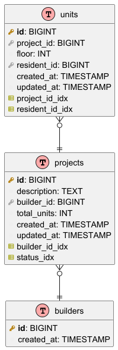


**Analytics**

El diagrama de Dashboard and Analytics modela la captura y análisis de métricas operativas en IoBuild. La tabla energy_consumption registra el consumo energético de cada dispositivo y unidad, incluyendo timestamp, valor, unidad de medida y metadatos adicionales en formato JSON. Los registros de ocupación (occupancy_records) capturan porcentajes de ocupación y número de dispositivos activos por unidad en momentos específicos. Finalmente, analytics_reports almacena reportes generados bajo demanda, especificando tipo de reporte, período analizado, proyecto asociado y datos completos en formato JSON. Este modelo permite a ingenieros y propietarios tomar decisiones informadas sobre eficiencia energética, planificación de recursos y optimización de espacios, contribuyendo al objetivo de crear edificios inteligentes y sostenibles.

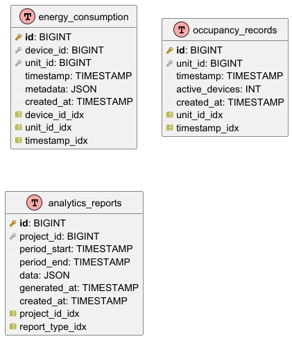

<div style="page-break-before: always;"></div>

## Capítulo V: Product Implementation
## 5.1. Software Configuration Management

La gestion de configuracion de software del proyecto IoBuild define y controla el conjunto de herramientas, servicios y convenciones necesarios para asegurar un desarrollo movil consistente, trazable y reproducible.  
En esta seccion se documentan los componentes del entorno de desarrollo, su proposito dentro del proyecto y su aporte a la calidad del producto final.

### 5.1.1. Software Development Environment Configuration

Para la implementacion de la solucion, se configuro un entorno de desarrollo orientado a aplicaciones moviles Android, integracion con servicios backend y soporte para diseno UX/UI, documentacion y colaboracion del equipo.

| Producto/Herramienta | Categoria | Ruta de Descarga/Acceso | Proposito en el Proyecto |
|---|---|---|---|
| OpenJDK | Desarrollo Backend | https://openjdk.org/ | Entorno de ejecucion para aplicaciones Java |
| Apache Maven | Desarrollo Backend | https://maven.apache.org/ | Gestion de dependencias y construccion del proyecto |
| Spring Boot | Desarrollo Backend | https://spring.io/projects/spring-boot | Framework para desarrollo de APIs RESTful |
| Android Studio | Desarrollo Movil | https://developer.android.com/studio | IDE para desarrollo de aplicaciones Android nativas |
| Kotlin | Desarrollo Movil | Incluido en Android Studio | Lenguaje de programacion para aplicacion movil |
| Render PostgreSQL | Base de Datos | https://render.com/docs/postgresql | Base de datos relacional en la nube |
| Material Design 3 | Diseno UX/UI | https://m3.material.io/ | Sistema de diseno para interfaces consistentes |
| Jira | Gestion de Proyectos | https://www.atlassian.com/es/software/jira | Gestion de backlog y sprints |
| UXPressia | Gestion de Requisitos | https://uxpressia.com/ | Creacion de User Personas, Journey Maps e Impact Mapping |
| PlantUML | Documentacion | https://plantuml.com/ | Creacion de diagramas de arquitectura y flujos |
| Postman | Testing APIs | https://www.postman.com/ | Pruebas de endpoints RESTful |
| Git | Control de Versiones | https://git-scm.com/ | Control de versiones del codigo fuente |
| GitHub | Repositorio | https://github.com/ | Almacenamiento y colaboracion en codigo |
| Render | Despliegue Backend | https://render.com/ | Plataforma de despliegue para aplicaciones Spring Boot |
| Firebase Cloud Messaging | Notificaciones Push | https://firebase.google.com/ | Servicio de notificaciones push para dispositivos moviles |

### 5.1.2. Source Code Management

La gestion del codigo fuente de IoBuild se realiza con Git y GitHub, siguiendo practicas estandar para asegurar trazabilidad, colaboracion efectiva y control de cambios durante todo el ciclo de desarrollo.

**Gestion de Repositorios**

El proyecto utiliza GitHub como plataforma centralizada de control de versiones. La organizacion del codigo se separa por componente para facilitar mantenimiento independiente y evolucion controlada del sistema.

| Producto | URL del Repositorio | Descripcion |
|---|---|---|
| Landing Page | https://github.com/CcaritaTech-upc/ccarita-tech.website | Sitio web de presentacion del producto |
| Web Application | https://github.com/CcaritaTech-upc/ccarita-tech.webapp | Aplicación web hecha en Vue.js |
| Mobile Application Kotlin | https://github.com/CcaritaTech-upc/ccarita-tech.mobileapp | Aplicacion movil nativa Android |
| Project Report | https://github.com/CcaritaTech-upc/ccarita-tech.report | Reporte tecnico y documentacion del proyecto |

**Implementacion de GitFlow**

Se adopta GitFlow como estrategia de branching para estructurar el trabajo del equipo. Este modelo define ramas principales para produccion e integracion, junto con ramas de soporte para nuevas funcionalidades, releases y hotfixes. Con ello se mantiene la estabilidad del codigo y se ordena el flujo de trabajo entre desarrollo, validacion y entrega.

**Convenciones de Nomenclatura**

Para mantener consistencia en el repositorio, se establecen convenciones de nombres para ramas:

- `feature/<modulo>-<descripcion-corta>`
- `release/v<major>.<minor>.<patch>`
- `hotfix/v<major>.<minor>.<patch>`
- `bugfix/<modulo>-<descripcion-corta>`

Estas convenciones permiten identificar rapidamente el proposito de cada rama y mejoran la coordinacion entre integrantes.

**Versionado Semantico**

El proyecto sigue Semantic Versioning (`MAJOR.MINOR.PATCH`):

- `MAJOR`: cambios incompatibles con versiones anteriores.
- `MINOR`: nuevas funcionalidades compatibles.
- `PATCH`: correcciones de errores sin romper compatibilidad.

Este esquema comunica claramente el impacto de cada version y facilita la planificacion de despliegues.

**Conventional Commits**

Se utiliza la especificacion Conventional Commits para estandarizar los mensajes de commit y mejorar la trazabilidad del historial. Formato base:

`<type>(<scope>): <description>`

Tipos de commit mas usados:

- `feat`: nueva funcionalidad.
- `fix`: correccion de error.
- `docs`: cambios en documentacion.
- `refactor`: mejora interna sin cambiar comportamiento funcional.
- `test`: incorporacion o ajuste de pruebas.
- `chore`: tareas de mantenimiento o configuracion.

Esta convencion facilita auditoria de cambios y futura generacion automatica de changelogs.

### 5.1.3. Source Code Style Guide & Conventions

El proyecto **IoBuild** define una guia de estilo comun para mantener consistencia, legibilidad y mantenibilidad en sus componentes de backend, aplicacion movil, landing page y documentacion tecnica.

**1. Estandares de Nomenclatura y Estilo**

Se adopta nomenclatura en ingles para elementos de codigo (clases, metodos, variables, paquetes y ramas). Esta decision reduce ambiguedades, facilita la colaboracion y mantiene alineacion con la documentacion oficial de las tecnologias utilizadas.

Reglas generales aplicadas:

- Nombres descriptivos y orientados a responsabilidad.
- Una sola convencion por tipo de elemento en todo el proyecto.
- Evitar abreviaciones no estandar.
- Mantener consistencia entre codigo, pruebas y documentacion.

**2. Convenciones para Backend y APIs**

Para backend con Java y Spring Boot se toma como base **Google Java Style Guide** y buenas practicas del ecosistema Spring:

- Clases en `PascalCase` y metodos/atributos en `camelCase`.
- Paquetes en minusculas, organizados por dominio o responsabilidad.
- Controladores REST con rutas claras, recursos en plural y uso correcto de verbos HTTP.
- Separacion por capas: `controller`, `application/service`, `domain`, `infrastructure`.
- DTOs para requests/responses y validaciones en capa de entrada.

Esto permite una API consistente, facil de mantener y alineada con arquitectura limpia y DDD definido en el proyecto.

**3. Estandares para Desarrollo Movil**

Para la aplicacion Android en Kotlin se siguen las convenciones oficiales de Kotlin y Android:

- Clases y composables en `PascalCase`.
- Funciones, propiedades y variables en `camelCase`.
- Constantes en `UPPER_SNAKE_CASE`.
- Estructura por features/pantallas para mejorar escalabilidad.
- Uso consistente de componentes Material Design 3 para UI.

Estas reglas aseguran codigo idiomatico, legible y coherente con las practicas actuales de desarrollo movil nativo.

**4. Convenciones para Pruebas y Especificaciones**

Las pruebas unitarias y de integracion usan nombres descriptivos que explican escenario y resultado esperado.

Convenciones aplicadas:

- Nombre de test orientado a comportamiento: `shouldExpectedResultWhenCondition`.
- Estructura `Arrange - Act - Assert`.
- Separacion de pruebas por capa o feature.
- En pruebas de aceptacion con Gherkin, uso de escenarios claros bajo `Given - When - Then`.

Con este enfoque, las pruebas funcionan como evidencia tecnica y documentacion viva de los requisitos.

**5. Guias para Frontend y Documentacion**

Para la landing page (HTML/CSS/JS) se aplican buenas practicas de estilo inspiradas en guias de Google y estandares web:

- HTML semantico y jerarquia clara de encabezados.
- Clases CSS con nombres descriptivos y consistentes.
- Separacion de estructura, estilos y comportamiento.
- Diseno responsive para desktop y mobile.

Para la documentacion (`README`, diagramas y evidencias), se mantiene formato uniforme:

- Titulos y secciones con numeracion consistente.
- Tablas para configuraciones, herramientas y trazabilidad.
- Lenguaje tecnico claro y directo.
- Actualizacion continua de evidencias por sprint.

Estas convenciones fortalecen la calidad del codigo y facilitan el trabajo colaborativo durante todo el ciclo de vida del producto.

### 5.1.4. Software Deployment Configuration

El proyecto IoBuild implementa una estrategia de despliegue diferenciada por componente, utilizando servicios en la nube y canales de distribucion acordes al tipo de aplicacion. Esta aproximacion permite optimizar recursos y mantener una entrega continua para landing page, backend y aplicacion movil.

**1. Landing Page**

- **Tipo de aplicacion:** Sitio estatico (HTML, CSS, JavaScript)
- **Plataforma de despliegue:** GitHub Pages (o Netlify, segun definicion del equipo)
- **Fuente de despliegue:** Rama `main` del repositorio de Landing Page
- **Estrategia:** Despliegue automatico por cada push/merge a `main`
- **Objetivo:** Publicar una pagina informativa del producto con acceso web para stakeholders y usuarios objetivo

**2. Backend (Web Service)**

- **Tipo de servicio:** Web Service
- **Plataforma:** Render
- **Runtime:** Java (Spring Boot)
- **Fuente de despliegue:** Rama `main` del repositorio backend
- **Base de datos:** Render PostgreSQL
- **Variables de entorno referenciales:** `DATABASE_URL`, `JWT_SECRET`, `FCM_SERVICE_ACCOUNT`
- **Health checks:** Endpoint de verificacion de estado habilitado para monitoreo
- **Objetivo:** Exponer APIs para autenticacion, gestion de proyectos/dispositivos y soporte a la aplicacion movil

**3. Base de Datos**

- **Tipo de servicio:** Database as a Service
- **Plataforma:** Render PostgreSQL
- **Caracteristicas:** backup automatico, conexiones SSL y monitoreo basico
- **Objetivo:** Persistencia centralizada y segura para los datos del sistema

**4. Mobile Application Kotlin (Android)**

- **Tipo de aplicacion:** Aplicacion movil nativa Android (Kotlin)
- **Entorno de build:** Android Studio + Gradle
- **Artefacto generado:** APK (debug/release) o AAB
- **Estrategia de distribucion actual:** Instalacion manual en dispositivos de prueba y emuladores
- **Canal de publicacion:** No productivo (fase academica/prototipo)
- **Objetivo:** Validar funcionalidades, flujo de navegacion y experiencia de usuario en entorno real de uso

**5. Consideraciones de Configuracion**

- Control de versiones con GitHub
- Convenciones de ramas y commits definidas en `4.1.2`
- Versionado incremental del aplicativo movil para control de entregas de sprint
- Evidencias de despliegue y ejecucion registradas por sprint en la seccion 4.2

**Deploy Diagram**

El diagrama de despliegue de esta etapa representa:
- Repositorio GitHub (Landing Page) -> Plataforma de hosting estatico -> Navegador web del usuario
- Repositorio Backend -> Render Web Service -> Render PostgreSQL
- Codigo Kotlin en repositorio -> Android Studio/Gradle -> APK/AAB -> Dispositivo Android (emulador o fisico)


## 5.2. Product Implementation & Deployment
### 5.2.1. Sprint Backlogs
## 5.2.1.1. Sprint Backlog 1

| Story ID | ID Task | Titulo | Descripción | Estimación (Horas) | Assigned To | Status |
|---|---|---|---|---|---|---|
| US01 | TK01 | Sección Sobre Nosotros | Como visitante del sitio, quiero conocer la historia y valores de la aplicación, para tener mayor conexión y confianza con la empresa. | 2 | Fabrizio Martin Panta Castro | Done |
| US02 | TK02 | Sección testimonios del cliente | Como visitante del sitio, quiero consultar testimonios de otros clientes, para generar confianza en la propuesta de valor de la start up. | 5 | Jhosep Jamil Argomedo Camacho | Done |
| US03 | TK03 | Acceso a información de contacto | Como visitante del sitio, quiero acceder fácilmente a la información de contacto de IoBuild, para comunicarme en caso de dudas. | 5 | Axel Randall Ordonez Ricaldi | Done |
| US04 | TK04 | Visualización de servicios principales | Como visitante del sitio, quiero conocer los servicios que ofrece IoBuild, para entender su propuesta de valor. | 3 | Brayan Roberto Ccarita Cruz | Done |
| US05 | TK05 | Opción de registro | Como visitante del sitio, quiero registrarme en la aplicación, para tener acceso a las funcionalidades de la aplicación. | 3 | Axel Randall Ordonez Ricaldi | Done |
| US06 | TK06 | Preguntas frecuentes | Como visitante del sitio, quiero consultar una sección de preguntas frecuentes, para resolver dudas comunes sin necesidad de contactar a la start up. | 5 | Mateo Italo Loechle Arias | Done |
| US07 | TK07 | Internacionalización de la landing page | Como visitante del sitio, quiero poder encontrar más de un idioma disponible, para poder elegir el idioma de mi preferencia. | 3 | Axel Randall Ordonez Ricaldi | Done |
| US38 | TK08 | Registrarse en la plataforma | Como usuario, quiero crear una cuenta nueva proporcionando mis datos básicos y seleccionando mi rol, para poder acceder a las funcionalidades de la plataforma. | 5 | Axel Randall Ordonez Ricaldi | Done |
| US39 | TK09 | Iniciar Sesión (Login) | Como usuario, quiero iniciar sesión con mis credenciales, para acceder de forma segura a las funcionalidades de la plataforma. | 4 | Axel Randall Ordonez Ricaldi | Done |
| US40 | TK10 | Cerrar Sesión (Logout) | Como usuario, quiero cerrar sesión en la aplicación, para proteger mi cuenta cuando termine de utilizar la plataforma. | 3 | Mateo Italo Loechle Arias | Done |
| TS21 | TK11 | Registrar nuevo usuario | Como desarrollador, quiero enviar los datos de registro (nombre, email, password, rol) a la API, para crear una nueva identidad en el sistema y permitir el acceso futuro. | 5 | Jhosep Jamil Argomedo Camacho | Done |
| TS22 | TK12 | Validar token de sesión | Como desarrollador, quiero que la API valide que el token enviado en los headers es legítimo y no ha expirado, para proteger las rutas privadas. | 3 | Mateo Italo Loechle Arias | Done |
| TS15 | TK13 | Crear ruta segura y mostrar datos específicos | Como desarrollador, quiero proteger el dashboard de fabricantes para que solo los fabricantes puedan visualizarlo. | 4 | Brayan Roberto Ccarita Cruz | Done |
| US09 | TK14 | Acceso a proyectos activos | Como ingeniero, quiero tener acceso a los proyectos que se encuentran activos, para poder realizar un seguimiento de su progreso y gestionar los recursos necesarios. | 5 | Jhosep Jamil Argomedo Camacho | Done |
| US20 | TK15 | Lista de proyectos | Como ingeniero, quiero ver una lista de todos mis proyectos para poder conocer el estado y detalles de cada uno. | 5 | Fabrizio Martin Panta Castro | Done |
| US21 | TK16 | Agregar nuevo proyecto | Como arquitecto, quiero agregar un nuevo proyecto para poder registrar nuevos desarrollos inmobiliarios. | 8 | Jhosep Jamil Argomedo Camacho | Done |
| US22 | TK17 | Detalles de un proyecto | Como arquitecto, quiero ver los detalles de un proyecto específico para poder revisar su información completa. | 5 | Mateo Italo Loechle Arias | Done |
| TS01 | TK18 | Listar proyectos por constructor | Como desarrollador, quiero solicitar a la API que liste todos los proyectos asociados a un constructor específico, para poder mostrar la vista principal de Proyectos. | 5 | Fabrizio Martin Panta Castro | Done |
| TS02 | TK19 | Crear un proyecto | Como desarrollador, quiero añadir un nuevo proyecto a través de la API para poder implementar la funcionalidad de registro de nuevos desarrollos. | 2 | Jhosep Jamil Argomedo Camacho | Done |
| TS03 | TK20 | Recuperar proyecto por ID | Como desarrollador, quiero solicitar un proyecto por su {id} para poder mostrar la vista de detalles del proyecto. | 5 | Mateo Italo Loechle Arias | Done |
| TS12 | TK21 | Actualizar información de un proyecto | Como desarrollador, quiero solicitar a la API que actualice la información de un proyecto (nombre, ubicación y descripción) para mantener los datos actualizados en la vista de gestión de proyectos. | 6 | Fabrizio Martin Panta Castro | Done |

---

## 5.2.1.2. Sprint Backlog 2

| Story ID | ID Task | Titulo | Descripción | Estimación (Horas) | Assigned To | Status |
|---|---|---|---|---|---|---|
| US23 | TK01 | Lista de clientes | Como Arquitecto, quiero ver una lista de todos los clientes para poder gestionar sus proyectos asociados y el estado de su cuenta. | 5 | Brayan Roberto Ccarita Cruz | Done |
| US24 | TK02 | Buscar y ordenar clientes | Como Ingeniero, quiero poder ordenar la lista de clientes por columnas (Nombre Completo, Proyecto Asociado, Estado de Cuenta) para poder encontrar u organizar clientes rápidamente según criterios específicos. | 5 | Axel Randall Ordonez Ricaldi | Done |
| US25 | TK03 | Agregar un Nuevo Cliente | Como arquitecto o ingeniero, quiero agregar un nuevo cliente, para registrar su información y asociarlo a los proyectos correspondientes. | 4 | Jhosep Jamil Argomedo Camacho | Done |
| US26 | TK04 | Perfil del cliente | Como Ingeniero, quiero ver el perfil detallado de un cliente para poder acceder a toda su información y opciones de gestión. | 8 | Fabrizio Martin Panta Castro | Done |
| US27 | TK05 | Acceder a la Configuración del Cliente | Como Arquitecto, quiero acceder a la configuración específica de un cliente para poder realizar acciones de gestión como editar o gestionar el estado de su cuenta. | 4 | Jhosep Jamil Argomedo Camacho | Done |
| TS04 | TK06 | Actualizar información de un cliente | Como desarrollador, quiero enviar a la API una solicitud para modificar los datos de un cliente existente, para poder implementar la edición de su perfil y la gestión de su estado de cuenta. | 8 | Brayan Roberto Ccarita Cruz | Done |
| TS05 | TK07 | Eliminar un cliente | Como desarrollador, quiero solicitar a la API la eliminación de un cliente por su {id}, para poder implementar la funcionalidad de dar de baja clientes que ya no se utilizarán. | 5 | Axel Randall Ordonez Ricaldi | Done |
| TS06 | TK08 | Soportar ordenación de clientes | Como desarrollador, quiero poder enviar parámetros de ordenación a la API (nombre de columna y dirección), para poder implementar las funcionalidades de Buscar/Ordenar Clientes. | 8 | Fabrizio Martin Panta Castro | Done |
| TS07 | TK09 | Listar clientes | Como desarrollador, quiero solicitar a la API que liste los clientes, opcionalmente filtrados por estado o nombre, para poder mostrar la vista de la lista de clientes. | 5 | Jhosep Jamil Argomedo Camacho | Done |
| TS08 | TK10 | Crear un cliente | Como desarrollador, quiero añadir un nuevo cliente a través de la API para poder implementar la funcionalidad de creación de clientes. | 8 | Mateo Italo Loechle Arias | Done |
| TS09 | TK11 | Recuperar cliente por ID | Como desarrollador, quiero solicitar un recurso de cliente por su {id} para poder implementar la vista detallada del perfil. | 5 | Brayan Roberto Ccarita Cruz | Done |
| US10 | TK12 | Acceso a dispositivos conectados | Como usuario, quiero tener acceso a los dispositivos conectados, para poder monitorear su estado y uso. | 5 | Mateo Italo Loechle Arias | Done |
| US15 | TK13 | Visualizar los dispositivos y su distribución por tipo | Como ingeniero, quiero ver cuáles son los dispositivos y cómo están distribuidos por tipo, para realizar un análisis más detallado de los recursos disponibles. | 6 | Fabrizio Martin Panta Castro | Done |
| US33 | TK14 | Ver Lista de Dispositivos | Como propietario, quiero ver una lista de todos los dispositivos registrados para poder monitorear su estado y ubicacion. | 3 | Jhosep Jamil Argomedo Camacho | Done |
| US34 | TK15 | Agregar un Nuevo Dispositivo | Como propietario, quiero agregar un nuevo dispositivo al sistema para expandir la cobertura de monitoreo y control. | 3 | Brayan Roberto Ccarita Cruz | Done |
| US35 | TK16 | Editar/Configurar Ajustes de Dispositivo | Como propietario, quiero acceder a la configuracion especifica de un dispositivo para modificar sus parametros o revisar su informacion detallada. | 4 | Axel Randall Ordonez Ricaldi | Done |
| US36 | TK17 | Eliminar un Dispositivo | Como propietario, quiero poder eliminar un dispositivo que ya no esta en uso o esta defectuoso, para mantener la lista limpia y precisa. | 5 | Fabrizio Martin Panta Castro | Done |
| TS10 | TK18 | Listar dispositivos | Como desarrollador, quiero solicitar a la API que liste todos los dispositivos, filtrados por ubicación o estado, para poder mostrar la lista de Gestión de Dispositivos. | 5 | Brayan Roberto Ccarita Cruz | Done |
| TS11 | TK19 | Eliminar un dispositivo por id | Como desarrollador, quiero solicitar a la API que elimine un dispositivo por su {id} para poder retirar hardware que ya no se utiliza del sistema. | 4 | Mateo Italo Loechle Arias | Done |
| TS13 | TK20 | Actualizar información de un dispositivo | Como desarrollador, quiero solicitar a la API que actualice la información de un dispositivo (nombre y ubicación) para reflejar los cambios en la gestión de dispositivos. | 5 | Jhosep Jamil Argomedo Camacho | Done |
| TS14 | TK21 | Crear un nuevo dispositivo | Como desarrollador, quiero solicitar a la API que cree un nuevo dispositivo especificando su nombre, tipo y ubicación, para registrar nuevos equipos en el sistema. | 6 | Axel Randall Ordonez Ricaldi | Done |

---

## 5.2.1.3. Sprint Backlog 3

| Story ID | ID Task | Titulo | Descripción | Estimación (Horas) | Assigned To | Status |
|---|---|---|---|---|---|---|
| US16 | TK01 | Acceder al perfil del usuario | Como usuario, quiero tener acceso a mi perfil, para ver datos como mi nombre, email, numero de telefono y mi direccion. | 5 | Brayan Roberto Ccarita Cruz | Done |
| US17 | TK02 | Edicion de Informacion del Perfil | Como usuario, quiero poder editar alguna parte de mi informacion, como mi email, numero de telefono o direccion, para mantener mis datos actualizados. | 6 | Axel Randall Ordonez Ricaldi | Done |
| US18 | TK03 | Ver Imagen que Representa al Usuario | Como usuario, quiero poder ver una imagen que me represente, para tener una experiencia mas personalizada. | 4 | Fabrizio Martin Panta Castro | Done |
| US19 | TK04 | Visualización del rol de la cuenta | Como usuario, quiero poder ver el rol de mi cuenta, para entender qué permisos tengo dentro de la aplicación. | 5 | Axel Randall Ordonez Ricaldi | Done |
| US19 | TK05 | Ver el Rol de la Cuenta | Como usuario, quiero poder ver el rol de mi cuenta, para entender que permisos tengo dentro de la aplicacion. | 4 | Mateo Italo Loechle Arias | Done |
| US08 | TK06 | Visualizar dashboard de analíticas y métricas según el rol | Como usuario de la plataforma (constructor o propietario), quiero acceder a un dashboard centralizado con métricas clave y datos en tiempo real de mis proyectos y dispositivos, para supervisar el rendimiento, ocupación y consumo energético de mis espacios. | 5 | Fabrizio Martin Panta Castro | Done |
| US11 | TK07 | Capacidad de ocupación por proyecto | Como ingeniero, quiero tener acceso a la capacidad de ocupación de cada proyecto, para poder analizar el uso de los recursos y planificar de manera eficiente. | 5 | Brayan Roberto Ccarita Cruz | Done |
| US12 | TK08 | Gráfico de consumo de energía por hora | Como ingeniero, quiero ver un gráfico sobre la energía que se consume por hora, para poder evaluar el rendimiento energético de los proyectos en tiempo real. | 8 | Fabrizio Martin Panta Castro | Done |
| US13 | TK09 | Gráfico de registro de ocupación | Como ingeniero, quiero ver un gráfico sobre el registro de ocupación, para poder analizar la evolución de la ocupación a lo largo del tiempo. | 5 | Jhosep Jamil Argomedo Camacho | Done |
| US14 | TK10 | Resumen del proyecto | Como ingeniero, quiero ver un resumen sobre cada proyecto, para saber si está activo, su ubicación y cuántos departamentos están ocupados. | 5 | Mateo Italo Loechle Arias | Done |
| US28 | TK11 | Plan de suscripción actual | Como ingeniero, quiero ver mi plan de suscripción actual y su estado para confirmar los beneficios que tengo y el costo mensual. | 8 | Fabrizio Martin Panta Castro | Done |
| US29 | TK12 | Planes de suscripción alternativos | Como ingeniero, quiero ver planes de suscripción alternativos (Professional y Starter) para poder comparar sus precios y beneficios con mi plan actual. | 5 | Jhosep Jamil Argomedo Camacho | Done |
| US30 | TK13 | Cambio de plan | Como arquitecto, quiero iniciar el proceso de cambio de plan para poder seleccionar un nivel de servicio diferente que se ajuste mejor a mis necesidades. | 2 | Mateo Italo Loechle Arias | Done |
| US31 | TK14 | Renovar plan activo | Como arquitecto, quiero renovar mi plan actual para asegurar la continuidad del servicio si estoy cerca de la fecha de expiración o si mi plan no está configurado para renovación automática. | 5 | Brayan Roberto Ccarita Cruz | Done |
| US32 | TK15 | Cancelar plan actual | Como ingeniero, quiero cancelar mi plan actual para finalizar mi suscripción al término del ciclo de facturación. | 8 | Axel Randall Ordonez Ricaldi | Done |
| TS16 | TK16 | Obtener suscripción actual | Como desarrollador, quiero solicitar la información de la suscripción activa del usuario actual, para mostrar el plan, costo y beneficios en la vista principal de suscripciones. | 3 | Axel Randall Ordonez Ricaldi | Done |
| TS17 | TK17 | Listar catálogo de planes | Como desarrollador, quiero solicitar la lista de todos los planes de suscripción disponibles en el sistema, para mostrarlos como alternativas en la interfaz de comparación. | 3 | Fabrizio Martin Panta Castro | Done |
| TS18 | TK18 | Cambiar plan de suscripción | Como desarrollador, quiero enviar una solicitud para actualizar el plan de suscripción del usuario, para hacer efectivo el cambio de nivel de servicio seleccionado en la interfaz. | 5 | Jhosep Jamil Argomedo Camacho | Done |
| TS19 | TK19 | Renovar suscripción | Como desarrollador, quiero solicitar la renovación de la suscripción actual, para extender la vigencia del servicio cuando el usuario confirma la acción. | 3 | Mateo Italo Loechle Arias | Done |
| TS20 | TK20 | Cancelar suscripción | Como desarrollador, quiero solicitar la cancelación de la suscripción activa, para detener la renovación automática y finalizar el servicio al terminar el ciclo. | 3 | Brayan Roberto Ccarita Cruz | Done |
| US37 | TK21 | Acceder a Ayuda y Soporte | Como usuario, quiero acceder a una sección de ayuda y soporte, para resolver dudas o problemas relacionados con el uso de la aplicación. | 5 | Jhosep Jamil Argomedo Camacho | Done |

### 5.2.2. Implemented Landing Page Evidence

La landing page fue implementada y posteriormente desplegada mediante GitHub Pages, permitiendo publicar la aplicación web y verificar su funcionamiento en un entorno accesible desde Internet. En esta sección se presenta la evidencia correspondiente al proceso de configuración, despliegue y visualización final de la página.

#### Configuración de GitHub Pages
Como primer paso, se configuró el repositorio del proyecto en GitHub y se habilitó el servicio GitHub Pages desde la configuración del repositorio. Para ello, se accedió a la sección Settings > Pages, donde se estableció la fuente de despliegue correspondiente a la rama y carpeta que contienen los archivos de la aplicación.

**Repositorio - Landing Page**

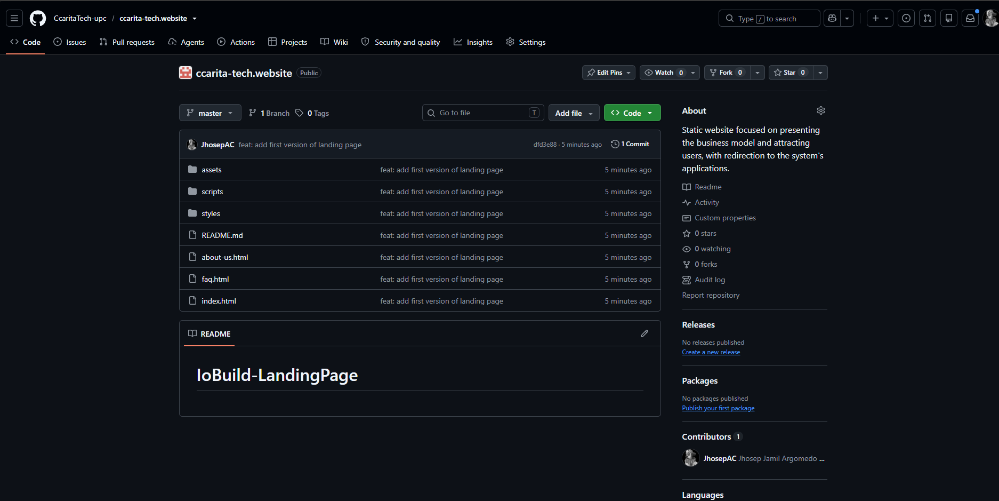

**Configuración para despliegue - Landing Page**

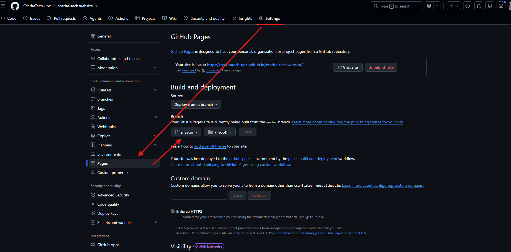

#### Proceso de despliegue
Una vez configurada la fuente de publicación, se realizó el despliegue de la aplicación. GitHub Pages procesó los archivos del repositorio y generó la versión publicada de la landing page. El estado de despliegue permitió comprobar que la aplicación fue publicada correctamente y que se encontraba disponible mediante la URL proporcionada por GitHub Pages.

**Enlace:** https://ccaritatech-upc.github.io/ccarita-tech.website/

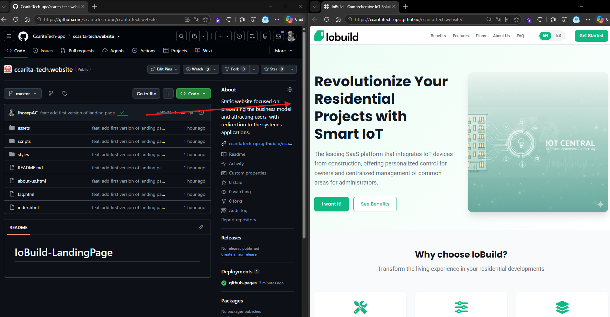

#### Visualización de la landing page
Finalmente, se accedió a la URL pública generada por GitHub Pages para verificar la implementación de la landing page. La página presenta la estructura, estilos, componentes y contenido definidos durante la etapa de desarrollo.

##### Hero - Inicio
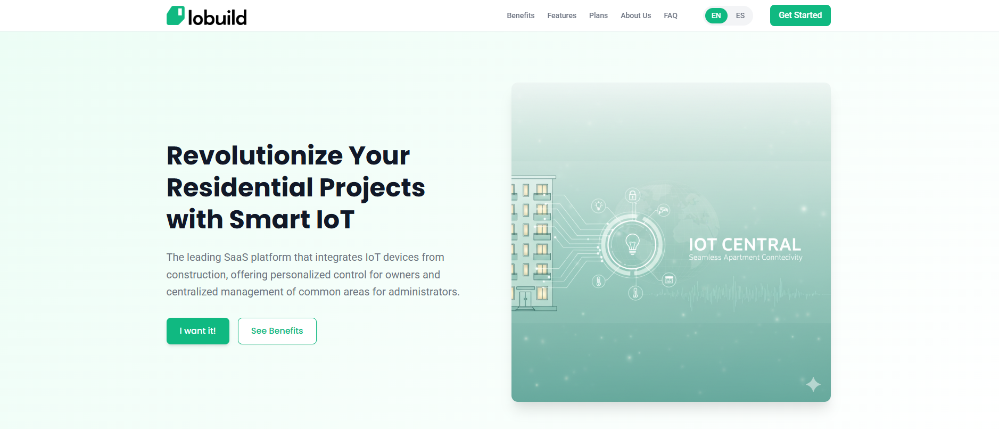

##### Benefits  - Beneficios
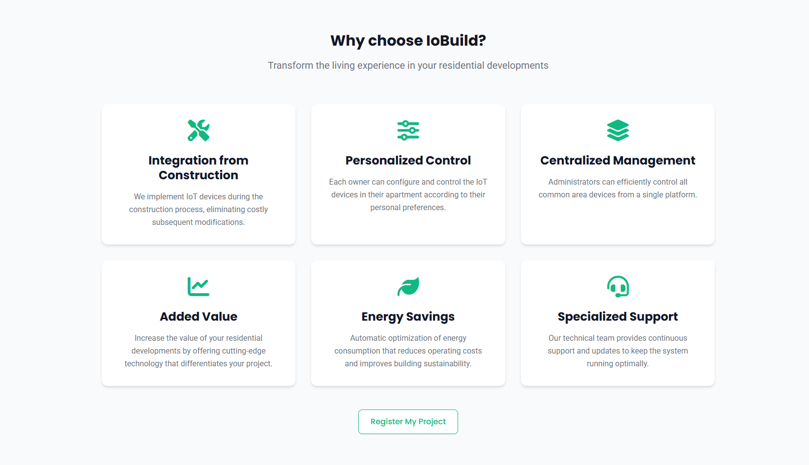

##### Features - Características
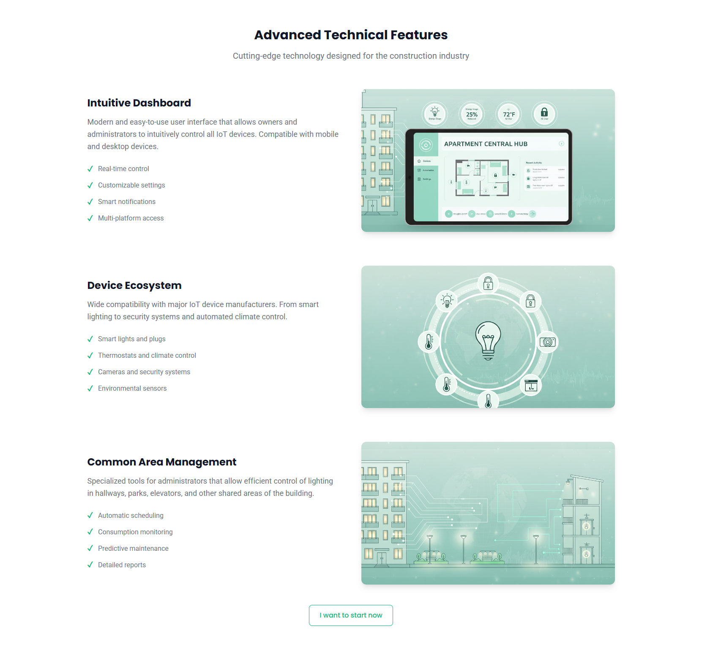

##### Social Proof - Testimonios
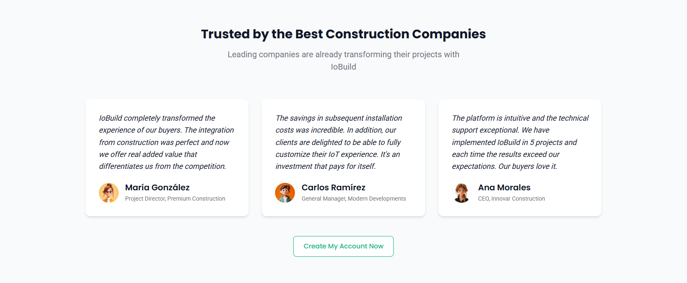

##### Pricing - Precio
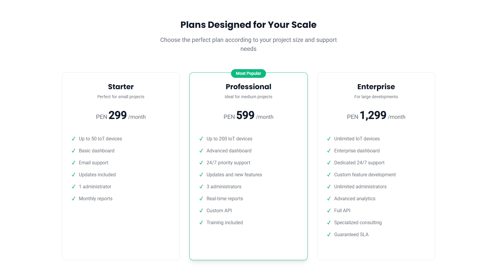

##### CTA - Llamado a la acción


##### Footer - Pie de Página


##### About Us - Sobre Nostros


##### FAQ - Preguntas frecuentes


En conjunto, estas evidencias permiten verificar que la landing page fue correctamente configurada, desplegada y publicada mediante GitHub Pages, así como comprobar visualmente que la versión disponible en línea corresponde con la implementación desarrollada para el proyecto.

### 5.2.3. Implemented Frontend-Web Application Evidence

### 0.1 Deploy


Aqui podemos observar la app deployada con render , en este caso se utilizo esta plataforma por su mayor cantidad de recursos gratuitos 

### 1. Pantalla de Inicio de Sesión

Formulario principal de acceso a la plataforma. Permite ingresar con credenciales de correo y contraseña, o seleccionar el tipo de registro: **Constructor** o **Propietario**.

---

### 2. Registro como Constructor - Paso 1

Primera etapa del flujo de registro para constructores, donde se solicitan las credenciales principales de la cuenta (correo electrónico y contraseña).

---

### 3. Registro como Propietario - Paso 1

Primera etapa del formulario de registro para propietarios de inmuebles, enfocada en la creación de las credenciales de acceso a la cuenta.

---

### 4. Registro como Propietario - Paso 2

Segunda etapa del registro de propietario donde se capturan los datos personales y de perfil (nombre, dirección, teléfono y foto de perfil).

---

### 5. Panel de Control del Propietario

Dashboard principal del propietario ("Mi Panel de Unidad"), con resumen de dispositivos, estado del hogar inteligente y gráficas de consumo energético, temperatura y agua.

---

### 6. Telemetría y Monitoreo en Tiempo Real

Módulo de monitoreo en vivo ("Live Energy") que muestra datos de consumo de dispositivos seleccionados en los últimos minutos o 24 horas.

---

### 7. Estado del Sistema y Unidades

Sección de diagnóstico que presenta el estado de salud de los dispositivos IoT conectados y el resumen general de las unidades inmobiliarias asignadas.

---

### 8. Perfil de Usuario

Vista de administración de cuenta donde el usuario puede consultar y actualizar su información personal, datos de contacto e idioma de la aplicación.

---

### 9. Vinculación de Dispositivos

Modal para la adición de nuevos dispositivos IoT ("Add Device"), permitiendo seleccionar el tipo de equipo, asignarle un nombre y vincularlo a una unidad específica.

---

### 10. Gestión de Suscripciones

Módulo de planes de suscripción para empresas o constructores (Starter, Professional y Enterprise), donde se administran las funcionalidades de infraestructura IoT e integración de proyectos.


### 5.2.4. Acuerdo de Servicio - SaaS

El presente acuerdo describe las condiciones de prestación de IoBuild como Software as a Service (SaaS). Se considera un acuerdo académico/propuesto para el producto, construido a partir de las funcionalidades y configuraciones que actualmente aparecen en la aplicación web. El proveedor del servicio es CcaritaTech mediante la plataforma IoBuild y el cliente objetivo es una empresa constructora o administradora de proyectos residenciales que necesita centralizar sus dispositivos IoT, unidades inmobiliarias y métricas operativas.

#### Objeto y alcance del servicio

IoBuild ofrece acceso web a una plataforma para gestionar proyectos residenciales inteligentes. El servicio comprende:

- Gestión de proyectos, unidades inmobiliarias y clientes asociados.
- Registro, consulta, actualización y eliminación de dispositivos IoT.
- Visualización de dashboards, métricas de energía, estado de dispositivos e insights históricos.
- Administración de perfiles, usuarios y sesiones autenticadas.
- Catálogo de planes, suscripciones, cancelación y consulta de comprobantes.
- Integración opcional con telemetría mediante MQTT e InfluxDB.
- Integración de pagos mediante Stripe, incluyendo checkout, confirmación de sesión y webhook de eventos.

El cliente utiliza el servicio desde un navegador web. En la versión actual, el frontend se implementa como una SPA en Vue 3/Vite y consume la API mediante la ruta relativa `/api/v1`. El backend se ejecuta como un monolito modular ASP.NET Core 9 y persiste la información en una única base MySQL.

#### Planes comerciales configurados

Los siguientes planes se encuentran definidos en el seed de la aplicación. Los precios son valores referenciales del prototipo y se muestran en dólares estadounidenses en el flujo de facturación.

| Plan | Precio mensual | Capacidad y beneficios principales |
|---|---:|---|
| Starter | USD 299 | Hasta 50 dispositivos IoT, dashboard básico, soporte por correo, actualizaciones incluidas, 1 administrador y reportes mensuales. |
| Professional | USD 799 | Hasta 200 dispositivos IoT, dashboard avanzado, soporte prioritario 24/7, actualizaciones y nuevas funcionalidades, 3 administradores, reportes en tiempo real, API personalizada y capacitación incluida. |
| Enterprise | USD 1,299 | Dispositivos IoT ilimitados, dashboard empresarial, soporte dedicado 24/7, desarrollo de funcionalidades personalizadas, administradores ilimitados, analítica avanzada, API completa, consultoría especializada y SLA garantizado. |

Estos valores y características proceden de [DataSeeder.cs](https://github.com/CcaritaTech-upc/ccarita-tech.webapp/blob/main/backend/src/IoBuild.Api/Persistence/DataSeeder.cs). El alcance comercial, la moneda definitiva, los impuestos y las condiciones de renovación deberán confirmarse antes de una puesta en producción.

#### Aprovisionamiento, pago y ciclo de suscripción

El ciclo operativo definido en la aplicación es el siguiente:

1. El usuario autenticado consulta los planes disponibles mediante `GET /api/v1/plans`.
2. Selecciona un plan desde la vista de suscripciones del frontend.
3. El backend crea una sesión de checkout mediante `POST /api/v1/subscriptions/payments/sessions`.
4. Stripe procesa el pago o se utiliza el modo simulado configurado para pruebas.
5. Al retornar al frontend, la sesión se confirma mediante `PATCH /api/v1/subscriptions/payments/sessions/{sessionId}`.
6. La suscripción activa se registra en MySQL; el cliente puede consultar, renovar o cancelar su plan.
7. Las facturas se consultan mediante `GET /api/v1/subscriptions/payments/invoices`.
8. Los eventos de Stripe pueden recibirse en `POST /api/v1/webhooks/stripe`, donde se valida la firma y se procesa el evento.

La implementación de este flujo está documentada principalmente en [SubscriptionsEndpoints.cs](https://github.com/CcaritaTech-upc/ccarita-tech.webapp/blob/main/backend/src/IoBuild.Api/Subscriptions/Interfaces/REST/SubscriptionsEndpoints.cs), [StripeHttpPaymentProvider.cs](https://github.com/CcaritaTech-upc/ccarita-tech.webapp/blob/main/backend/src/IoBuild.Api/Subscriptions/Infrastructure/Stripe/StripeHttpPaymentProvider.cs) y [my-subscription.vue](https://github.com/CcaritaTech-upc/ccarita-tech.webapp/blob/main/frontend/src/subscriptions/presentation/views/my-subscription.vue).

#### Compromisos del proveedor y del cliente

| Parte | Compromisos |
|---|---|
| Proveedor/CcaritaTech | Mantener la aplicación disponible en el entorno de despliegue, conservar la información de suscripciones, procesar las operaciones soportadas por la API, incluir actualizaciones según el plan y proteger las credenciales secretas de Stripe en el backend. |
| Cliente | Proporcionar datos válidos de sus proyectos y dispositivos, proteger sus credenciales, utilizar el sistema conforme a su finalidad, mantener actualizado el medio de pago y respetar los límites del plan contratado. |
| Terceros | Stripe, el proveedor de hosting, la red del cliente y los dispositivos IoT pueden afectar el resultado del servicio. Sus fallas o indisponibilidad no son controladas directamente por IoBuild. |

#### Disponibilidad, soporte y limitaciones del prototipo

La aplicación incorpora mecanismos técnicos de operación como `/health`, readiness de migraciones, healthchecks de Docker Compose, proxy Nginx y servicios opcionales de observabilidad con OpenTelemetry/Jaeger. Estos mecanismos facilitan el monitoreo y la recuperación, pero no constituyen por sí mismos una garantía contractual de disponibilidad.

El plan Enterprise muestra la característica “Guaranteed SLA” en el catálogo, pero la versión actual no define todavía un porcentaje de uptime, tiempos máximos de respuesta, ventanas de mantenimiento, compensaciones ni un proceso formal de escalamiento. Por ello, esos parámetros deben completarse en el contrato comercial antes de ofrecer el servicio como SLA legalmente vinculante.


### 5.2.5. Implemented Native-Mobile Application Evidence 


1. Login
La pantalla presenta una interfaz de inicio de sesión minimalista. El diseño incluye dos campos de entrada de texto: uno ara el correo electrónico (Email) y otro para la contraseña (Password). Debajo de estos campos, destaca un botón principal de color verde con el texto "Sign In" para acceder al sistema, seguido de una opción de registro en la parte inferior que dice "Don’t have an account? Register".


2. Dashboard
El "Builder Dashboard" muestra métricas clave como proyectos activos, dispositivos conectados y ocupación. Incluye un gráfico circular de "Device Distribution" (temperatura, agua, energía y control de acceso), un gráfico de líneas sobre la tasa de ocupación mensual y una sección de "Project Overview" con detalles específicos del proyecto "Torres del Pacífico".


3. Profile
La pantalla muestra el perfil de usuario de "Juan Pérez", identificado con el cargo de "Builder". Incluye una sección con datos personales como nombre completo, nombre de usuario, teléfono, dirección en San Isidro, Lima, y edad. En la parte inferior, destaca un botón verde con la opción "Edit Profile".


Esta interfaz corresponde a la edición del perfil de "Juan Pérez", bajo el rol de "Builder". Presenta cinco campos de texto editables con la información del usuario: nombre completo, nombre de usuario, teléfono, dirección y edad. En la parte inferior, se incluyen dos opciones principales: un botón verde para "Save Changes" (Guardar cambios) y un enlace de texto para "Cancel" (Cancelar).


4. Projects
La interfaz muestra una lista de proyectos de "IoBuild" organizados en tarjetas cuadrículas. Cada tarjeta presenta el nombre del edificio, como "Torres del Pacífico" o "Torre Ccarita", su ubicación o descripción breve, y una barra de progreso que indica el estado de las unidades ocupadas (por ejemplo, 68/80 o 90/90 unidades). Además, la pantalla incluye un botón flotante en la esquina inferior derecha con el símbolo "+" para añadir nuevos elementos.


### 5.2.6. Implemented RESTful API and/or Serverless Backend Evidence 

### 1. Vista General y Endpoints de Analytics

* **Descripción:** Interfaz principal de Swagger UI para la API de IoBuild ("All Bounded Contexts v1"). Muestra los endpoints de consulta (`GET`) para el módulo **Analytics**, permitiendo la obtención de métricas, consumo energético e insights tanto de constructores (*builders*) como de propietarios (*owners*).

---

### 2. Gestión de Clientes (Clients)

* **Descripción:** Módulos y endpoints correspondientes a la entidad **Clients**. Ofrece una arquitectura CRUD estándar (`GET`, `POST`, `PUT`, `DELETE`) para el registro, edición, consulta y eliminación de datos de los clientes.

---

### 3. Administración e Interacción con Dispositivos (Devices)

* **Descripción:** Conjunto de endpoints del contexto de **Devices**. Incluye soporte para la gestión de dispositivos y sus tipos, comandos en tiempo real, recepción de telemetría (`/telemetry`), retransmisión de datos (`/replay`), así como la consulta de estado y métricas de energía por dispositivo.

---

### 4. Gestión de Identidad y Acceso (IAM)

* **Descripción:** Endpoints para el módulo **IAM** (*Identity and Access Management*). Permite el registro de usuarios (`sign-up`), inicio y cierre de sesión (`sign-in`, `sign-out`), gestión de invitaciones y administración de sesiones activas.

---

### 5. Health Check, Contratos, Planes y Perfiles

* **Descripción:** Documentación de los contextos **IoBuild.Api** (verificación de estado `/health` y contratos), **Plans** (gestión de planes de suscripción) y **Profiles** (actualización e inspección de perfiles de usuario, incluyendo la foto de perfil vía `PATCH`).

---

### 6. Gestión de Proyectos y Subscripciones (Projects & Subscriptions)

* **Descripción:** Endpoints de los contextos **Projects** y **Subscriptions**. Permite la administración de proyectos y sus estructuras, el manejo del ciclo de vida de suscripciones, sesiones de pago, historial de facturas e integración mediante webhooks con Stripe.

---

### 7. Transiciones de Sistema y Unidades (System & Cutover / Units)

* **Descripción:** Endpoints correspondientes a **System & Cutover** (control de estado, congelamiento y estabilización del sistema durante despliegues) y **Units** (administración de unidades/inmuebles y asignación de propietarios).

### 5.2.7. RESTful API documentation 

La API de IoBuild v2 expone recursos REST utilizando Minimal APIs de ASP.NET Core 9. Todos los recursos funcionales se agrupan bajo la versión `/api/v1`, intercambian información en JSON y se organizan por bounded contexts dentro del monolito modular. La implementación se compone desde [Program.cs](https://github.com/CcaritaTech-upc/ccarita-tech.webapp/blob/main/backend/src/IoBuild.Api/Program.cs), que registra los módulos y configura Swagger/OpenAPI.

#### Acceso a la documentación OpenAPI

La interfaz Swagger se habilita automáticamente con `UseSwagger()` y `UseSwaggerUI()`. En el stack Docker local puede accederse desde:

- UI interactiva: `http://localhost:80/swagger`
- API directa: `http://localhost:8080/swagger`
- Especificación general: `/swagger/v1/swagger.json`

El backend publica documentos separados para `v1`, `publishing`, `devices`, `iam`, `subscriptions`, `profiles` y `analytics`. La configuración también define el esquema de seguridad Bearer para las operaciones que requieren autenticación.

#### Convenciones REST y respuestas

- `GET`: consulta recursos o colecciones.
- `POST`: crea recursos o ejecuta operaciones de dominio.
- `PUT`: reemplaza o actualiza información de un recurso.
- `PATCH`: aplica cambios parciales.
- `DELETE`: elimina un recurso o cierra una sesión.
- `200 OK`: operación exitosa con contenido.
- `201 Created`: creación exitosa de un recurso o sesión.
- `204 No Content`: operación exitosa sin cuerpo de respuesta.
- `400 Bad Request`: error de validación.
- `401 Unauthorized`: autenticación requerida.
- `403 Forbidden`: acceso no permitido.
- `404 Not Found`: recurso inexistente.
- `503 Service Unavailable`: dependencia no disponible.

#### API transversal

| Método | Ruta | Descripción | Acceso |
|---|---|---|---|
| GET | `/health` | Verifica la disponibilidad y readiness de la aplicación. | Público |
| GET | `/api/v1/contracts` | Devuelve el catálogo de contratos de compatibilidad de la API. | Público |
| GET | `/` | Redirige al usuario hacia Swagger UI. | Público |

#### Bounded Context: IAM

| Método | Ruta | Descripción | Acceso |
|---|---|---|---|
| POST | `/api/v1/users` | Registra un usuario. | Público |
| POST | `/api/v1/authentication/sign-up` | Registra un usuario. | Público |
| GET | `/api/v1/authentication/invitation?email={email}` | Consulta el estado de invitación de un correo. | Público |
| POST | `/api/v1/sessions` | Inicia sesión y devuelve un token. | Público |
| POST | `/api/v1/authentication/sign-in` | Inicia sesión. | Público |
| DELETE | `/api/v1/sessions/current` | Revoca la sesión actual. | Bearer |
| POST | `/api/v1/authentication/sign-out` | Cierra la sesión actual. | Bearer |
| GET | `/api/v1/users` | Lista usuarios del sistema. | Bearer |

#### Bounded Context: Publishing

| Método | Ruta | Descripción | Acceso |
|---|---|---|---|
| GET, POST | `/api/v1/projects` | Lista o crea proyectos. | Bearer |
| GET, PUT, DELETE | `/api/v1/projects/{id}` | Consulta, actualiza o elimina un proyecto. | Bearer |
| POST | `/api/v1/projects/{id}/structure` | Genera o actualiza la estructura de un proyecto. | Bearer |
| GET | `/api/v1/units?projectId={id}&ownerId={id}` | Lista unidades filtradas. | Bearer |
| GET | `/api/v1/units/{id}` | Obtiene una unidad. | Bearer |
| POST | `/api/v1/units` | Crea una unidad. | Bearer |
| PATCH | `/api/v1/units/{id}` | Actualiza una unidad. | Bearer |
| PATCH | `/api/v1/units/{id}/assign-owner` | Asigna el propietario de una unidad. | Bearer |
| GET, POST | `/api/v1/clients` | Consulta o crea clientes. | Bearer |
| GET, PUT, DELETE | `/api/v1/clients/{id}` | Consulta, actualiza o elimina un cliente. | Bearer |

#### Bounded Context: Profiles

| Método | Ruta | Descripción | Acceso |
|---|---|---|---|
| GET | `/api/v1/profiles?userId={id}` | Lista o filtra perfiles. | Bearer |
| GET, PUT | `/api/v1/profiles/{id}` | Consulta o actualiza un perfil. | Bearer |
| POST | `/api/v1/profiles` | Crea un perfil. | Bearer |
| PATCH | `/api/v1/profiles/{userId}/photo` | Reemplaza la foto de perfil. | Bearer |

#### Bounded Context: Devices

| Método | Ruta | Descripción | Acceso |
|---|---|---|---|
| GET | `/api/v1/devices/types` | Consulta tipos de dispositivos. | Público |
| GET, POST | `/api/v1/devices` | Lista o registra dispositivos IoT. | Bearer |
| GET, PUT, DELETE | `/api/v1/devices/{id}` | Consulta, actualiza o elimina un dispositivo. | Bearer |
| POST | `/api/v1/devices/{id}/commands` | Envía un comando autorizado. | Bearer |
| POST | `/api/v1/devices/telemetry` | Ingresa telemetría. | Público/Integración |
| POST | `/api/v1/devices/telemetry/replay` | Reproduce telemetría desde InfluxDB. | Bearer |
| GET | `/api/v1/devices/{id}/energy` | Consulta energía. | Bearer |
| GET | `/api/v1/devices/{id}/status` | Consulta el estado actual. | Bearer |

#### Bounded Context: Analytics

| Método | Ruta | Descripción |
|---|---|---|
| GET | `/api/v1/analytics/builders/{userId}/metrics` | Métricas del dashboard del constructor. |
| GET | `/api/v1/analytics/owners/{userId}/metrics` | Métricas del dashboard del propietario. |
| GET | `/api/v1/analytics/builders/{userId}/energy` | Energía reciente del constructor. |
| GET | `/api/v1/analytics/owners/{userId}/energy` | Energía reciente del propietario. |
| GET | `/api/v1/analytics/insights` | Consulta datos históricos por proyecto y métrica. |

#### Bounded Context: Subscriptions, Plans & Payments

| Método | Ruta | Descripción |
|---|---|---|
| GET | `/api/v1/plans` y `/api/v1/plans/{id}` | Lista planes o consulta un plan. |
| POST, PUT | `/api/v1/plans` y `/api/v1/plans/{id}` | Administra el catálogo de planes. |
| GET | `/api/v1/subscriptions` y `/api/v1/subscriptions/{id}` | Consulta suscripciones. |
| POST | `/api/v1/subscriptions` | Crea una suscripción. |
| PUT | `/api/v1/subscriptions/{id}` | Actualiza una suscripción. |
| POST | `/api/v1/subscriptions/{id}/cancel` | Cancela una suscripción. |
| POST | `/api/v1/subscriptions/payments/sessions` | Crea una sesión de checkout Stripe. |
| PATCH | `/api/v1/subscriptions/payments/sessions/{sessionId}` | Confirma la sesión pagada. |
| GET | `/api/v1/subscriptions/payments/invoices?builderId={id}` | Consulta facturas. |
| POST | `/api/v1/webhooks/stripe` | Recibe eventos de Stripe. |

#### Ejemplo de interacción

Solicitud de inicio de sesión:

```http
POST /api/v1/authentication/sign-in
Content-Type: application/json

{
  "email": "user@demo.com",
  "password": "secret"
}
```

Respuesta exitosa:

```json
{
  "id": 1,
  "email": "user@demo.com",
  "role": "builder",
  "token": "eyJhbGciOiJIUzI1NiIsInR5cCI6IkpXVCJ9..."
}
```

Consulta autenticada de dispositivos:

```http
GET /api/v1/devices?projectId=1
Authorization: Bearer {token}
```

Respuesta esperada:

```json
[
  {
    "id": 1,
    "name": "Sensor de Temperatura - Torre A",
    "type": "SmartMeter",
    "location": "Torre A - Piso 5",
    "projectId": 1,
    "status": "Online"
  }
]
```

La documentación se deriva de los archivos de endpoints del repositorio actual:

- [IAM](https://github.com/CcaritaTech-upc/ccarita-tech.webapp/blob/main/backend/src/IoBuild.Api/IAM/Interfaces/REST/IamEndpoints.cs)
- [Publishing](https://github.com/CcaritaTech-upc/ccarita-tech.webapp/blob/main/backend/src/IoBuild.Api/Publishing/Interfaces/REST/PublishingEndpoints.cs)
- [Profiles](https://github.com/CcaritaTech-upc/ccarita-tech.webapp/blob/main/backend/src/IoBuild.Api/Profiles/Interfaces/REST/ProfilesEndpoints.cs)
- [Devices](https://github.com/CcaritaTech-upc/ccarita-tech.webapp/blob/main/backend/src/IoBuild.Api/Devices/Interfaces/REST/DevicesEndpoints.cs)
- [Analytics](https://github.com/CcaritaTech-upc/ccarita-tech.webapp/blob/main/backend/src/IoBuild.Api/Analytics/Interfaces/REST/AnalyticsEndpoints.cs)
- [Subscriptions](https://github.com/CcaritaTech-upc/ccarita-tech.webapp/blob/main/backend/src/IoBuild.Api/Subscriptions/Interfaces/REST/SubscriptionsEndpoints.cs)

### 5.2.8. Team Collaboration Insights 


## 5.3. Video About-the-Product. 
